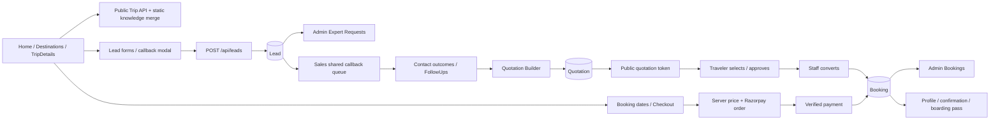
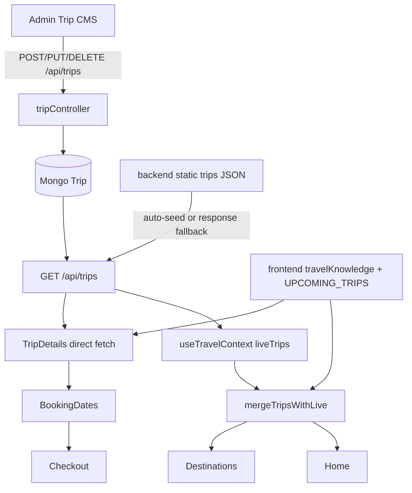
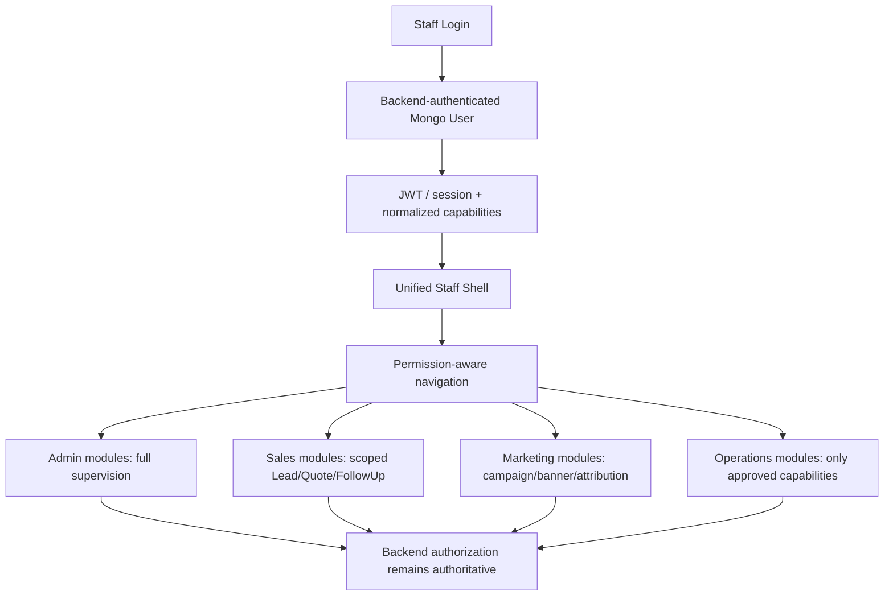

# WanderLuxe Staff Control Center Rebuild — Phase 1 Architecture Audit

**Audit date:** 2026-09-16  
**Audited local revision:** `d13b42a` on `main`  
**Remote tracking state:** local `main` is one commit behind `origin/main` (`f6324d8`, title `sales`)  
**Method:** repository source inspection plus non-destructive build, lint, syntax, and existing test execution  
**Scope:** analysis only; no application source, routes, schemas, authentication, permissions, or tests were changed

Status labels used below:

- **WORKING / CONNECTED** — source paths and persistence are connected; runtime still depends on deployment configuration.
- **PARTIALLY CONNECTED** — some paths are live, but a route, role, data authority, or UI path is incomplete.
- **LEGACY / DUPLICATED** — retained behavior overlaps a newer path or conflicts with current intent.
- **FRONTEND ONLY / BACKEND ONLY** — only one side is currently implemented.
- **BROKEN / UNREACHABLE** — static evidence proves the intended path cannot complete.
- **UNKNOWN — NEEDS RUNTIME VERIFICATION** — correctness depends on MongoDB, payment, Cloudinary, or deployed environment state not available in this audit.

---

## 1. Executive Summary

The current system is not one staff application. It is three unequal layers:

1. an admin-only, 3,768-line `AdminDashboard.jsx` with eleven embedded modules;
2. a separate, canonical `/staff/sales` shared Expert Request queue;
3. backend-only Marketing, pricing, reporting, and sales foundations with no usable Marketing/Management frontend.

The backend already has a useful role vocabulary (`super_admin`, `admin`, `operations`, `sales`, `marketing`, `user`, `influencer`) and action-permission table. It also has mature Mongo-backed domains for trips, leads, quotations, bookings, pages, media, and creator applications. These backend domains can largely remain in place during a future frontend-shell rebuild.

The current frontend role model is materially narrower than the backend. `staffLogin()` accepts only `admin`, `super_admin`, and `sales`; `/admin` accepts only `admin` and `super_admin`; `/staff/sales` accepts only `admin`, `super_admin`, and `sales`. Operations and Marketing users can exist in MongoDB and pass the generic backend login, but cannot enter a staff workspace through the current staff login. `AdminDashboard` tab role arrays for Sales, Marketing, and Operations are therefore mostly cosmetic and unreachable.

The shared Expert Request queue is real at the backend for `leadType=callback_request`: every Sales user is server-forced onto the same callback queue, claim/assignment is rejected for callback requests, and call outcomes record `loggedByName`. Legacy ownership remains active for non-callback lead types, quotations, and per-user follow-ups. The Sales UI cannot currently open a new quotation builder: it navigates to `/admin/quotations?leadId=...`, which is admin-only and redirects Sales back to `/staff/sales`.

Most Admin modules are connected, but not all are authoritative:

- Mongo-backed: analytics, trips, leads, quotations, bookings, pages, users, creator approvals, most media operations.
- Browser-local: Admin payout approvals and creator eligible-plan toggles.
- Server-memory-only: Admin Discounts (`couponsList`), separate from the Mongo `Coupon` model used by influencer/checkout flows.
- Mixed/fabricated fallback: Marketing campaigns/banners/dashboard, creator wallet/analytics/coupons, pages, media catalog, trips, booking/order fallbacks, pricing rules, and some sales metrics.

The public trip catalog is intentionally hybrid rather than Mongo-authoritative. The backend auto-seeds or falls back to static JSON, and the frontend always starts with static travel knowledge then overlays live Mongo trips by slug. Consequently, a database-empty state does not produce an empty catalog, and deleting/deactivating a Mongo trip may not remove an equivalent static trip from public discovery.

The most serious security debt is the production-reachable fallback identity model: hardcoded default Admin/Sales credentials, a default JWT secret, email-based superuser overrides on both frontend and backend, and synthetic identities (`usr_admin`, `usr_sales_1`, etc.). Authentication falls back to `memoryUsers` regardless of production mode. Synthetic IDs can also be written into ObjectId-backed models and cause Mongo persistence failures or diversion into process memory. The unmerged remote commit `f6324d8` appears to add ObjectId hardening, but it is not part of the audited working tree and was not treated as current behavior.

**Phase 1 result: PASS for static architecture discovery; PARTIAL for runtime verification.** The report is sufficient to choose a safe decomposition strategy, but deployed MongoDB, Razorpay, Cloudinary, and real staff accounts must be verified before migration.

---

## 2. Current Repository State

### Git state

| Item | Finding |
|---|---|
| Current branch | `main` |
| Local HEAD | `d13b42a Create DESIGN_SYSTEM_PALETTE_README.md` |
| Upstream | `origin/main` |
| Divergence | Local branch is behind by 1 commit |
| Upstream-only commit | `f6324d8 sales` |
| Tracked uncommitted changes before audit | None |
| Untracked collaborator/tool content | `.serena/` |
| Audit action | `.serena/` preserved; no pull, checkout, or source edits performed |

The upstream-only commit changes auth middleware, Lead, FollowUp, Booking, and Quotation handling and adds `backend/utils/mongoId.js`. Because Phase 1 permits only this report to change, it was not merged. This report therefore describes the checked-out code at `d13b42a`, not the unmerged remote revision.

### Relevant recent history

| Commit | Relevance |
|---|---|
| `0467915` | Shared Sales Queue architecture and route migration |
| `905c87f` | Dedicated Sales Portal originally at `/admin/sales` |
| `cce0945` | Admin Expert Requests section |
| `3ffd54c` / `84ae80c` | Admin, Sales, Marketing, FollowUp, PricingRule foundation |
| `9d5fca3` and quotation reports | Quotation workflow evolution |

### Repository shape

- `frontend/src/App.jsx` — all React routing.
- `frontend/src/pages/` — customer pages plus Admin, Sales, quotation, creator, booking, and CMS views.
- `frontend/src/components/` — guards, CRM drawers/modals, quotation builder, media, itinerary, and public UI.
- `frontend/src/contexts/AuthContext.jsx` — session, role normalization, and substantial creator/payout local state.
- `frontend/src/services/api.js` — main REST client; `quotationService.js` is a second quotation client/default layer.
- `backend/server.js` — Express bootstrap and route mounts.
- `backend/routes/` — domain routes and middleware composition.
- `backend/controllers/` — domain logic, including many in-memory fallbacks.
- `backend/models/` — 17 Mongoose models.
- `backend/services/` — quotation pricing, travel knowledge, media resolution, itinerary feasibility/copilot.
- `backend/middlewares/authMiddleware.js` — JWT, role middleware, synthetic identities, action permissions.
- `backend/scripts/` and `backend/test_*.js` — standalone verification scripts; there is no backend `npm test` script.
- Root `*_REPORT.md` and `.docx` files — historical intent only; current code was used as authority.

### Files central to the future rebuild

- Admin: `frontend/src/pages/AdminDashboard.jsx`, `frontend/src/components/AdminExpertRequests.jsx`.
- Sales: `frontend/src/pages/SalesPortal.jsx` and CRM components.
- Auth/RBAC: `AdminLogin.jsx`, `AuthContext.jsx`, `AdminRoute.jsx`, `RoleProtectedRoute.jsx`, `authController.js`, `authMiddleware.js`, `User.js`.
- Public-to-staff workflows: Trip, Lead, Quotation, Booking, Page, Media, Creator, and Marketing controllers/routes/models plus their public React consumers.

---

## 3. Current Staff Route Architecture

### Route Matrix

| Route | Component | Frontend access | Redirect/behavior | Backend capabilities used | Classification |
|---|---|---|---|---|---|
| `/admin/login` | `AdminLogin` | Public | Authenticated Sales → `/staff/sales`; Admin/Super Admin → `/admin`; other roles remain on login | `POST /api/auth/login` | Canonical staff login, but Admin/Sales only |
| `/admin` | `AdminDashboard` | Admin, Super Admin; configured admin email bypass | Sales → `/staff/sales`; other roles get Access Restricted | All Admin/module APIs | Canonical Admin root |
| `/admin/quotations` | `AdminDashboard defaultTab="quotations"` | Admin, Super Admin | Same guard as `/admin` | Quotation APIs | Canonical Admin quotation list/builder |
| `/admin/quotations/:id` | `QuotationDetail` | Admin, Super Admin, Sales | Unauthorized Sales quotation rejected again by backend ownership check | `GET/PATCH/action /api/quotations/:id` | Canonical internal quotation detail |
| `/admin/quotations/:quoteId/edit` | `AdminDashboard defaultTab="quotations"` | Admin, Super Admin | Sales redirected away | Quotation APIs | Admin-only edit wizard route |
| `/admin/bookings/:id` | `AdminDashboard defaultTab="bookings_crm"` | Admin, Super Admin | Booking `:id` is not consumed by `AdminDashboard`; opens the module, not necessarily that booking | Admin bookings API | Reachable but incomplete deep link |
| `/staff/sales` | `SalesPortal` | Admin, Super Admin, Sales | Unauthenticated → `/admin/login`; other roles denied | Lead, contact, follow-up APIs | Canonical Sales workspace |
| `/admin/sales` | `<Navigate>` | Public redirect | Always redirects to `/staff/sales`, whose guard then applies | None directly | Legacy compatibility route |
| `/staff/management` | None | None | Falls into `NotFound` | Marketing backend exists separately | **Does not exist** |
| Any Marketing route | None | None | No destination exists after login | Marketing APIs | Backend only |
| Any Operations route | None | None | No destination exists after login | Operations permissions exist | Backend only |

No route is registered under `/management`, `/staff/management`, `/staff/marketing`, or `/staff/operations`.

### Canonicality and reachability

- `/staff/sales` is explicitly documented in code as canonical.
- `/admin/sales` is legacy and safely redirect-only.
- `/admin` and its Admin child routes are strictly Admin/Super Admin at the guard.
- `QuotationDetail` is the only existing Admin-prefixed screen intentionally reachable by Sales.
- The Sales “Open Quotation Builder” action points to `/admin/quotations?leadId=...`; Sales is redirected before the builder renders. `AdminDashboard` also does not consume `leadId` from search parameters, so the URL does not prefill the lead even for Admin.

---

## 4. Authentication Flow

```mermaid
flowchart TD
    A[Staff enters email/password in AdminLogin] --> B[AuthContext.staffLogin]
    B --> C[POST /api/auth/login]
    C --> D{Mongo connected and user found?}
    D -- Yes --> E[bcrypt User.matchPassword]
    D -- No --> F[memoryUsers / special default identities]
    F --> G[bcrypt or configured/default password checks]
    E --> H[JWT: id + role + email, 30 days]
    G --> H
    H --> I[localStorage wanderluxe_token]
    I --> J[GET /api/auth/me on application restart]
    J --> K[AuthContext role normalization and admin-email override]
    K --> L{staffLogin allowed role?}
    L -- sales --> M[/staff/sales]
    L -- admin or super_admin --> N[/admin]
    L -- marketing/operations/other --> O[Rejected by staffLogin]
    M --> P[RoleProtectedRoute]
    N --> Q[AdminRoute -> RoleProtectedRoute]
    P --> R[Backend JWT protect + endpoint role/permission middleware]
    Q --> R
```

Detailed sequence:

1. `AdminLogin` calls `staffLogin(email,password)`.
2. `staffLogin` calls the same generic `POST /api/auth/login` used by customer login.
3. `loginUser` first queries MongoDB if connected.
4. If the configured/default Admin email is absent, the backend can create it in Mongo when the supplied password matches the configured or default Admin password.
5. If no Mongo user is found, login falls back to process-local `memoryUsers`, including Admin and two Sales identities.
6. bcrypt is used for Mongo and memory password hashes, but special default password comparisons also exist.
7. `generateToken` signs `id`, `role`, and `email` using `JWT_SECRET` or a hardcoded fallback and expires in 30 days.
8. The frontend stores the token in `localStorage`, not an HttpOnly cookie.
9. On reload, `AuthContext` calls `GET /api/auth/me`; `protect` tries Mongo for valid ObjectIds, otherwise synthesizes a user from known IDs/emails or JWT claims.
10. `AuthContext` can normalize the configured Admin email to `role=admin` even if the returned Mongo role differs.
11. `staffLogin` then permits only Admin, Super Admin, and Sales.
12. Route guards apply frontend visibility; backend middleware remains authoritative for API actions.

Authentication is therefore Mongo-first, not Mongo-only.

---

## 5. Current Role Model

### Role Matrix

| Role | `User` enum | Backend login | `staffLogin` | Frontend destination | Backend permissions | End-to-end usability |
|---|---:|---:|---:|---|---|---|
| `super_admin` | Yes | Yes | Yes | `/admin` | Global bypass in permission helpers | Usable if Mongo user exists |
| `admin` | Yes | Yes | Yes | `/admin` | Admin endpoints and most actions | Usable; configured email can override role |
| `operations` | Yes | Yes | **No** | None | Trips/quotation/lead/booking-related permissions exist | Backend-capable, frontend unusable |
| `sales` | Yes | Yes | Yes | `/staff/sales` | Shared callback leads, own/open quotations, follow-ups, booking conversion | Partially usable; quotation creation UI path is broken |
| `marketing` | Yes | Yes | **No** | None | Marketing CRUD/dashboard plus read-only masked Leads/Quotations | Backend-capable, frontend unusable |
| `user` | Yes | Yes via normal login | No | Customer routes | Customer bookings/profile; public trip access | Usable as customer |
| `influencer` | Yes | Generic and dedicated login | No | `/influencer` | Creator APIs when approved | Usable, but mixed Mongo/local/fake data |

There is no `management` backend role. The correct backend role is `marketing`; “Management / Marketing Desk” is a future workspace label only.

---

## 6. Frontend Route Access Matrix

| Screen/module | Super Admin | Admin | Operations | Sales | Marketing | User/Influencer | Evidence/classification |
|---|---:|---:|---:|---:|---:|---:|---|
| Admin Dashboard shell | Yes | Yes | No | Redirected | No | No | `AdminRoute` permits only Admin/Super Admin |
| Admin Analytics tab | Yes | Yes | Unreachable | Unreachable in Admin | Unreachable | No | Tab array says all five staff roles; guard contradicts it |
| Admin Quotations tab | Yes | Yes | Unreachable | Unreachable | Unreachable | No | Sales can only use direct detail route |
| Admin Expert Requests tab | Yes | Yes | Unreachable | Duplicated in SalesPortal | No | No | Sales tab declaration is cosmetic |
| Admin Trip CMS | Yes | Yes | Unreachable | No | Unreachable | No | Backend mutation uses `adminOnly`, contradicting tab’s Operations/Marketing roles |
| Admin Media Library | Yes | Yes | Unreachable | No | Unreachable | No | Backend write routes use `adminOnly` |
| Admin Pages CMS | Yes | Yes | No | No | Unreachable | No | Backend writes use `adminOnly` |
| Admin Bookings & CRM | Yes | Yes | Unreachable | Unreachable | No | No | Backend contains some staff booking actions, but Admin API is `adminOnly` |
| Creator Approvals | Yes | Yes | No | No | No | No | Correctly isolated |
| Payouts | Yes | Yes | No | No | No | No | Browser-local state only |
| Discounts | Yes | Yes | No | No | No | No | Server process memory only |
| Users & Roles | Yes | Yes | No | No | No | No | Correctly isolated at route, but no Super-Admin-only distinction |
| Sales Portal | Yes | Yes | No | Yes | No | No | Admin supervision supported |
| Quotation Detail | Yes | Yes | No (guard excludes) | Yes, backend-owned/open only | No (guard excludes despite backend read support) | No | Frontend/backend role mismatch |
| Marketing/Management frontend | No | No | No | No | No | No | Not implemented |

The Admin tab role arrays should not be used as evidence of usable access. They are presentation metadata inside a component that those roles cannot render.

---

## 7. Backend Permission Matrix

Legend: **A** explicit `ACTION_PERMISSIONS` + `checkPermission`; **R** direct role middleware; **C** controller-level check; **P** public; **—** denied/missing. Parentheses identify important inconsistencies.

| Action | super_admin | admin | operations | sales | marketing | user | influencer | Enforcement |
|---|---:|---:|---:|---:|---:|---:|---:|---|
| Trip view | P | P | P | P | P | P | P | Public routes; `trips:view` exists but is unused |
| Trip create/edit/delete | R | R | — | — | — | — | — | `adminOnly`; conflicts with action table that says Operations may create/edit/publish |
| Trip publish/departures | R | R | — | — | — | — | — | No dedicated publish/departure endpoint; Trip update is Admin-only |
| Lead view | R | R | R | R callback queue only | R masked | — | — | Route role list + controller scoping/masking |
| Lead claim | R | R | R | R non-callback only | — | — | — | Callback requests explicitly reject claim |
| Lead assignment | R | R | R | — | — | — | — | Callback requests explicitly reject assignment |
| Lead status/contact | R | R | R | R; shared for callback, ownership for others | — | — | — | Route + controller IDOR checks |
| Quotation list/view | R/C | R/C | R/C | R/C own, created, or open | R/C sanitized read | — | — | Route roles + controller filtering |
| Quotation create/edit/send/approve | R/C | R/C | — | R/C own/open | — | — | — | `requireRoles`; controller concession/ownership checks |
| Quotation delete | R | R | — | — | — | — | — | `adminOnly` plus status guards |
| Quotation → Trip | R | R | R | — | — | — | — | `operationsOrAdmin` |
| Quotation → Booking | R/C | R/C | R/C | R/C own/open | — | — | — | `requireRoles` + controller authorization |
| Pricing view | A | A | A | A | — | — | — | `pricing:view` |
| Pricing manage rules | A | A | — | — | — | — | — | `pricing:manage_rules` |
| Follow-ups | A/C | A/C | — | A/C own records | — | — | — | Action table omits Operations; controller scopes Sales |
| Sales dashboard | A | A | — | A | — | — | — | `sales:view_dashboard`; SalesPortal does not consume it |
| Marketing dashboard/campaign/banner | A | A | — | — | A | — | — | Marketing action permissions |
| Reports | R | R | — | — | — | — | — | Mounted under globally `adminOnly`; action `reports:view` is not used |
| User role management | R | R | — | — | — | — | — | Globally `adminOnly`; no Super-Admin-only restriction |
| Admin booking list | R | R | — | — | — | — | — | `/api/admin/bookings` |
| Booking view by ID | R | R | R | R | R | R | R | Any authenticated user; **no ownership check** in `getBookingById` |
| Booking cancellation | C | C | C | C | — | Owner | Owner | Controller permits listed staff or owner |
| Payment order/verification | Auth | Auth | Auth | Auth | Auth | Auth | Auth | Verification checks owner except only literal `admin` bypass; missing secret skips HMAC |
| Refund | — | — | — | — | — | — | — | No refund implementation found |
| Creator application approval | R | R | — | — | — | — | — | Admin routes |
| Creator payout request | Eligible via influencerOnly | Eligible | — | — | — | approved status can pass `influencerOnly` | Yes | Middleware also lets Admin pass; no Admin Mongo payout-management route |

The action table and actual route middleware are not a single source of truth. Several actions bypass `checkPermission` and use older role helpers, producing conflicts.

---

## 8. Current AdminDashboard Module Inventory

### Admin Module Matrix

| Module | Frontend ownership | API/controller/model | Read/write behavior | Public/customer impact | Status |
|---|---|---|---|---|---|
| Analytics | Embedded lines ~1084–1269 | `/api/admin/stats` → `adminController` → User/Trip/Lead/Review/Booking/Quotation | Read-only Mongo aggregates; returns real zeroes on DB failure | Supervisory only | **WORKING / CONNECTED**; eager-loaded |
| Quotations | Embedded UI + `QuotationBuilderWizard`, preview/share modals | `/api/quotations` → `quotationController` → Quotation, Lead, Trip, Booking | Create/edit/delete/send/approve/revise/convert | Public proposal, Lead status, Booking, draft Trip | **WORKING / CONNECTED** for Admin; Sales builder path broken |
| Expert Requests | Separate `AdminExpertRequests` component | `/api/leads` + `/api/follow-ups` → Lead/FollowUp | Shared callback read, contact log, status, follow-up | Direct customer contact pipeline | **PARTIALLY CONNECTED**; Lost modal references undefined `assignModalLead` |
| Trip CMS | Embedded CRUD/modal | `/api/trips` → `tripController` → Trip | Full create/update/delete/deactivate; image upload | Home, catalog, TripDetails, checkout inventory/pricing | **WORKING / CONNECTED**, but public static merge weakens authority |
| Media Library | Embedded list/report + separate picker/upload modals | `/api/media` → MediaAsset controller/model + Cloudinary/upload | List/create/update/delete/resolve | Trip/quotation itinerary visuals | **PARTIALLY CONNECTED**; coverage URL mismatch; list falls back to canonical memory assets |
| Pages CMS | Embedded CRUD/modal | `/api/pages` → Page controller/model | Create/update/delete; public read | `/page/:slug`, SEO/sitemap | **PARTIALLY CONNECTED**; GET route never decodes Admin token, so drafts are excluded; memory pages substitute on empty DB |
| Bookings & CRM | Embedded Booking and Lead tables + `BookingDetailsModal` | `/api/admin/bookings`, `/api/leads` → Booking/Lead | Read bookings; update Lead; create quotation; legacy assign action in component | Customer records and sales pipeline | **WORKING / CONNECTED** with stale ownership UI |
| Creator Approvals | Embedded; AuthContext wrappers | `/api/admin/influencer-applications` → User | Approve changes role/status; reject status | Enables influencer portal | **WORKING / CONNECTED** when Mongo is available |
| Payouts | Embedded | AuthContext `allPayoutRequests` | Local approve/status mutation | No authoritative provider or Mongo effect | **FRONTEND ONLY** |
| Discounts | Embedded | `/api/admin/coupons` → module-local `couponsList` | Process-memory CRUD | Not reliably connected to checkout Mongo coupons | **LEGACY / DUPLICATED / SERVER MEMORY** |
| Users & Roles | Embedded | `/api/admin/users` → User | List; UI toggles only Admin/User | Changes staff/customer authorization | **WORKING / CONNECTED**, limited UI and high impact |

### Loading strategy

`fetchAllAdminData()` runs on initial mount and every analytics range change. It sequentially fetches stats, trips, pages, bookings, leads, quotations, coupons, users, then creator applications regardless of active tab. This means:

- changing only the analytics range reloads every module;
- failures are individually caught and logged, so one failure does not normally blank the whole dashboard;
- the dashboard performs redundant quotation fetches when the Quotations tab is active;
- Media alone is tab-lazy, but performs list plus coverage calls and debounced re-fetches;
- no permission check precedes module fetches inside `AdminDashboard` (the route guard currently prevents non-Admin render, masking this defect);
- future role reuse of this component would immediately issue forbidden/overbroad requests for hidden tabs.

### Customer-impacting destructive actions

- Trip delete can hard-delete trips without bookings or deactivate trips with bookings.
- Page delete removes Mongo and/or memory page content.
- Media delete removes an asset record referenced by visual workflows.
- Quotation delete is permanent where controller status rules allow it.
- User role changes immediately alter authorization.
- Lead status and assignment mutate CRM state.
- Quotation conversions create Booking or Trip records.

---

## 9. SalesPortal Architecture

`SalesPortal.jsx` is a separate 1,182-line dark-themed workspace. It contains:

- shared callback queue list;
- local KPI cards derived from the currently fetched page of Leads;
- quick filters (all/new/due/overdue/in-progress/qualified);
- search, status, and priority filtering;
- lead dossier drawer;
- phone/WhatsApp/email shortcuts;
- status updates and Lost reason;
- contact outcome logging with actor attribution;
- follow-up scheduling;
- attempted quotation-builder navigation.

The portal calls Lead and FollowUp APIs directly. Although it imports `getSalesDashboardApi`, it never calls it; backend sales KPIs/revenue are therefore unused by the Sales UI. Local KPI counts are only as complete as the 100-record fetch.

### Shared queue result

- Sales `GET /api/leads` is forcibly scoped to `leadType=callback_request` by the server.
- All Sales users see every callback request, including legacy-assigned ones.
- `claimLead` and `assignLead` return 400 for callback requests.
- `logLeadContact` and `updateLeadStatus` allow any Sales user on callback requests and record actor fields.
- Non-callback Leads retain ownership rules and claim/assignment support.
- Quotations remain assigned/created/open-pool scoped, not globally shared.
- FollowUps remain scoped to `salesUserId` for Sales.

### Reusable versus presentation logic

Reusable business interaction candidates:

- query parameter construction for shared lead filters;
- dossier fetching;
- contact outcome payloads;
- status/lost-reason payloads;
- follow-up creation;
- formatting utilities after consolidation.

Presentation-only:

- dark shell/header;
- KPI card/grid layout;
- drawer and modal markup;
- duplicated badge colors and relative-time functions.

The future shell can host this module without changing shared-queue backend logic, but quotation creation needs a Sales-authorized route/component first.

---

## 10. Marketing / Management Backend Architecture

No Management or Marketing frontend exists, and `/staff/management` does not exist.

Reusable backend foundation:

- `Campaign` model and CRUD at `/api/marketing/campaigns`.
- `Banner` model and CRUD at `/api/marketing/banners`.
- public `GET /api/marketing/banners/active`.
- dashboard aggregation endpoint at `/api/marketing/dashboard`.
- action permissions for dashboard, campaigns, and banners.
- masked Lead reads and sanitized Quotation reads for Marketing.
- `Coupon` and Trip models are imported by Marketing code, but current marketing controller does not provide a complete offer/promotion-attribution workflow.

Major limitations:

- `staffLogin` rejects `marketing`.
- no frontend API wrappers exist for Marketing endpoints.
- no Marketing React route or component exists.
- memory campaigns contain fabricated spend, clicks, leads, conversions, and revenue.
- when Mongo has zero campaigns, the dashboard returns fabricated non-zero Marketing success metrics even if Mongo is connected.
- public active-banner endpoint falls back to memory banners, but no customer React component consumes it.
- `featuredTrips` and target destinations are metadata only; Home and TripDetails do not query campaigns/banners.

**Conclusion:** Marketing CRUD and RBAC are reusable after data-authority hardening. The present dashboard metrics and public reach are not production-authoritative.

---

## 11. Customer Website → Staff/Admin Data Flow Map



### Public Dependency Matrix

| Public surface | Backend/internal source | Admin action that affects it | Fallback behavior | Risk |
|---|---|---|---|---|
| Home trip sections | `/api/trips` overlaid on static knowledge | Trip create/edit/status/media/batches | Static catalog remains and injects default batches/prices/images | High authority ambiguity |
| Destinations/catalog | Same hybrid catalog | Trip CRUD | Falls back to `UPCOMING_TRIPS` on errors | High |
| TripDetails | Direct `/api/trips/:id` over initial static trip | Trip content/media/price/batches | Keeps initial static/first trip on fetch failure | High; wrong fallback can be shown |
| BookingDates | Trip API/static list | Trip price/batches/capacity | Static trip fallback | High for availability |
| Checkout | Booking API + local booking draft | Trip price, coupon, capacity | Backend may synthesize generic trip and test order | Critical financial integrity |
| Expert request | `/api/leads` | Lead status/contact/follow-up/quotation | Production Lead endpoint returns 503 if DB unavailable | Appropriate for Leads |
| Public quotation | `/api/quotations/public/:token` | Send/revise/approve/convert | Process-memory quotation possible | High durability risk |
| Dynamic pages | `/api/pages/:slug` | Page create/edit/delete/publish | Built-in memory pages | Medium/high authority ambiguity |
| Trip/quotation media | Trip fields + `/api/media` resolver | Media CRUD and selection | Canonical memory assets / remote defaults | Medium |
| Creator storefront/coupons | Creator frontend + Coupon APIs/local state | Creator approval; limited Admin local payout action | Extensive hardcoded/local creator data | High |
| Marketing banner | Public endpoint exists | Banner CRUD | Memory banners | **Public UI not connected** |

---

## 12. Trip CMS → Public Website Data Flow



Public pages depend on Trip fields including `_id/id`, `slug`, `title`, `location`, `destination`, `duration`, `days/nights`, `price`, `originalPrice`, `discount`, `image`, `heroImage`, `gallery`, rating/reviews, tags/category/mood, overview/shortDescription, batches/availableBatches, capacity/bookedSeats/status, sharingPricing, pickupPoints, itinerary, inclusions/exclusions, FAQs, `status`, `isActive`, and SEO.

Important authority behavior:

- Backend `GET /api/trips` auto-seeds Mongo from static JSON when connected and empty.
- If query results are empty for any reason/filter, it returns static trips.
- Frontend `mergeTripsWithLive` first inserts every static trip, then overlays live trips by slug; live data does not replace the catalog as a set.
- `normalizeTripObject` fabricates default price, rating, reviews, images, pickup points, and six batches when fields are absent.
- Home and Destinations fall back to `UPCOMING_TRIPS`.
- TripDetails initializes from static data before live fetch; on error it retains that value.
- Admin deactivation can hide a live trip, but a same/different-slug static trip can remain visible.
- Booking verification updates Mongo batch seats after payment; static/default batches cannot be authoritative inventory.

Direct public impact from Admin: changing title/slug/images/pricing/batches/status/SEO affects catalog and booking inputs; deleting a Trip with bookings deactivates it, while deleting one without bookings hard-deletes it.

---

## 13. Expert Request → Sales → Quotation Flow

Lead creation entry points:

- `RequestCallbackModal` from TripDetails and BookingDates: `leadType=callback_request`, usually `source=trip_page`.
- `CallbackForm` on Home: lead payload with `source=Website Lead Form`; backend infers callback only when callback fields support it, otherwise trip enquiry.
- Contact page: creates a general/trip enquiry with contact/custom source.
- Any other direct `POST /api/leads` consumer receives server validation, source normalization, duplicate throttling, and priority calculation.

```mermaid
sequenceDiagram
    participant T as Traveler UI
    participant L as Lead API
    participant DB as Mongo Lead
    participant S as SalesPortal/AdminExpertRequests
    participant F as FollowUp API
    participant Q as Quotation API
    T->>L: POST /api/leads
    L->>DB: validate, throttle, create NEW lead
    S->>L: GET callback_request queue
    L-->>S: all callback requests for Sales
    S->>L: log contact / update status
    L->>DB: callOutcomes + loggedByName
    S->>F: schedule personal follow-up
    F->>DB: FollowUp + nextFollowUpAt
    S-xQ: Current UI navigation blocked by AdminRoute
    Note over S,Q: Backend permits Sales quotation creation; frontend route does not
```

ObjectId handling:

- `optionalAuth` can produce synthetic user IDs.
- `createLead` assigns `authUserId` directly to ObjectId-backed `Lead.userId`; a synthetic ID can cause a Mongo cast failure and a 500.
- `tripRef` is guarded with `ObjectId.isValid`, while `tripId` is retained as a string snapshot.
- contact outcome actor IDs are stored only when valid ObjectIds; names remain as attribution.

The Admin `Bookings & CRM` area retains a legacy Assign action for non-callback Leads. The dedicated Expert Requests component correctly queries callback requests, but its Lost modal is broken because it renders and submits through undefined `assignModalLead` rather than the existing `lostModalLead` state.

---

## 14. Quotation → Booking / Trip Conversion Flow

1. Staff creates a draft; the backend recalculates pricing through `quotationPricingService` and records creator/assignee snapshots.
2. A linked Lead is moved to `IN_PROGRESS` and receives the quotation reference.
3. Send freezes a public token; traveler public view changes `SENT` to `VIEWED`.
4. Traveler may select options; the backend recalculates authoritative price.
5. Traveler or authorized staff approves/rejects; approval stores an immutable snapshot.
6. Admin/Operations may convert an approved quotation to a **draft** Trip.
7. Admin/Operations/Sales may convert an approved quotation to a pending-payment Booking, subject to quotation ownership.
8. Quotation and Lead receive conversion linkage/status.

Role rules:

- Sales discount/markup concessions are controller-limited.
- Sales sees only assigned, created, or unassigned quotations.
- Marketing read is sanitized; writes and conversions are denied.
- Delete is Admin-only and controller-protected for commercial history.
- Convert-to-Trip is Operations/Admin only.

Persistence caveat: Quotation ObjectId fields receive the logged-in ID. Synthetic Sales/Admin identities can make Mongo create fail; the controller catches the error and creates a process-memory quotation instead. Such a quote disappears on process restart and its public token is instance-local.

---

## 15. Booking / Payment → Admin Flow

Customer flow:

1. BookingDates loads Trip/batches and writes `wanderluxe_booking_draft` to localStorage.
2. Checkout requests `/api/bookings/calculate-pricing` and `/create-order`.
3. Backend resolves the Trip, validates seats, computes server price, validates a coupon, and creates a Razorpay order.
4. A pending Booking is saved to Mongo or `memoryBookings`.
5. `/verify-payment` verifies HMAC only when `RAZORPAY_KEY_SECRET` is configured, updates paid/provisional state, creates creator ledger effects, and increments Trip batch seats.
6. Profile, confirmation, provisional letter, QR verification, and boarding pass consume Booking endpoints.
7. Admin reads all bookings through `/api/admin/bookings` and opens `BookingDetailsModal`.

Admin dashboard currently inspects booking/payment status and linked quotation data; it does not expose refunds. It can create a Booking from an approved quotation. Generic booking cancellation allows Admin, Super Admin, Operations, Sales, or the owner, but AdminDashboard does not currently expose that control.

High-risk findings:

- If a Trip cannot be found, `createBookingOrder` silently constructs a generic ₹18,500 Trip instead of rejecting the request.
- If Razorpay order creation fails, the backend creates a synthetic order.
- If the Razorpay secret is absent, payment signature verification is skipped.
- `GET /api/bookings/:bookingId` lacks owner/staff authorization; any authenticated user with an ID can read the record.
- Admin table UI defaults missing payment/status fields to `PAID`/`CONFIRMED` in places, which can misrepresent incomplete legacy records.
- `/api/checkout/bookings` is unauthenticated and creates attributed Mongo Bookings/commissions from client-supplied amounts; it is separate from the primary verified booking flow.

No refund controller/route was found.

---

## 16. Page CMS / Media / Marketing Public Connections

### Page CMS

`AdminDashboard` → Page API → Mongo `Page` → `DynamicPage` at `/page/:slug` and `/pages/:slug`. Published pages are public. However, public GET routes do not run optional authentication, so `getAllPages` never recognizes the Admin token and never returns drafts to AdminDashboard. Built-in memory pages are returned whenever the Mongo query is empty, including when Mongo is connected and legitimately empty.

### Media

Admin upload/edit/delete → `MediaAsset` and Cloudinary-backed upload metadata → itinerary media resolver → Trip/Quotation itinerary fields → public TripDetails/quotation documents. Public list and resolver routes are unauthenticated. The Admin coverage card is broken because the client requests `/media/coverage-report`, but the server route is `/media/coverage`.

### Marketing

Campaign, Banner, and public-active-banner endpoints exist. The public React application contains no fetch of `/api/marketing/banners/active` and no campaign consumer. Therefore:

> **BACKEND EXISTS, PUBLIC UI NOT CONNECTED.**

Marketing-created banners do not currently control the Home hero, offer strips, Trip pages, or landing pages. Campaign featured-trip metadata does not promote Trips in the public catalog. Coupon/offer integration is split across Admin process memory, Mongo influencer coupons, and static checkout codes.

---

## 17. MongoDB Models and Relationships

### Model Matrix

| Model | Purpose | Important relationships | Primary consumers |
|---|---|---|---|
| `User` | Customer/staff/creator identity and role | embedded bookedTrips; influencer application | Auth, Admin users/approvals, creator, booking |
| `Trip` | Catalog package, batches, media, SEO | `sourceQuotationId → Quotation` | Public catalog, Admin CMS, booking, SEO |
| `Lead` | Enquiry/callback CRM | `userId → User`, `tripRef → Trip`, assignee/audit Users, `quotations → Quotation`, `convertedBookingId → Booking` | Forms, Admin, Sales, Marketing analytics |
| `FollowUp` | Scheduled CRM action | `leadId → Lead`, customer/sales/creator/completer Users | Sales CRM |
| `Quotation` | Commercial proposal and revisions | Lead, customer/assignee/creator/updater Users, MediaAsset, converted Trip, Booking | Staff, public proposal, conversion |
| `Booking` | Payment/order/traveler snapshot | `userId → User`, `sourceQuotationId → Quotation`, `leadId → Lead` | Checkout, Profile, Admin, reports |
| `Page` | Dynamic public content and SEO | None | Pages CMS, DynamicPage, SEO |
| `MediaAsset` | Indexed media/storage/geography | uploader User | Admin media, itinerary resolver |
| `Campaign` | Marketing campaign and metrics | creator/updater Users | Marketing backend only |
| `Banner` | Placement-based promotional banner | creator User | Marketing backend; public endpoint unused |
| `Coupon` | Influencer/checkout coupon | IDs stored without full ref normalization | Creator and checkout; not Admin Discounts |
| `PricingRule` | Dynamic commercial rule | creator/updater/history Users | Pricing API, quotation calculations/tests |
| `Payout` | Creator payout request | influencer stored as ID field | Influencer API; not Admin local payout list |
| `Commission` | Booking-derived creator commission | IDs/booking identifiers | Checkout/booking creator accounting |
| `WalletLedger` | Creator ledger entries | influencer/booking identifiers | Creator wallet |
| `Itinerary` | Saved AI plan/share token | `user → User` | AI planner/profile/public share |
| `Review` | Trip review | `user → User`; trip identifier | Public reviews/Admin stats |

Snapshot fields in Booking and Quotation intentionally reduce dependence on later Trip/User edits. That is worth preserving.

---

## 18. Frontend API → Backend Route Mapping

### API Matrix

| Frontend API/group | Backend route | Middleware | Controller/model | Consumers/status |
|---|---|---|---|---|
| Auth APIs | `/api/auth/*` | public or `protect` | authController/User/memoryUsers | All login/profile paths |
| Admin stats/users/bookings/coupons/approvals | `/api/admin/*` | global `protect + adminOnly` | adminController | AdminDashboard |
| Trip APIs | `/api/trips/*` | GET public; writes Admin-only | tripController/Trip | Public + Admin CMS |
| Lead APIs | `/api/leads/*` | optional public create; staff reads/actions | leadController/Lead | Forms, Admin, Sales |
| FollowUp APIs | `/api/follow-ups/*` | `protect + followups:manage` | followUpController/FollowUp | Sales/Admin Expert Requests |
| Quotation APIs | `/api/quotations/*` | public token endpoints; role middleware internally | quotationController/Quotation | Admin, direct Sales detail, customer |
| Booking APIs | `/api/bookings/*` | price public; most protected; QR public | bookingController/Booking | Checkout/Profile/Admin indirectly |
| Checkout attribution APIs | `/api/checkout/*` | public | checkoutController | Coupon validation; legacy/alternate booking path |
| Page APIs | `/api/pages/*` | GET public; writes Admin-only | pageController/Page | Admin CMS/DynamicPage |
| Media APIs | `/api/media/*` | list/resolve public; writes Admin-only | mediaAssetController/MediaAsset | Admin/quotation/media pickers |
| Creator APIs | `/api/influencer/*` | `protect + influencerOnly` | influencerController | InfluencerDashboard |
| Sales dashboard | `/api/sales/dashboard` | `sales:view_dashboard` | salesController | Wrapper/import exists; UI does not call |
| Marketing APIs | `/api/marketing/*` | active banners public; action permissions for rest | marketingController/Campaign/Banner | No frontend wrappers/consumer |
| Pricing rules | `/api/pricing-rules/*` | action permissions | pricingRuleController | No AdminDashboard UI; tests/backend only |
| Upload | `/api/upload/*` | `protect` only | uploadController/Cloudinary | Trip/media/quotation uploads; any authenticated role can call |

Notable mismatches:

- client `getMediaCoverageReportApi` → `/media/coverage-report`; server → `/media/coverage`;
- Admin Pages list sends a token, but public route does not decode it;
- Sales Portal imports but does not use Sales dashboard API;
- no Marketing client functions exist;
- two quotation API layers (`api.js`, `quotationService.js`) coexist.

---

## 19. Current Data Sources and Authority

### Data Authority Matrix

| Feature | Current authoritative/intended store | Actual fallbacks/secondary store | Authority finding |
|---|---|---|---|
| Staff identity/role | Mongo `User` | memoryUsers, env defaults, JWT claims, frontend email override | Conflicted; not Mongo-only |
| Session | JWT signed by backend | token + user copy in localStorage | JWT/API is intended authority; local exposure risk |
| Trips | Mongo `Trip` | backend JSON, frontend travel knowledge/mockData | Hybrid; Mongo is not catalog-set authority |
| Leads | Mongo `Lead` | guarded development memoryLeads | Good production failure behavior, except synthetic-ID cast risk |
| Quotations | Mongo `Quotation` | unguarded memoryQuotations | Mixed; durability risk |
| Follow-ups | Mongo `FollowUp` | development-gated seeded memory | Mostly Mongo-authoritative |
| Bookings/payments | Mongo `Booking` + Razorpay | memoryBookings, synthetic Razorpay orders, auth embedded bookedTrips, legacy checkout route | Fragmented/high risk |
| Admin analytics | Mongo aggregates | real zeroes | Correct empty behavior |
| Admin discounts | module-local server array | none durable | Not authoritative |
| Creator coupons | Mongo `Coupon` | hardcoded response coupons + local AuthContext coupons | Conflicted |
| Creator payouts | Mongo `Payout` for request API | Admin UI uses localStorage list | Admin and backend are disconnected |
| Creator wallet/analytics | intended Mongo ledger/commission | hardcoded balances, transactions, metrics | Fabricated |
| Pages | Mongo `Page` | seeded memoryPages | Mixed |
| Media | Mongo `MediaAsset`/Cloudinary metadata | canonical in-memory assets, remote URLs | Mixed but intentional for visual fallback |
| Marketing | Mongo Campaign/Banner | seeded memory campaigns/banners and metrics | Fabricated on empty DB |
| Pricing rules | Mongo `PricingRule` | seeded memory rules | Mixed |
| Booking draft | server should ultimately revalidate | `wanderluxe_booking_draft` localStorage | Acceptable transient state only because server recalculates |
| Preferences/history/wishlist/packing | localStorage | none | Safe client personalization, not business authority |
| AI itineraries | Mongo `Itinerary` plus local saved plan history | template generation fallback | Mixed by design |

External stores/services: Cloudinary (uploads), Razorpay (orders/payment IDs), optional WhatsApp provider/simulated IDs, static JSON/JS catalogs, environment variables.

---

## 20. Fake / Memory / Demo Data Findings

### Legacy Code Matrix

| Location | Data/behavior | Classification | Production effect |
|---|---|---|---|
| `authController.memoryUsers` | Admin, influencer, two Sales identities with default credentials | Dangerous production fallback | Production login can use it |
| `adminController.couponsList` | Four coupons, process-memory CRUD | Dangerous business-data split | Admin Discounts not durable/not same as checkout coupons |
| `marketingController.memoryCampaigns` | Spend/click/lead/conversion/revenue metrics | Dangerous fake production data | Used whenever Mongo campaigns are empty, even connected |
| `marketingController.memoryBanners` | Active promotional banners | Production fallback | Public endpoint returns them; UI currently does not consume |
| `salesController` | 12 leads, ₹145k revenue, five quotes, etc. | Development-only if env gates respected | Gated to non-production + explicit flag |
| `leadController.memoryLeads` | Captured Leads | Development fallback | Correctly fails in production/flag false |
| `followUpController.memoryFollowUps` | Seeded follow-ups | Development fallback for list; CRUD can still create memory on DB failure | Durability risk on mutation |
| `quotationController.memoryQuotations` | Full quotations/public tokens | Ungated process fallback | Production can return success with non-durable quote |
| `bookingController.memoryBookings` | Orders/payments/docs | Ungated process fallback | Production can return non-durable booking success |
| `pageController.memoryPages` | Published content pages | Production fallback | Empty Mongo never appears empty |
| `mediaAssetController.memoryMediaAssets` | Canonical assets | Production/static fallback | Empty Mongo returns bundled media |
| `pricingRuleController.memoryPricingRules` | Seed rules | Process fallback | Empty/failed DB may not be visible as empty |
| `influencerController` | eligible plans, coupon results, balances, ledger, analytics | Dangerous fake production data | Creator dashboard shows fabricated success |
| `AuthContext` | eligible plans, payout requests, commissions | Browser-local business state | Per-browser and mutable |
| `travelKnowledgeService` | default batches, seats, ratings, reviews, prices/images | Public static fallback | Can look like live availability |
| `TripDetails` | default selected batch and fallback batches/seats | Public UI fallback | Can display hardcoded availability |
| `bookingController.STATIC_TRIPS_CATALOG` | four plans/prices | Transaction fallback | Used when Mongo trip absent |
| `checkoutController` | static coupon codes/default traveler/amounts | Legacy public transaction path | Can create server records from client-supplied values |

Safe static content includes editorial travel knowledge, taxonomy, destination copy, blog/team/testimonial content, icons, and deterministic media defaults when clearly presented as editorial. Seat counts, prices, revenue, commissions, campaign results, wallet balances, bookings, and payment success are not safe to fabricate.

---

## 21. Legacy / Stale Code Findings

- `/admin/sales` is retained correctly as a legacy redirect.
- General Lead ownership fields (`assignedTo`, `assignedToUser`, `assignedBy`, claim/assign APIs) remain active for non-callback Leads and must not be globally deleted.
- Callback Leads may still carry legacy assignee values, but server query/actions ignore ownership for their shared queue.
- AdminDashboard’s generic CRM still exposes Assign logic; callback assignment is now rejected server-side.
- `getSalesUsers` and `AssignLeadModal` remain useful for non-callback CRM.
- Sales dashboard compatibility fields `totalAssignedLeads` and `openRequestsCount` now alias shared-queue counts.
- Older quotation tests/reports describe Sales assignment isolation; that remains true for Quotations, not Expert Requests.
- `AuthContext.adminLogin` is a compatibility delegate to `staffLogin`.
- `ENV_ADMIN_PASSWORD` is declared in the frontend but unused; password checking is backend-side.
- Auth `addBooking/cancelBooking` embedded in User is a legacy second booking store beside the primary `Booking` model.
- `checkoutController.createAttributedBooking` is a second booking creation pipeline beside the protected Razorpay flow.
- `quotationService.js` duplicates API/default-building responsibility now also in `api.js` and backend pricing.
- Admin header/tab text still implies role-adaptive reuse that current routing does not support.
- Historical Marketing/module reports imply broader readiness than current frontend routing provides.

---

## 22. Authentication Technical Debt

1. Hardcoded default Admin email/password, Influencer credentials, and two Sales credentials are present in backend source.
2. A hardcoded JWT secret is used when the environment variable is absent.
3. Backend auth uses memory fallback regardless of `NODE_ENV`.
4. Admin email can create an Admin Mongo record on login when absent.
5. Email identity overrides Mongo role in frontend session normalization and route guards.
6. Backend role helpers also grant global Admin/Super Admin behavior to the configured email.
7. JWT claims can synthesize a user when Mongo lookup fails, so deletion/deactivation in Mongo may not always invalidate an existing token if the record is unavailable.
8. Tokens live in localStorage and have a 30-day lifetime; no refresh/revocation mechanism was found.
9. Generic customer login returns all roles; only frontend `staffLogin` determines staff-login eligibility.
10. Operations/Marketing are valid backend roles but omitted from staff login.
11. No rate limiting, lockout, or login audit middleware was found.
12. Upload routes require authentication but not action/role authorization.
13. Permissive CORS callback always returns allowed for unmatched origins.

Recommended migration: seed/maintain every staff identity in Mongo, remove credential/synthetic production fallbacks behind a migration flag, rotate JWT secret, eliminate email role overrides, shorten/rotate sessions, and make one backend staff-session response the frontend authority. Do this in a dedicated, tested phase—not during UI decomposition.

---

## 23. ObjectId / Synthetic ID Risks

Synthetic IDs found: `usr_admin`, `usr_influencer`, `usr_sales_1`, `usr_sales_2`, timestamp-based `usr_*`, `lead_*`, `quot_*`, `book_*`, `fu_*`, `camp_*`, `ban_*`, and placeholder fixed ObjectIds.

Risks:

- `Lead.userId` is ObjectId-backed, but public lead creation can assign `req.user._id` without validating a synthetic ID.
- Quotation `assignedTo`, `createdBy`, `updatedBy`, status history, and audit fields are ObjectId-backed; memory staff IDs can make Mongo creation fail and cause memory fallback.
- Booking `userId` is ObjectId-backed; memory-authenticated users can push bookings into memory rather than Mongo.
- FollowUp creation substitutes fixed placeholder ObjectIds for invalid lead/user values, weakening relationship integrity.
- Middleware deliberately avoids Mongo lookup for known synthetic IDs, perpetuating the alternate identity universe.
- Several populate and authorization comparisons accept both documents and strings, increasing inconsistent edge behavior.
- AI itinerary code contains explicit exclusions for synthetic admin/influencer IDs.

The upstream-only `f6324d8` adds a `mongoId.js` utility and touches these domains, indicating this risk is actively recognized, but those changes are not present in the audited checkout.

---

## 24. Duplicate Logic Findings

| Rule/behavior | Duplicated in | Future owner |
|---|---|---|
| Role normalization/admin-email override | AuthContext, AdminLogin, RoleProtectedRoute, AdminDashboard, QuotationBuilder, backend middleware/controllers | Backend session/permission response; minimal shared frontend selector |
| Lead filters/status badges/KPIs | SalesPortal, AdminExpertRequests, AdminDashboard CRM, salesController | Backend query/metrics + shared Lead workspace utilities |
| Contact/follow-up/lost flows | SalesPortal and AdminExpertRequests | Reusable ExpertRequests module |
| Lead ownership decisions | Lead controller, quotation controller, Sales UI assumptions | Backend per-domain policy |
| Quotation API/defaults/pricing | `api.js`, `quotationService.js`, QuotationBuilder, backend pricing service | Backend pricing; one frontend API adapter |
| Quotation status actions | AdminDashboard, QuotationDetail, PublicQuotationView, controllers | Backend state machine + shared frontend action map |
| Trip normalization/default batches | backend Trip controller, travelKnowledgeService, TripDetails, BookingDates, Checkout | Backend catalog contract; explicit editorial fallback layer |
| Booking status/payment display | AdminDashboard, BookingDetailsModal, Profile, confirmation/boarding docs | Backend normalized Booking DTO |
| Public URL construction | AdminDashboard, share modal/detail, controllers | Shared URL helper/config |
| Date/relative-time formatting | SalesPortal, AdminExpertRequests, multiple booking/quotation components | Shared frontend date utility |
| Creator coupon/payout arithmetic | AuthContext, InfluencerDashboard, influencer/checkout controllers | Backend Coupon/Commission/Ledger/Payout services |

---

## 25. AdminDashboard Monolith Risks

`AdminDashboard.jsx` owns 69 state/effect declarations, approximately 155 functions/wrappers, eleven modules, multiple forms/modals, all initial data loading, role-filtered navigation, and high-impact mutations.

Risks:

- cross-module rerenders and accidental coupling;
- eager network fan-out and repeated fetches;
- no error boundary per module;
- role metadata disconnected from route/backend capability;
- URL state is only partly implemented (`tab` read once, setter unused; booking ID ignored; lead ID ignored);
- embedded business defaults become silently production-facing;
- destructive actions rely on `window.confirm` and local optimistic state;
- very large bundle and weak lazy-loading boundary;
- hard to test a module without mounting all Admin concerns;
- future shared-shell reuse would expose forbidden API calls unless decomposed first.

The file should not become the future shared dashboard as-is. Preserve it during migration and extract module-by-module behind compatibility routes.

---

## 26. Current Runtime / Build / Test Status

| Verification | Result |
|---|---|
| Frontend dependencies | Present locally |
| Backend dependencies | Present locally |
| `frontend npm run build` | **PASS**; 2,529 modules; main JS 2,304.27 kB / 581.33 kB gzip; chunk-size warning |
| `frontend npm run lint` | **FAIL**; 11 hook-order errors in `TripCard.jsx` and `ShareItineraryModal.jsx`, plus many warnings |
| Backend syntax (`node --check` over controllers/routes/middleware/models/services/utils) | **PASS** |
| Quotation RBAC suite | **PASS: 32/32** |
| Lead→Quotation→Booking pipeline | **PASS: 6/6**, but output reports deposit as `undefined` |
| Quotation hardening suite | **PASS: 16/16** |
| Comprehensive modules verifier | **PASS: 15/15** using its own test server/fallback conditions |
| Shared Expert Request live suite | **NOT COMPLETED**; stalled before assertions waiting on DB/server prerequisites and was stopped |
| Sales Portal auth live suite | **NOT COMPLETED**; same environment dependency and was stopped |
| Expert Requests 33-test suite | **NOT COMPLETED**; stalled before assertions and was stopped |
| Backend `npm test` | Not available; no test script exists |
| Mongo production runtime | Not verified |
| Cloudinary runtime | Not verified |
| Razorpay live signature/order behavior | Not verified |

Passing controller-level suites do not prove production persistence. Several tests intentionally exercise memory fallbacks and synthetic users.

---

## 27. What Can Be Reused Safely

- Existing public routes and URL shapes.
- `User.role` enum names, excluding any proposal to add `management`.
- JWT-protected API shape as an interim transport, after auth hardening.
- Lead shared callback queue query/action semantics.
- Lead outcome attribution fields and status taxonomy.
- Quotation pricing service, state transition rules, sanitized public projection, approval snapshot, and conversion controllers.
- Booking snapshots, server-side price calculation structure, payment-status model, QR/boarding/provisional document separation.
- Trip, Lead, FollowUp, Quotation, Booking, Page, MediaAsset, Campaign, Banner, PricingRule model domains.
- Admin analytics Mongo aggregations.
- DynamicPage and public quotation consumers.
- Media resolver and existing media picker/upload components after route mismatch repair.
- Sales dossier/contact/follow-up workflow as a module.
- Admin supervision access to Sales Portal.

“Reuse safely” means preserve behavior during shell work, not that every listed item is free of debt.

---

## 28. What Should Eventually Be Extracted

Recommended boundaries based on current code:

- `StaffShell`: layout only; no role authorization logic beyond rendering backend-derived capabilities.
- `StaffNavigation`: capability-aware route links.
- `AdminOverview`: current analytics only.
- `QuotationWorkspace`: list, filters, builder launch, detail actions.
- `ExpertRequestsWorkspace`: one implementation shared by Admin supervision and Sales.
- `TripManagement`: Trip list/editor/media/batches/SEO.
- `MediaManagement`: asset list, coverage, upload, resolver tools.
- `PageManagement`: Page list/editor.
- `BookingsManagement`: booking list/detail and explicit authorized actions.
- `GeneralLeadCRM`: non-callback lead ownership/assignment workflow, kept distinct from Expert Requests.
- `CreatorManagement`: application review, Mongo-backed payouts/plans.
- `DiscountManagement`: one Coupon authority.
- `UsersRolesManagement`: explicit role choices and stronger Super Admin policy.
- `SalesWorkspace`: shared queue plus quotation/follow-up routes.
- `MarketingWorkspace`: dashboard/campaign/banner/offer modules after fallback removal.
- shared API adapters, status maps, date utilities, public URL helper, and capability selectors.

---

## 29. What Must Not Be Removed Yet

- `AdminDashboard.jsx` until every route/module has a verified replacement.
- `SalesPortal.jsx` and `/staff/sales` until shared Expert Requests and Sales quotation creation work in the new shell.
- `/admin/sales` redirect while bookmarks/reports may still use it.
- Lead assignment/claim fields and endpoints because non-callback Leads still use them.
- static trip knowledge/fallback until product decides Mongo catalog authority and a migration/seed strategy.
- memory/synthetic auth until every actual staff account is verified in Mongo and tokens are migrated—despite the security urgency.
- Page/media static fallbacks until public content ownership and empty-state expectations are decided.
- `quotationService.js` until all importing components are migrated.
- embedded User `bookedTrips` and legacy checkout path until data usage/migration is proven.
- creator localStorage state until Mongo-backed Admin payout/plan flows are implemented and reconciled.
- historical routes and public token URLs.

---

## 30. What Appears Safe to Deprecate Later

After instrumentation and migration, likely candidates are:

- the `/admin/sales` compatibility redirect (only after usage reaches zero);
- AdminDashboard role arrays for roles barred from the component;
- unused frontend `ENV_ADMIN_PASSWORD`;
- unused SalesPortal `getSalesDashboardApi` import, or preferably wire the endpoint and remove duplicate local KPIs;
- duplicate `quotationService.js` REST helpers after consolidation;
- process-memory Admin Discounts after migration to `Coupon`;
- browser-local Admin payout approval after Mongo Admin endpoints exist;
- default fabricated creator analytics/coupons/wallet;
- memory Marketing metrics and banners after explicit demo-mode isolation;
- `totalAssignedLeads` compatibility naming for shared Expert Requests;
- callback ownership UI/actions after confirming no external client calls them;
- User-embedded booking API after all customers are migrated to `Booking`.

None should be deleted solely from this audit.

---

## 31. Missing Pieces for Unified Staff Dashboard

- One canonical staff route namespace and route registry.
- Marketing and Operations destinations.
- Backend capability/session endpoint usable by navigation.
- Sales-authorized quotation create/edit route.
- Module-level lazy loading and error boundaries.
- Permission-aware data fetching.
- Shared Expert Requests component replacing duplicate UIs.
- Separate General CRM ownership module.
- Mongo-only production staff identity migration.
- Unified Coupon, creator plan, payout, wallet, and commission authority.
- Marketing frontend API adapter and workspace.
- Real Marketing attribution model from UTM/campaign → Lead → Booking → revenue.
- Explicit public banner/offer integration if desired.
- Normalized API response envelopes.
- End-to-end tests for every role and route.
- Audit logging for role changes, destructive CMS actions, payments, and staff access.
- Runtime observability for DB fallback and synthetic identity use.

---

## 32. High-Risk Dependencies Before Redesign

### Risk Matrix

| Severity | Issue | Affected files | Impact / why dangerous | Future recommendation |
|---|---|---|---|---|
| CRITICAL | Production-reachable default credentials, memory staff, default JWT secret | authController, authMiddleware, generateToken, AuthContext, guards | Authentication can succeed outside Mongo; email overrides role authority | Migrate staff to Mongo, remove production fallback, rotate secrets/tokens |
| CRITICAL | Payment verification can skip HMAC; order can be synthetic | bookingController | Payment can be marked through sandbox behavior if secrets are absent | Fail closed outside explicit test mode |
| CRITICAL | Public alternate checkout booking endpoint trusts client amounts | checkoutRoutes/controller | Unauthenticated record/commission creation | Remove or authenticate and server-price after migration |
| HIGH | Synthetic IDs collide with ObjectId fields | auth/lead/quotation/booking/follow-up code | Mongo writes fail or relationships become placeholders/process memory | Central ID normalization; eliminate synthetic production identities |
| HIGH | Booking detail IDOR | bookingController `getBookingById` | Authenticated user can read another booking | Enforce owner or authorized staff roles |
| HIGH | Generic Trip/order fallback on unknown trip | bookingController | Can price/book a nonexistent trip | Return 404/controlled error in production |
| HIGH | Sales quotation builder unreachable | SalesPortal, App, guards | Sales cannot complete Lead→Quote workflow | Add capability-protected staff quotation route/module |
| HIGH | Static/live Trip authority conflict | tripController, useTravelContext, travelKnowledgeService, TripDetails | Admin deletion/empty DB does not map to public truth; fake seats/prices | Decide authority, separate editorial fallback from inventory |
| HIGH | Marketing/creator fabricated metrics | marketingController, influencerController, AuthContext, InfluencerDashboard | Staff/customer sees fake success/revenue/wallet data | True empty states and explicit demo mode |
| HIGH | Admin Discounts disconnected from Mongo Coupon | adminController, Coupon, checkout/influencer controllers | Admin changes do not reliably affect checkout | One Coupon service/model |
| HIGH | Payout Admin UI is localStorage-only | AuthContext, AdminDashboard, Payout model | Approval has no durable/provider effect | Mongo Admin payout workflow with ledger audit |
| HIGH | Quotation/Booking memory fallback returns success | controllers | Commercial records vanish/restart or differ per instance | Fail closed in production; explicit test adapter |
| MEDIUM | AdminDashboard eager monolith | AdminDashboard | Performance, permissions, change risk | Extract shell/modules incrementally |
| MEDIUM | Admin media coverage endpoint mismatch | api.js, mediaRoutes | Coverage card never loads | Align route after audit phase |
| MEDIUM | Admin Page drafts invisible | pageRoutes/controller | Admin list cannot manage draft-only state correctly | Protected Admin list or optional auth |
| MEDIUM | Expert Requests Lost modal variable error | AdminExpertRequests | Admin cannot complete Lost action from module | Correct during focused bugfix phase |
| MEDIUM | `/admin/bookings/:id` ignores ID | App, AdminDashboard | Deep link does not open target booking | Route-specific booking detail state |
| MEDIUM | Action table conflicts with route middleware | authMiddleware and routes | Future UI may assume permissions that APIs reject | Generate capabilities from actual policy |
| MEDIUM | Upload accepts any authenticated role | uploadRoutes | Customers can reach storage upload endpoints | Add action/role permission and quotas |
| MEDIUM | Permissive CORS | server.js | Any origin is effectively accepted | Enforce allowlist in production |
| MEDIUM | Lint hook-order failures | TripCard, ShareItineraryModal | Undefined React behavior under conditional renders | Fix before shell refactor |
| LOW | Large frontend bundle | build output/Admin monolith | Slow load and deployment warning | Route/module code splitting |

---

## 33. Questions Requiring Product Decision

1. Should Mongo be the exclusive public Trip catalog, or should static editorial trips intentionally coexist? If coexistence is intended, how does Admin deactivate a static trip?
2. Should Operations receive a frontend workspace now, or only backend capability preservation?
3. Should Marketing see masked Leads/Quotations in its first workspace, or only aggregated attribution?
4. Should Admin and Super Admin remain equivalent for role management and destructive actions?
5. Are general non-callback Leads still owned/assigned, while callback requests remain shared?
6. Should Quotations remain Sales-owned/open-pool, or also become shared?
7. Should FollowUps be private to the acting Sales user or visible to the whole callback team?
8. Which page/banner content must be Mongo-authoritative versus safe static fallback?
9. Should Marketing banners control Home/offer strips, and which placements map to which components?
10. Which coupon system is canonical: Admin discounts, influencer coupons, campaign offers, or one unified model with scopes?
11. Are creator plans/payouts currently live business features or demo-only?
12. Must Sales be able to cancel Bookings, or should that be Operations/Admin only?
13. Should a customer be allowed to approve/reject and alter quotation options without a second verification factor beyond the share token?
14. What is the required migration path for existing synthetic users, memory quotations/bookings, and embedded User bookings?
15. Is the upstream `f6324d8` intended to be merged before implementation begins?

---

## 34. Recommended Architecture Direction — NO IMPLEMENTATION



The safe direction is **not** to rename `AdminDashboard` into a shared shell. Build a thin shell and mount extracted modules behind current compatibility routes. Each module should declare required backend capabilities; the shell should not infer permission from email or visual tab metadata.

Recommended migration sequence after Phase 1:

1. Merge/reconcile the upstream ObjectId hardening commit and freeze an audited baseline.
2. Add characterization tests for current routes, role redirects, Admin module APIs, shared callback queue, and public Trip fallback.
3. Introduce a staff route/capability registry and empty `StaffShell` that does not replace existing screens.
4. Extract the shared Expert Requests module first because it already has stable backend semantics and exists twice in the frontend.
5. Add a Sales-authorized quotation list/builder route inside the shell while retaining direct quotation detail URLs.
6. Extract remaining Admin modules one at a time, with parity tests and redirects only after verification.
7. Build Marketing only after fake fallback data and login/destination gaps are resolved.
8. Perform auth fallback removal and data migrations as explicit security phases, not incidental UI work.

### Safest next implementation objective

Create a tested, permission-aware `StaffShell` and extract **Expert Requests only** into one reusable module mounted for Admin supervision and Sales, while preserving `/admin`, `/staff/sales`, `/admin/sales`, all backend routes, and all current public behavior. Include a Sales-capable quotation-builder route contract in the design, but do not migrate other Admin modules in that first implementation slice.

---

## 35. Phase 1 PASS / FAIL Matrix

| Audit requirement | Result | Evidence/result |
|---|---|---|
| Repository state and history | PASS | Branch, divergence, commits, untracked `.serena/` recorded |
| Current route matrix | PASS | All staff/admin routes and missing Management route mapped |
| AdminDashboard module inventory | PASS | Eleven modules, APIs, stores, roles, side effects classified |
| Role-filter reachability | PASS | Cosmetic/unreachable role tabs identified |
| Authentication end to end | PASS | Login → Mongo/memory → JWT → localStorage → `/me` → guards traced |
| Legacy auth/security debt | PASS | Defaults, email overrides, synthetic identities, JWT fallback mapped |
| Backend permission matrix | PASS | Action, role, route, controller enforcement compared |
| Public-to-internal workflows | PASS | Trips, Leads, Quotations, Booking, Pages, Media, Creator, Marketing traced |
| Sales architecture/shared queue | PASS | Callback shared queue and remaining ownership boundaries verified |
| Marketing architecture | PASS | Backend reusable surface and absent frontend confirmed |
| Fake/memory/demo audit | PASS | Production/development/static categories documented |
| Admin fetch strategy | PASS | Eager/redundant/lazy behavior mapped |
| Frontend boundaries | PASS | Current ownership and extraction map documented |
| Backend boundaries/models/APIs | PASS | Model and API matrices included |
| Duplicate logic and stores | PASS | Ownership recommendations and authority matrix included |
| UI structure | PASS | Admin and Sales shell/module characteristics documented |
| Frontend build | PASS with warning | Production build succeeds; oversized main chunk |
| Frontend lint | FAIL | 11 React hook-order errors plus warnings |
| Backend syntax | PASS | All primary JS domains parse |
| Existing isolated tests | PASS | 32 + 6 + 16 + 15 assertions pass |
| Live Mongo/staff workflow tests | PARTIAL | Three suites stalled before assertions without usable runtime prerequisites |
| Production Mongo/Razorpay/Cloudinary runtime | NOT VERIFIED | External configuration unavailable |
| Non-destructive constraint | PASS | Only this report was added |

### Required evidence-based answers

1. **Can AdminDashboard become the shared dashboard?** Not safely as-is. Decompose behind a thin shell first.
2. **Which modules are production-connected?** Analytics, quotations, leads/expert requests, trips, bookings, pages, users, creator approvals, and most media paths are connected; each has noted fallback/route caveats.
3. **Which rely on local/in-memory data?** Payouts/eligible plans (localStorage), Admin Discounts (server memory), Marketing, creator analytics/wallet/coupon defaults, static trip/page/media/pricing fallbacks, and process-memory quotations/bookings.
4. **Which role-filtered tabs are unreachable?** Every Operations, Sales, and Marketing declaration inside AdminDashboard is unreachable through `/admin`; Sales uses its separate portal.
5. **Can Marketing use staff login today?** No; `staffLogin` rejects it.
6. **Does a usable Management frontend exist?** No.
7. **Reusable Marketing backend?** Campaign/Banner models and CRUD, dashboard/active-banner endpoints, permissions, masked Lead reads, sanitized Quotation reads—after fallback hardening.
8. **What Sales functionality moves without backend change?** Shared Expert Request list/filter/detail, outcome logging, status changes, actor attribution, and follow-up creation.
9. **Reusable Sales logic vs presentation?** API payload/query behaviors are reusable; shell/cards/drawer/modal markup and local KPIs are presentation/duplication.
10. **True shared Expert queue everywhere?** Backend callback reads and actions are shared; quotations and follow-ups remain scoped, and legacy fields/UI still exist.
11. **Where does ownership remain?** Non-callback Leads, Quotations, FollowUps, model fields, assignment APIs/components, and compatibility metrics.
12. **Which homepage features are Admin-controlled?** Live Trip content/pricing/batches/images/status indirectly; Page CMS only on dynamic routes; Marketing banners do not control Home.
13. **Which Admin actions immediately affect public site?** Trip/Page/Media/Quotation public-share mutations; role/creator approval affects portals.
14. **Which affect booking/payment/customer records?** Quotation→Booking, Lead conversion/status, Trip batch/inventory edits, User roles, and booking visibility; no Admin refund UI found.
15. **What breaks if AdminDashboard is deleted?** Admin analytics, quotation list/builder/conversions, Expert Requests supervision, Trip/Media/Page CMS, Booking/CRM, creator review, payout UI, discounts, users/roles, and all listed Admin deep links.
16. **What breaks if `/staff/sales` redirects to `/admin`?** Sales hits `AdminRoute` and loops/returns to Sales; if guard were weakened, eager Admin APIs would 403 or overexpose data and tab metadata would not enforce backend capability.
17. **What is required for Marketing in one shell?** Staff-login acceptance/destination, a Marketing route/module/API client, capability navigation, real empty states, and public attribution/banner product decisions.
18. **Where are email/role overrides?** AuthContext login/session normalization, AdminLogin, RoleProtectedRoute, AdminDashboard, QuotationBuilder, auth middleware, and several controllers.
19. **Where are synthetic IDs?** Auth memory users/JWT middleware and memory/fallback records across Lead, FollowUp, Quotation, Booking, Marketing, Pages, and tests.
20. **Where are fake metrics/fallbacks?** Marketing, influencer, Sales development fallback, Admin reports fallback sections, static trip availability/pricing, creator local state, and seeded memory controllers.
21. **Safest next implementation objective?** A tested permission-aware shell plus one extracted shared Expert Requests module, preserving routes and public behavior; do not start the full redesign.

---

## Final Phase 1 Console Summary

```text
PHASE 1 ARCHITECTURE AUDIT: PASS (runtime verification PARTIAL)

Files changed:
- ADMIN_STAFF_DASHBOARD_PHASE_1_ARCHITECTURE_AUDIT.md

Current staff routes:
- /admin/login
- /admin
- /admin/quotations
- /admin/quotations/:id
- /admin/quotations/:quoteId/edit
- /admin/bookings/:id
- /staff/sales (canonical)
- /admin/sales (legacy redirect)

Current roles:
- super_admin, admin, operations, sales, marketing, user, influencer

Admin modules found:
- Analytics, Quotations, Expert Requests, Trip CMS, Media Library, Pages CMS,
  Bookings & CRM, Creator Approvals, Payouts, Discounts, Users & Roles

Sales architecture:
- Separate /staff/sales portal; callback_request is a backend-enforced shared queue.
- General Leads, Quotations, and FollowUps retain scoped ownership.
- Sales quotation-builder navigation is currently blocked by AdminRoute.

Management frontend exists:
NO

Marketing backend exists:
YES

Major auth debt:
- Default credentials/JWT secret, memory identities, email superuser overrides,
  localStorage JWT, synthetic IDs, and role policy duplicated across layers.

Major legacy conflicts:
- Callback shared queue vs retained general Lead ownership; action table vs route middleware;
  Mongo Coupon/Payout models vs Admin memory/local UI; duplicate booking and quotation clients.

Public website dependencies:
- Trips and batches, Leads, public Quotations, Bookings/Payments, Pages, Media, creator flows.
- Public Trip catalog merges Mongo with static knowledge and is not Mongo-exclusive.

Fake/memory production-data risks:
- Marketing and creator metrics, Admin Discounts, creator payouts/plans, Trip availability defaults,
  and process-memory Quotation/Booking success paths.

Build result:
- PASS; oversized 2.3 MB main JS chunk warning.

Test result:
- Frontend lint FAIL (11 hook-order errors).
- Backend syntax PASS.
- Isolated RBAC/quotation/pipeline/module suites PASS.
- Mongo/live staff suites NOT COMPLETED in this environment.

Recommended next implementation objective:
- Introduce a permission-aware StaffShell and extract one shared Expert Requests module with
  parity tests, while preserving every current route and all public behavior. Do not begin the
  full visual redesign or Marketing workspace yet.
```
