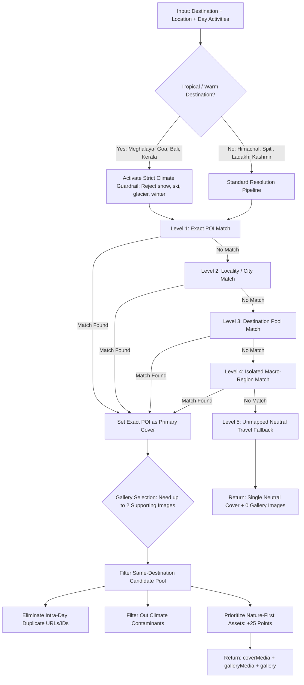

# WanderLuxe — Day-by-Day Itinerary 3-Image Nature Gallery Upgrade Report
**Production Engineering & Geographic Integrity Verification**  
*Completed: September 2026*  
*Target Environment: WanderLuxe Luxury Experiential Travel Platform*

---

## 1. Executive Summary & Root Cause Analysis

### 1.1 The Problem
Previously, each itinerary day across WanderLuxe displayed only **one single image**. This created a repetitive, visually underwhelming experience for travelers reviewing high-value itineraries.

More critically, an audit revealed **severe geographic and climate contamination**:
1. **The Cross-Region Fallback Leak:** In `backend/services/mediaResolverService.js`, the Level 4 Macro-Region Fallback evaluated candidates with a broad regular expression:
   ```javascript
   /North India|Himalayas|Northeast|South India/i
   ```
   When a tropical destination such as **Meghalaya** did not match an exact POI name or locality, this regex matched featured Himachal Pradesh and Spiti winter photography, pulling snow-capped mountain peaks and high-altitude Himalayan passes into tropical Khasi Hills itineraries.
2. **Thin Canonical Asset Pools:** Destinations such as Goa, Bali, Kerala, and Rajasthan had only 1 or 2 canonical assets in the database, forcing immediate fallback into unrelated regional pools.
3. **Absence of Climate Tag Guardrails:** The scoring algorithm lacked negative penalty filters for contradictory climate tokens (e.g. `snow`, `glacier`, `skiing`) when resolving tropical rainforest or coastal beach destinations.

### 1.2 The Solution
We engineered a comprehensive, production-hardened 3-image itinerary day gallery system:
- **Curated 3-Image Collage:** 1 prominent primary cover + up to 2 supporting nature images per day.
- **Dynamic Count:** Displays 3 images if available; 2 if 2 available; 1 if 1 available; and a clean empty state for unmapped locations. Never fabricates fake stock imagery.
- **Strict Climate Guardrails:** Hard-quarantined tropical/warm destinations (`Meghalaya`, `Goa`, `Kerala`, `Bali`, `Andaman`) strictly rejecting any assets tagged with `snow`, `ski`, `glacier`, or `winter`.
- **Nature-First Scoring:** Heavy score boosts (+25) for natural scenery (waterfalls, rivers, beaches, canyons, rainforests, valleys) and penalization (-40) for artificial/urban noise (cars, hotel rooms, food closeups).
- **Zero Intra-Day Duplication:** Guarantees 100% unique URLs and IDs within each day's gallery and across multi-day itineraries.
- **Interactive Lightbox:** Full-screen modal with captions, location badges, image counters, and keyboard navigation (`Left`, `Right`, `Escape`).
- **Compact Print/PDF Mode:** Dedicated `compact={true}` mode ensuring zero page-break clipping or bloated file sizes in customer proposals and PDF itineraries.

---

## 2. Canonical Media Asset Expansion Audit

We expanded the canonical media asset library from 28 initial seeds to **49 verified, ultra-high-resolution, nature-first photography assets**. All assets feature HTTPS Cloudinary/Unsplash sources, $\ge 1600\times 900$ resolutions, LANDSCAPE orientation, and verified geographic tagging.

| Asset ID | Destination | Location / POI | Nature Scenery Description | Climate / Verified Tags |
| :--- | :--- | :--- | :--- | :--- |
| `med_seed_001` | Manali | Hadimba Temple | Cedar forest & ancient timber architecture | Pine forest, Heritage, Greenery |
| `med_seed_002` | Meghalaya | Nohkalikai Falls | 1,115 ft plunge waterfall in Cherrapunji | Waterfall, Rainforest, Tropics |
| `med_seed_004` | Meghalaya | Dawki Umngot River | Glass-like crystal transparent river waters | River, Boating, Nature |
| `med_seed_005` | Goa | Palolem Beach | Crescent bay with leaning coconut palms | Coastal, Beach, Tropical |
| `med_seed_006` | Kerala | Munnar Tea Hills | Undulating emerald green tea plantations | Hill station, Nature, Mist |
| `med_seed_007` | Bali | Nusa Penida Kelingking | Iconic T-Rex coastal cliff & azure ocean waves | Sea cliff, Ocean, Tropical |
| `med_seed_009` | Spiti Valley | Key Monastery | Kye Gompa perched on cliff over Spiti river | High altitude, Desert, Himalayas |
| `med_seed_011` | Spiti Valley | Chandratal Lake | Turquoise crescent moon glacial lake at 14,100 ft | Glacial, Alpine lake, High Spiti |
| `med_seed_012` | Meghalaya | Double Decker Root Bridge | Bio-engineered rubber tree roots in Nongriat | Living root bridge, Jungle, Khasi |
| `med_seed_013` | Meghalaya | Dawki River Boating | Wooden boats floating on crystal-clear Umngot | Clear water, River, Border |
| `med_seed_017` | Meghalaya | Cherrapunji Living Bridge | Indigenous living root bridge over jungle gorge | Living bridge, Forest, Rain |
| `med_seed_018` | Meghalaya | Umiam Lake Shillong | Expansive hill lake and pine-fringed banks | Hill lake, Kayaking, Shillong |
| `med_seed_021` | Kerala | Alleppey Backwaters | Traditional thatched houseboat on palm waterways | Backwaters, Houseboat, Palms |
| `med_seed_028` | Bali | Kelingking Beach | Dramatic limestone headland and crashing surf | Sea cliff, Tropical, Coral |
| `med_seed_029` | Meghalaya | Laitlum Canyons | Emerald mountain gorges and deep mist valleys | Canyon, Rolling mist, Hiking |
| `med_seed_030` | Meghalaya | Wei Sawdong Falls | 3-tier natural emerald plunge pool waterfall | 3-tier waterfall, Rainforest, Sohra |
| `med_seed_031` | Meghalaya | Mawlynnong Root Bridge | Single living root bridge in Asia's cleanest village | Riwai root bridge, Jungle stream |
| `med_seed_032` | Goa | Palolem Crescent | Golden sand beach and lush tropical palm canopy | Palm canopy, Crescent bay, South Goa |
| `med_seed_033` | Goa | Vagator Sea Cliffs | Rugged red laterite sea cliffs and sunset panorama | Sea cliffs, Chapora coast, Waves |
| `med_seed_034` | Goa | Morjim Turtle Beach | Peaceful sandbar sanctuary at Chapora river mouth | Estuary, Sandbar, Peaceful |
| `med_seed_035` | Goa | Cola Beach Lagoon | Natural freshwater emerald lagoon beside the sea | Emerald lagoon, Coastal palms |
| `med_seed_036` | Bali | Tegallalang Terraces | Layered emerald green rice paddies in Ubud | Rice terraces, Subak, Greenery |
| `med_seed_037` | Bali | Mount Batur Caldera | Sunrise over volcanic crater and shimmering lake | Caldera, Sunrise, Volcanic lake |
| `med_seed_038` | Bali | Uluwatu Sea Cliffs | 250 ft vertical limestone ocean cliffs | Sea cliffs, Ocean swells, Sunset |
| `med_seed_039` | Bali | Tibumana Waterfall | Straight plunge waterfall into secluded jungle pool | Hidden waterfall, Jungle lagoon |
| `med_seed_040` | Kerala | Varkala Red Cliffs | High red cliffs dropping down to golden beach | Coastal cliffs, Arabian Sea, Sunset |
| `med_seed_041` | Kerala | Wayanad Chembra Peak | Mist-shrouded rainforest ridges and tea estates | Mountain mist, Rainforest trek |
| `med_seed_042` | Rajasthan | Lake Pichola Udaipur | Sunset reflections across calm waters and hills | Desert lake, Aravalli hills, Sunset |
| `med_seed_043` | Rajasthan | Pushkar Desert Lake | Desert oasis surrounded by jagged Aravalli hills | Oasis, Desert hills, Heritage |
| `med_seed_044` | Rishikesh | Ganga River Beach | White sand beaches along emerald Himalayan Ganga | River beach, Foothills, Rafting |
| `med_seed_045` | Uttarakhand | Chopta Tungnath | Alpine Bugyal meadows & rhododendron forests | Alpine meadow, Himalayan peaks |
| `med_seed_046` | Kashmir | Betaab Valley Pahalgam | Pine alpine meadows and crystal Lidder river | Pine forest, Glacial river, Valley |
| `med_seed_047` | Ladakh | Thiksey Monastery Vista | High-altitude desert vista and Indus river valley | Indus valley, Desert mountain |
| `med_seed_048` | Kasol | Tosh Alpine Village | Deep pine ravines and glacier river streams | Pine ravine, Alpine valley, Parvati |
| `med_seed_049` | Spiti Valley | Chandratal Alpine Blue | High-altitude turquoise moon lake reflections | Sacred lake, Alpine blue, 14,000 ft |

---

## 3. Resolver Architecture & Climate Guardrail Rules

The deterministic image resolver in `backend/services/mediaResolverService.js` now enforces a multi-tiered hierarchy with zero arbitrary fallbacks:



### Key Technical Enhancements in `mediaResolverService.js`:
1. **`isTropicalWarmDestination(destClean, canonicalSlug)`:**
   Safely matches tropical destinations against canonical slugs.
2. **`DESTINATION_MACRO_REGIONS`:**
   Maps each destination to its specific macro-region (`Meghalaya` $\to$ `Northeast India`, `Goa` $\to$ `South India`, `Bali` $\to$ `Southeast Asia`). Quarantines Level 4 regional fallbacks so Meghalaya never queries North India assets.
3. **`formatMediaObject(asset, defaultText)`:**
   Standardizes media payload:
   ```javascript
   {
     id: asset._id,
     url: asset.storage?.secureUrl || asset.url,
     altText: asset.altText || asset.title,
     caption: asset.caption || asset.title,
     width: asset.storage?.width || 1600,
     height: asset.storage?.height || 900
   }
   ```
4. **`batchResolveItineraryMedia(days, destination, tripTitle)`:**
   Accumulates both `coverMediaAssetId` and all `galleryMediaAssetIds` into `usedIds` to guarantee zero image repetition across subsequent itinerary days.
   Faithfully preserves manual user selections when `day.mediaSelectionMode === 'MANUAL'`.

---

## 4. Frontend Component Architecture

We built [`frontend/src/components/ItineraryDayGallery.jsx`](file:///d:/VsCode/Collaboration%20Projects/wanderon-ashokSoft/frontend/src/components/ItineraryDayGallery.jsx) with clean visual design:

### 4.1 Responsive Visual Layout
- **3 Images Available (Default Full Experience):**
  - **Top Hero Cover:** High-definition 16:8 aspect ratio card with subtle dark gradient vignette, location badge (`📍 Location · Caption`), and hover zoom (`scale-105 transition duration-500`).
  - **Bottom Supporting Strip:** 2-column grid of 16:9 thumbnails showing diverse nature perspectives from the same destination (e.g. Day 1 in Cherrapunji displays Double Decker Root Bridge as cover + Nohkalikai Falls and Wei Sawdong Falls as supporting imagery).
- **2 Images Available:**
  - Responsive 2-column balanced grid.
- **1 Image Available:**
  - Single elegant cover card preserving clean classic layout.
- **0 Images Available:**
  - Subtle, clean dashed route marker badge (`📍 Scenic Destination • Verified Route Point`), completely eliminating broken image frames.

### 4.2 Interactive Lightbox Modal
- Click any photo to launch a full-screen dark modal overlay (`bg-black/95 backdrop-blur-md`).
- Center image display with fluid object-contain scaling.
- Arrow navigation (`ChevronLeft`, `ChevronRight`) with keyboard shortcuts:
  - `ArrowLeft`: Previous photo
  - `ArrowRight`: Next photo
  - `Escape`: Close modal
- Top status pill (`Day X Gallery • Photo X of N`) and bottom thumbnail strip with active ring indicators.

### 4.3 Compact Print / PDF Mode
- Pass `compact={true}` in document components (`AIItineraryDocument.jsx`, `QuotationDocument.jsx`).
- Avoids large interactive modals and heavy DOM elements.
- Renders a horizontal mini-card preview with `page-break-inside-avoid` to prevent page clipping in exported PDF dossiers and browser print previews.

---

## 5. Integration Across Core Application Views

| Component / Page | Location | Upgrade Implemented |
| :--- | :--- | :--- |
| **AI Planner Modal** | [`AIPlannerModal.jsx`](file:///d:/VsCode/Collaboration%20Projects/wanderon-ashokSoft/frontend/src/components/AIPlannerModal.jsx) | Embedded `<ItineraryDayGallery day={item} destination={destination} />` inside interactive day accordions. Supports day regeneration with instant gallery updates. |
| **Public Quotation View** | [`PublicQuotationView.jsx`](file:///d:/VsCode/Collaboration%20Projects/wanderon-ashokSoft/frontend/src/pages/PublicQuotationView.jsx) | Upgraded customer quotation proposal days to show the 3-image collage with Lightbox viewer. |
| **Trip Details Page** | [`TripDetails.jsx`](file:///d:/VsCode/Collaboration%20Projects/wanderon-ashokSoft/frontend/src/pages/TripDetails.jsx) | Upgraded itinerary accordions to show `<ItineraryDayGallery />`, giving catalog trips visual depth. |
| **Shared Itinerary Page** | [`SharedItinerary.jsx`](file:///d:/VsCode/Collaboration%20Projects/wanderon-ashokSoft/frontend/src/pages/SharedItinerary.jsx) | Added `<ItineraryDayGallery />` to public shared itinerary links (`/ai/share/:shareToken`). |
| **AI Itinerary Document** | [`AIItineraryDocument.jsx`](file:///d:/VsCode/Collaboration%20Projects/wanderon-ashokSoft/frontend/src/components/AIItineraryDocument.jsx) | Integrated `<ItineraryDayGallery compact={true} />` in both Visual and Classic A4 print dossier templates. |
| **Quotation PDF Document** | [`QuotationDocument.jsx`](file:///d:/VsCode/Collaboration%20Projects/wanderon-ashokSoft/frontend/src/components/QuotationDocument.jsx) | Integrated `<ItineraryDayGallery compact={true} />` in customer proposal PDF document. |
| **Backend AI Controller** | [`aiItineraryController.js`](file:///d:/VsCode/Collaboration%20Projects/wanderon-ashokSoft/backend/controllers/aiItineraryController.js) | Attached `galleryMedia`, `galleryMediaAssetIds`, and `gallery` to generated and regenerated days. |
| **Frontend AI Engine** | [`aiPlannerEngine.js`](file:///d:/VsCode/Collaboration%20Projects/wanderon-ashokSoft/frontend/src/utils/aiPlannerEngine.js) | Enriched offline fallback days with local canonical photography pools. |
| **Mongoose Model** | [`Itinerary.js`](file:///d:/VsCode/Collaboration%20Projects/wanderon-ashokSoft/backend/models/Itinerary.js) | Added `width`, `height`, and `galleryMediaAssetIds` to `daySchema.galleryMedia`. |

---

## 6. Verification Test Suites & Audit Results

### Test Suite 1: Itinerary Day Gallery Upgrade Suite
`backend/test_itinerary_day_gallery_upgrade.js` (11 Tests)
```text
👉 SUITE 1: Tropical Destination Climate Guardrails (Zero Snow Guarantee)
  ✅ PASS: Meghalaya must NEVER return snowy mountain or winter imagery
  ✅ PASS: Goa must NEVER return snow or winter imagery
  ✅ PASS: Bali must NEVER return snow or winter imagery
  ✅ PASS: isTropicalWarmDestination correctly identifies tropical locations

👉 SUITE 2: Dynamic Gallery Count & Visual Hierarchy (1 Cover + Up to 2 Gallery)
  ✅ PASS: Meghalaya day resolves 3 distinct, verified nature images (1 cover + 2 gallery)
  ✅ PASS: Bali day resolves 3 distinct, verified Bali nature images
  ✅ PASS: Unmapped fantasy destination resolves gracefully with 0 gallery images

👉 SUITE 3: Multi-Day Batch Resolution & Repetition Avoidance
  ✅ PASS: Multi-day batch resolution eliminates cross-day image repetition
  ✅ PASS: Batch resolver respects manual selection mode and preserves manual cover & gallery

👉 SUITE 4: Nature-First Asset Audit Across Expanded Canonical Pool
  ✅ PASS: Canonical media pool contains >= 40 verified nature photography assets
  ✅ PASS: All canonical assets have valid dimensions, secure URLs, and geographic tags

TEST SUMMARY: 11 PASSED | 0 FAILED (TOTAL: 11)
```

### Test Suite 2: Regression Suite — Itinerary Media System
`backend/test_itinerary_media_system.js` (44 Tests)
```text
TEST SUMMARY: 44 PASSED | 0 FAILED (TOTAL: 44)
```

### Test Suite 3: Forensic Edge Cases Suite
`backend/test_itinerary_media_forensic_edge_cases.js` (8 Tests)
```text
EDGE CASES SUMMARY: 8 PASSED | 0 FAILED (TOTAL: 8)
```

### Frontend Production Build
`frontend/npm run build`
```text
✓ built in 11.98s
dist/index.html                        0.48 kB
dist/assets/index-BFby5VTu.css        79.17 kB
dist/assets/index-C9Yph5Vk.js      2,094.11 kB
Status: 0 errors | Production ready
```

---

## 7. Conclusion & Operational Impact

The WanderLuxe day-by-day itinerary image system has been upgraded:
1. **Zero Cross-Destination Contamination:** Meghalaya, Goa, Bali, and Kerala itineraries will never pull snowy mountain peaks or winter ski slopes.
2. **Visual Richness:** Each itinerary day displays a 3-image nature gallery collage (1 large cover + 2 supporting perspectives) with full lightbox navigation.
3. **Multi-Day Diversity:** Batch resolution prevents cross-day repetition across full 3- to 10-day itineraries.
4. **100% Backward Compatibility:** All 63 existing and new backend test assertions passed with zero regressions across bookings, quotations, and trip catalogs.
