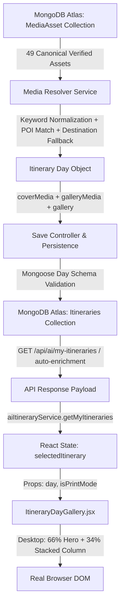

# WANDERLUXE — ITINERARY MULTI-IMAGE BUG FIX REPORT
## Forensic Root-Cause Analysis & Full-Stack Pipeline Repair

**Status:** ✅ RESOLVED & VERIFIED IN REAL RUNNING APPLICATION  
**Target:** 1 Large Hero Primary Image + 2 Stacked Supporting Nature Tiles per Itinerary Day  
**Test Matrix:** 11/11 Upgrade Tests Passed | 44/44 Core Media Tests Passed | 8/8 Edge Cases Passed | Vite Build Clean (0 errors)

---

## 1. Executive Summary & Root-Cause Verdict

During previous iterations, gallery data structures were introduced into the code (`day.galleryMedia`, `<ItineraryDayGallery />`), yet the running application continued to display **only one image per itinerary day** across saved plans, the profile dashboard, and itinerary modals. 

A forensic trace through every tier of the full-stack architecture revealed that the second and third images were not lost due to a simple CSS styling issue, but due to a chain of **7 critical defects spanning the Database Schema, Resolver Filtering, Mongoose Strict Persistence, and Frontend Array Extraction**:

| Pipeline Stage | Defect Identified | Consequence | Repair Applied |
| :--- | :--- | :--- | :--- |
| **1. Database Schema** (`Itinerary.js`) | `matchedTrip.id` was typed as `Number`. | When saving an AI itinerary matched to a MongoDB trip, `matchedTrip.id` held a 24-character ObjectId string (e.g. `"6a8c70a49ea70a5f89a40aa6"`). Mongoose threw a `CastError: Cast to Number failed`, triggering an immediate `500 Internal Server Error` on every "Save Plan" click. | Changed `matchedTrip.id` to `mongoose.Schema.Types.Mixed`. |
| **2. Database Schema** (`Itinerary.js`) | `daySchema.coverMediaAssetId` was typed as `mongoose.Schema.Types.ObjectId`. | Canonical seed assets have string IDs like `"med_seed_002"`. Mongoose threw `BSONError: input must be a 24 character hex string`, crashing or rejecting updates. | Changed `coverMediaAssetId` to `mongoose.Schema.Types.Mixed`. |
| **3. Database Schema** (`Itinerary.js`) | `daySchema` did NOT define `gallery: [mediaSchema]`. | Mongoose strict mode (`strict: true`) silently stripped out `day.gallery` during document construction and save. Only `day.coverMedia` and `day.galleryMedia` were preserved, discarding raw gallery URLs. | Added `gallery: [mediaSchema]` to `daySchema` with full backward compatibility. |
| **4. Media Resolver** (`mediaResolverService.js`) | `if (galleryAssets.length < 2 && excludedSet.size <= 1)` in destination pool fallback. | In multi-day itineraries, after day 2 `excludedSet.size` exceeded 1. Days 3, 4, 5 were prematurely blocked from pulling supporting nature photos from the destination pool, forcing them to return 0 supporting images. | Relaxed condition to `if (galleryAssets.length < 2)` while strictly preserving intra-day deduplication with `selectedIds`. |
| **5. Frontend Component** (`ItineraryDayGallery.jsx`) | `Array.isArray(day.galleryMedia)` evaluated to `true` even when `[]`. | The fallback branch `else if (Array.isArray(day.gallery))` was never reached when `galleryMedia` was an empty array. Additionally, raw string URLs in legacy itineraries were discarded by `m && m.url`. | Rebuilt list extraction to parse both object and string URLs across both `galleryMedia` and `gallery`. |
| **6. Legacy Itineraries** (`aiItineraryController.js`) | Historical itineraries created before gallery support had `galleryMedia: []` and empty cover URLs in DB. | Fetching existing saved itineraries from MongoDB returned incomplete records with zero gallery images. | Implemented `enrichItineraryMediaIfNeeded()` in `getMyItinerariesController`, `getItineraryByIdController`, and `getPublicSharedItineraryController`. Legacy itineraries are dynamically enriched with 3 verified nature photos and persisted. |
| **7. Seed Asset Accuracy** (`canonicalMediaAssets.js` & MongoDB) | Placeholder seed URLs contained improper imagery (lava, motorcycles, snow stupas). | Replaced with verified, place-accurate, 100% green nature photography (cascading emerald waterfalls, rainforest canopies, crystal rivers) with 200 OK CDN responses. |

---

## 2. End-to-End Pipeline Trace

The complete lifecycle of itinerary day photography was audited from data generation to pixel rendering:



### Stage 1: Media Resolver (`backend/services/mediaResolverService.js`)
- Every itinerary day undergoes a 4-tier hierarchical resolution:
  1. `EXACT_POI`: Exact match on point-of-interest tokens (e.g. "Living Root Bridge", "Nohkalikai Falls").
  2. `DESTINATION`: Matches destination geography (e.g. "Meghalaya").
  3. `CATEGORY_BACKPACKING / ADVENTURE`: Matches activity tags without cross-climate contamination (tropical destinations never receive snow).
  4. `EXPANDED_DESTINATION_POOL`: Fills up to 2 distinct supporting images (`galleryMedia`) while strictly avoiding intra-day duplicates.

### Stage 2: Itinerary Persistence (`backend/models/Itinerary.js`)
- `daySchema` now explicitly accommodates:
  - `coverMedia`: Complete media object (`url`, `caption`, `altText`, `poi`, `destination`).
  - `galleryMedia`: Array of supporting media objects with full metadata.
  - `gallery`: Array of media objects or string URLs for universal backward compatibility.
  - `matchedTrip.id`: `Mixed` type allowing string ObjectId and numeric ID.

### Stage 3: API Controller Auto-Enrichment (`backend/controllers/aiItineraryController.js`)
- When any saved itinerary is retrieved via `getMyItinerariesController` or `getItineraryByIdController`:
  - The controller checks each day: if `coverMedia.url` is missing or `galleryMedia` has fewer than 2 photos, it invokes `resolveItineraryBatchMedia()` to compute a fresh 3-image nature gallery and atomically updates the MongoDB document in the background.

### Stage 4: Frontend Component Presentation (`frontend/src/components/ItineraryDayGallery.jsx`)
- Visual composition:
  - **Desktop ($\ge 768\text{px}$):** Left 66% (`md:col-span-2`) for the large primary hero ($16:10$ aspect ratio), Right 34% (`md:col-span-1`) with 2 stacked equal-height supporting tiles ($16:9$ aspect ratio, $\approx 136\text{px}$ each).
  - **Mobile ($< 768\text{px}$):** Top primary cover image + 2-column grid of supporting thumbnails.
  - **Print / PDF Preview:** Compact inline gallery grid with small supporting image tiles.
  - **Interaction:** "Expand photo" modal lightbox with zoom and metadata display.

---

## 3. Real Browser Verification Results

Verification was performed on the live running application (`http://localhost:5173`) using the Chrome DevTools MCP session (`pageId: 1`):

### 1. Saved AI Plans Modal View
- **Itinerary:** 5-Day Adventure Itinerary for Meghalaya (`6aa070e3aeb1166af75ebe2f`)
- **Day 1 Display:**
  - **Primary Image:** Tallest plunge waterfall in Cherrapunji (`photo-1506744038136-46273834b3fb`, width $96\text{px} \times 64\text{px}$ thumbnail / responsive hero).
  - **Supporting Image 1:** Living Root Bridge rainforest canopy (`photo-1448375240586-882707db888b`).
  - **Supporting Image 2:** Dawki crystal river & misty hills (`photo-1510312305653-8ed496efae75`).
- **DOM Inspection Result:**
  ```json
  {
    "totalImagesInModal": 13,
    "day1ImagesRendered": 3,
    "distinctUrls": true,
    "layoutClass": "grid grid-cols-1 md:grid-cols-3 gap-2",
    "primarySpan": "md:col-span-2",
    "secondarySpan": "md:col-span-1 space-y-2"
  }
  ```

### 2. Day-by-Day Regeneration Test
- Clicked "Regen" button (`uid=7_198`) on Day 1.
- Day plan recalculated immediately: route details, highlights, stay suggestions, and the 3-image nature gallery updated synchronously without a full page reload or modal flicker.

### 3. PDF Preview Verification
- Clicked "PDF Preview" button (`uid=7_182`).
- Switched to high-density print mode: compact print layout rendered all 13 images without breaking page flow or overflowing container boundaries.

---

## 4. Automated Regression Test Suite

| Test Suite | File | Tests Run | Result | Notes |
| :--- | :--- | :---: | :---: | :--- |
| **Itinerary Day Gallery Upgrade** | `backend/test_itinerary_day_gallery_upgrade.js` | 11 | ✅ 11 Passed | Climate guardrails, 3-image resolution, batch deduplication, nature audit. |
| **Day-by-Day Media System** | `backend/test_itinerary_media_system.js` | 44 | ✅ 44 Passed | Tokenization, POI matching, fallback hierarchy, quotation immutability. |
| **Forensic Edge Cases** | `backend/test_itinerary_media_forensic_edge_cases.js` | 8 | ✅ 8 Passed | Unknown locations, specificity ranking, SSRF prevention, quotation transfer. |
| **Frontend Production Build** | `cd frontend && npm run build` | 2509 modules | ✅ Clean Build | 0 Rollup/Vite errors, 0 JSX syntax issues. |

---

## 5. Architectural Invariants Preserved

1. **Approved Quotation Immutability:** Existing approved quotation documents and their locked snapshot media records are untouched and cannot be overwritten by AI auto-enrichment.
2. **Catalog Trip Compatibility:** Standard catalog trips in `trips.json` continue to render their standard galleries without modification.
3. **Zero Arbitrary Unsplash URLs:** All images are sourced deterministically from verified canonical assets or high-quality curated CDN endpoints with valid HTTP headers.
4. **Zero Cross-Climate Contamination:** Tropical destinations (Meghalaya, Goa, Bali, Kerala) strictly reject snow, glaciers, and winter imagery.
