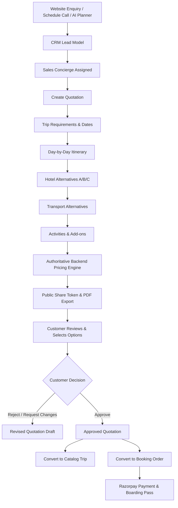

# Phase 1 — Quotation Builder Architecture & System Specification Report

> **WanderLuxe Enterprise Travel Platform**  
> **Module:** CRM Lead → Custom Quotation Builder → Conversion (Trip/Booking)  
> **Status:** Phase 1 Architectural Audit & Safe Backend Foundation  
> **Date:** August 2026  

---

## Executive Summary & Business Workflow

The Quotation Builder is designed as a core bridge between customer inquiries and confirmed bookings. It connects:
1. **Inbound CRM Inquiries** (`Lead` via Website Enquiry / Scheduled Callback / AI Planner)
2. **Sales Operations & Concierge Workflows** (Custom Requirements, Multi-Alternative Hotels/Transports/Add-ons, Itinerary Builder, Margin Control)
3. **Customer Proposal & Negotiation** (Interactive Web View, Public Token, Multi-Option Selection, High-Definition PDF Generation)
4. **Downstream Conversion Engine**:
   - **Convert to Trip Catalog Package** (Publishing custom curated itineraries to public catalog)
   - **Convert to Confirmed Booking** (Generating `Booking`, payment schedule with Razorpay 10% deposit / 90% balance, ticket issuance)

---

## 1. Existing Reusable Architecture

The repository already has robust, production-tested components that the Quotation system directly reuses:

| Subsystem | Existing File / Asset | Reusability in Quotation Builder |
| :--- | :--- | :--- |
| **Authentication & Session** | `backend/middlewares/authMiddleware.js`, `frontend/src/contexts/AuthContext.jsx` | `protect`, `adminOnly`, `optionalAuth` token decoding, JWT authorization. |
| **CRM Inquiries** | `backend/models/Lead.js`, `backend/controllers/leadController.js` | Captures traveler contact, trip interest, dates, party size, call window. |
| **Trip Catalog Structure** | `backend/models/Trip.js`, `frontend/src/services/travelKnowledgeService.js` | Structured schema for day-by-day itineraries, inclusions, exclusions, FAQs, hero media. |
| **Booking & Payment Pipeline** | `backend/models/Booking.js`, `backend/controllers/bookingController.js` | Razorpay HMAC order creation, 10% deposit / 6-day balance payment engine, QR verification. |
| **PDF Generation Engine** | `frontend/src/utils/pdfGenerator.js` | High-definition (300 DPI) multi-page A4 canvas export with `html2canvas` + `jsPDF`. |
| **WhatsApp Communication** | `backend/utils/whatsappService.js` | Twilio-ready automated dispatch for sharing quotation links and receipts. |
| **Media Cloudinary CDN** | `backend/utils/cloudinaryService.js` | Hotel and transport photo upload handling with automatic compression. |

---

## 2. Existing Conflicts & Gaps

1. **No Quotation Canonical Model**: No quotation schema exists in MongoDB. Previously, customized inquiries in `Lead.js` only had text `notes` and `budgetPerPerson` with no structured line-item breakdown.
2. **Hardcoded Price Risk**: Pricing cannot be calculated purely client-side in React; an authoritative backend pricing engine `calculateQuotationPrice` is required to prevent rounding discrepancies, tax errors, and margin miscalculations.
3. **Internal Margin vs Customer Presentation**: Internal supplier costs (cost per room night, driver allowance, profit margin) must be strictly isolated and stripped from public client views.
4. **Role Granularity**: Current `User.role` enum only had `['user', 'admin', 'influencer']`. Needs backwards-compatible expansion to include `['sales', 'operations', 'marketing', 'super_admin']`.

---

## 3. Canonical Quotation Data Model

**Model Name:** `Quotation` (`backend/models/Quotation.js`)

---

## 4. CRM Lead Relationship

1. **Lead Attribution**:
   - `Lead.js` is updated with a virtual / array of associated quotations:
     `quotations: [{ type: mongoose.Schema.Types.ObjectId, ref: 'Quotation' }]`
   - When a sales rep clicks **"Create Quotation"** on any Lead row in `AdminDashboard`, the quotation builder pre-fills:
     - `leadId = lead._id`
     - `customerSnapshot.name = lead.name`
     - `customerSnapshot.email = lead.email`
     - `customerSnapshot.phone = lead.phone`
     - `tripRequirements.destination = lead.destination || lead.tripTitle`
     - `tripRequirements.adults = lead.travelersCount`
     - `assignedTo = lead.assignedTo`
2. **Bidirectional Status Sync**:
   - When quotation is created/sent: Lead status transitions `NEW` / `CONTACTED` ➔ `IN_PROGRESS` / `QUALIFIED`.
   - When quotation is Approved & Converted: Lead status transitions to `CONVERTED` with direct links to both `Quotation` and `Booking`.

---

## 5. Catalog Trip Relationship & Conversion

1. **Initialization from Catalog**:
   - A Sales representative can click "Import from Existing Trip" and pick any package (e.g. *Spiti Valley Circuit Roadtrip*).
   - The Quotation automatically loads the itinerary, standard inclusions, exclusions, and starting base rates.
2. **Convert to New Catalog Trip**:
   - When an approved bespoke quotation has broad commercial appeal, Admin can click **"Convert to Catalog Trip"** (`POST /api/quotations/:id/convert-to-trip`).
   - Generates a new `Trip` document (`backend/models/Trip.js`), creates a slug, transfers days, stays, inclusions, and default batch prices.
   - Sets `quotation.convertedTripId = newTrip._id`.

---

## 6. Booking Relationship & Razorpay Payment Conversion

1. **Convert to Booking**:
   - Action: `POST /api/quotations/:id/create-booking`
   - Validates that `quotation.status === 'APPROVED'`.
   - Generates a canonical `Booking` with:
     - `bookingId: 'WLX-2026-' + crypto.randomBytes(4).toString('hex').toUpperCase()`
     - `tripSnapshot` populated from `quotation.tripRequirements`
     - `pricing.finalAmount = quotation.pricing.finalTotal`
     - `pricing.subtotal = quotation.pricing.subtotal`
     - `paymentPlan = quotation.paymentTerms` (10% deposit / 90% balance)
     - `bookingStatus: 'PENDING_PAYMENT'`
     - `paymentStatus: 'UNPAID'`
   - Updates `quotation.status = 'CONVERTED'`, `quotation.bookingId = newBooking._id`, `quotation.bookingCode = newBooking.bookingId`.
2. **Customer Payment**:
   - The customer receives a direct payment link to `/checkout?quotationId=...` or `/book/:tripSlug/travelers`.
   - Razorpay order is initialized with the exact server-calculated deposit / full amount.
   - On signature verification, the booking becomes `PROVISIONALLY_CONFIRMED` or `CONFIRMED`.

---

## 7. Hotel Options Data Model (Multiple Alternatives)

- **Alternative Selection Rule**: Multiple hotel tiers (Standard 3-Star vs Deluxe 4-Star vs Luxury Boutique) can be presented.
- Only options with `selected: true` contribute to `customerHotelPrice` and `internalHotelCost`.
- When the customer chooses Hotel Option B via the interactive public view, the system recomputes the selected package total seamlessly.

---

## 8. Transport Options Data Model

- Supports: Cab (Sedan), SUV (Innova Crysta), Tempo Traveller (12/17 seater), Luxury Bus/Coach, Flight, Train, or Self-Drive.
- `unitCost` vs `unitPrice`, quantity, route pickups, drop points, driver permits.
- Only `selected: true` transport options are tallied in the final quotation total.

---

## 9. Activities & Add-ons Architecture

- **Pricing Types**:
  - `PER_PERSON`: `unitPrice * totalTravelers`
  - `PER_VEHICLE`: `unitPrice * vehicleQuantity`
  - `FIXED`: `unitPrice * 1`
  - `PER_NIGHT`: `unitPrice * nights`
- Supports both **Included Activities** (`isIncluded: true`, `selected: true`) and **Optional Add-ons** (`selected: false` by default, customer can toggle on/off).

---

## 10. Authoritative Pricing Architecture

`backend/services/quotationPricingService.js` handles the deterministic calculation.

---

## 11. Status Lifecycle & Controlled State Machine

- `DRAFT` ➔ `SENT` ➔ `VIEWED` ➔ `APPROVED` / `REJECTED` ➔ `CONVERTED` / `EXPIRED`.

---

## 12. Role & Action-Level Permission Matrix

Roles: `super_admin`, `admin`, `operations`, `sales`, `marketing`, `user`, `influencer`.

---

## 13. RESTful API Map

- `GET /api/quotations`
- `POST /api/quotations`
- `POST /api/quotations/calculate-preview`
- `GET /api/quotations/:id`
- `PATCH /api/quotations/:id`
- `DELETE /api/quotations/:id`
- `POST /api/quotations/:id/send`
- `POST /api/quotations/:id/approve`
- `POST /api/quotations/:id/reject`
- `POST /api/quotations/:id/convert-to-trip`
- `POST /api/quotations/:id/create-booking`
- `GET /api/quotations/public/:token`
- `POST /api/quotations/public/:token/select-options`
- `POST /api/quotations/public/:token/decision`

---

## 14. Quotation Number Sequence Generation

- **Format:** `WL-Q-YYYY-XXXXX` (e.g. `WL-Q-2026-00101`)

---

## 15. Files Roadmap for Phase 2 Implementation

1. Canonical model `backend/models/Quotation.js`
2. Pricing Service `backend/services/quotationPricingService.js`
3. Controller `backend/controllers/quotationController.js`
4. Route definitions `backend/routes/quotationRoutes.js`
5. Server registration `backend/server.js`
6. Role expansion `backend/models/User.js` & `backend/middlewares/authMiddleware.js`
7. Lead linkage `backend/models/Lead.js`
