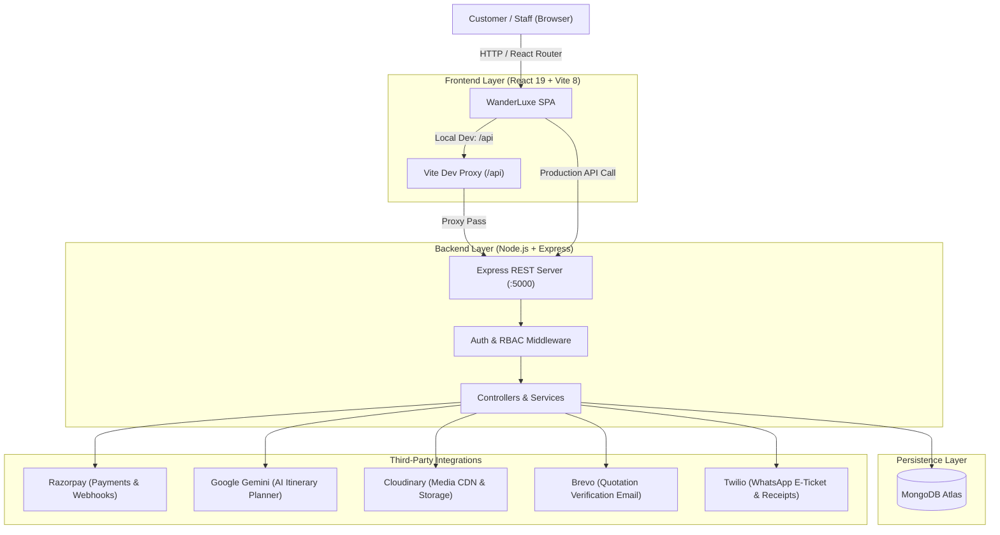
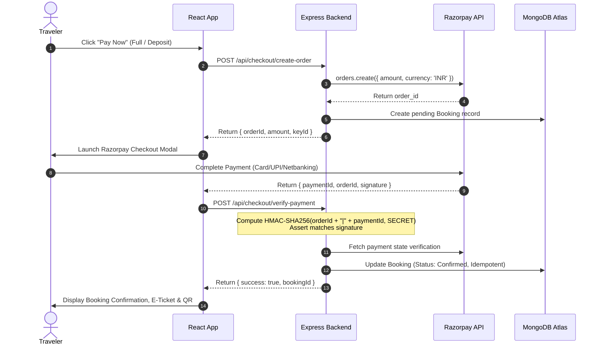

# WanderLuxe — Architecture & Technical Design

This document details the high-level architecture, module design, and data flows of the WanderLuxe luxury travel platform. It serves as an engineering reference for understanding how system components interact.

---

## Table of Contents

1. [Architecture at a Glance](#architecture-at-a-glance)
2. [Technology Stack](#technology-stack)
3. [Repository Directory Structure](#repository-directory-structure)
4. [Request Lifecycle & Routing](#request-lifecycle--routing)
5. [Authentication & Authorization (RBAC)](#authentication--authorization-rbac)
6. [Staff Workspace Architecture](#staff-workspace-architecture)
7. [Quotation V2 System](#quotation-v2-system)
8. [Payment & Booking Engine](#payment--booking-engine)
9. [AI Itinerary Planner 2.0](#ai-itinerary-planner-20)
10. [External Integrations Matrix](#external-integrations-matrix)
11. [When Docs and Code Differ](#when-docs-and-code-differ)

---

## Architecture at a Glance

WanderLuxe is built as a decoupled full-stack web application consisting of a React Single-Page Application (SPA) frontend and a Node.js Express REST API backend, backed by MongoDB Atlas.



---

## Technology Stack

| Layer | Technologies | Purpose |
| :--- | :--- | :--- |
| **Frontend** | React 19, Vite 8, React Router 7, Tailwind CSS, Lucide React, Framer Motion | High-performance client SPA with responsive, luxury-themed styling |
| **Backend** | Node.js 22 LTS, Express 4, Mongoose 8, JWT, bcryptjs | RESTful API server with strict RBAC, data validation, and crypto verification |
| **Database** | MongoDB Atlas (Mongoose ODM) | Document database with additive schema versioning and indexing |
| **Payments** | Razorpay SDK (Order API, Checkout, Webhooks, HMAC SHA-256 verification) | Full payment lifecycle, deposit/balance schedules, and instant verification |
| **AI Synthesis** | Google Generative AI (`gemini-1.5-flash`) | Context-aware, structured travel itinerary generation |
| **Media** | Cloudinary SDK (with local disk `./uploads` dev fallback) | Media management, CDN delivery, and optimization |
| **Communications** | Brevo REST API v3, Twilio REST API | Transactional OTP verification emails and WhatsApp boarding passes |
| **Document Generation** | jsPDF, html2canvas, node-qrcode | Client-side and server-side receipt, boarding pass, and quotation PDF generation |

---

## Repository Directory Structure

```text
wanderon-ashokSoft/
├── backend/
│   ├── config/             # DB connection, DNS overrides, environment validation
│   ├── constants/          # Static enumeration tokens, attachment categories
│   ├── controllers/        # Express route request handlers
│   ├── middlewares/        # JWT verification, RBAC guards, error handling
│   ├── models/             # Mongoose schemas (User, Trip, Booking, Quotation, etc.)
│   ├── routes/             # REST endpoint route declarations
│   ├── scripts/            # Database migrations, staff creation, diagnostics
│   ├── services/           # Reusable business logic (pricing, emails, Razorpay)
│   ├── utils/              # Helper utilities (Cloudinary, WhatsApp, formatting)
│   ├── server.js           # Server entry point, middleware wiring, health probes
│   ├── package.json        # Backend dependencies and test scripts
│   └── .env.example        # Backend environment template
├── frontend/
│   ├── public/             # Static public assets (favicons, manifest)
│   ├── src/
│   │   ├── assets/         # Bundled image assets and logos
│   │   ├── components/     # Shared UI components (Navbar, Footer, Modals)
│   │   ├── contexts/       # React Contexts (AuthContext, CartContext)
│   │   ├── data/           # Static travel knowledge bases (travelKnowledge.json)
│   │   ├── pages/          # Top-level page views (Home, Checkout, Profile, Login)
│   │   ├── quotation-v2/   # Customer and staff quotation presentation components
│   │   ├── services/       # Client API abstraction (api.js, apiConfig.js)
│   │   ├── staff/          # Staff Control Center (StaffShell, staffAccess.js)
│   │   └── utils/          # Client utilities (pdfGenerator.js, razorpay.js)
│   ├── index.html          # HTML entry point
│   ├── vite.config.js      # Vite configuration, strictPort: 5173, proxy settings
│   ├── vercel.json         # SPA fallback rewrite configuration for Vercel
│   ├── package.json        # Frontend dependencies and scripts
│   └── .env.example        # Frontend environment template
├── docs/                   # Authoritative developer documentation
├── scripts/                # Root integrity & data validation scripts
├── .nvmrc                  # Node version pin (22)
├── .node-version           # Node version pin (22)
└── .gitattributes          # Line endings and cross-platform git rules
```

---

## Request Lifecycle & Routing

### 1. Local Development Lifecycle

1. The developer navigates to `http://localhost:5173`. Vite serves the React SPA.
2. When the React app makes an API request (e.g. `fetch('/api/trips')`), the Vite development proxy intercepts `/api` and forwards the request to `http://localhost:5000/api/trips`.
3. Express receives the request:
   - Dynamic CORS middleware checks origin matching.
   - Request passes through security headers (`nosniff`, `strict-origin-when-cross-origin`).
   - Route handlers and optional `protect` / `requireRoles` middlewares validate the session.
   - Controllers call business services or Mongoose models.
   - JSON response returns back through the Vite proxy to the React app.

### 2. Production Lifecycle

- **Frontend**: Hosted on **Vercel** as a static Single Page Application. All routes rewrite to `/index.html` via `vercel.json`.
- **Backend**: Hosted on **Render** as a long-running Node service.
- **API Routing**: Frontend points to `VITE_API_URL=https://api.wanderluxe.com`.
- **CORS**: Express validates incoming requests against `FRONTEND_URL` and `ALLOWED_ORIGINS`.

---

## Authentication & Authorization (RBAC)

### 1. Authentication Flow

- **Token Storage**: On successful login (`POST /api/auth/login`), the backend signs a JSON Web Token (JWT) using `JWT_SECRET`. The client stores this token in browser `localStorage` under the key `wanderluxe_token`.
- **Session Restoration**: When the app boots, `AuthContext` calls `GET /api/auth/me` with the `Authorization: Bearer <token>` header to restore user profile state and permissions.
- **Fail-Closed DB Guard**: `authMiddleware.js` verifies `mongoose.connection.readyState === 1`. If MongoDB is disconnected, authentication endpoints return **HTTP 503** rather than hanging or generating cryptic crashes.

### 2. Role-Based Access Control (RBAC)

The application defines 7 explicit user roles:

| Role | Classification | Description & Capabilities |
| :--- | :--- | :--- |
| `super_admin` | Staff | Complete access across all workspaces, user management, and payouts. |
| `admin` | Staff | Full administrative control: trips, bookings, team analytics, media library. |
| `sales` | Staff | Sales portal: leads, expert inquiries, quotation builder, and customer bookings. |
| `marketing` | Staff | Marketing workspace: campaigns, banners, and lead acquisition analytics. |
| `operations` | Staff | Operations Control Center for confirmed departure monitoring, trip execution, team tasks, customer update history, Incidents, coordinators, and the Vendor directory. |
| `user` | Customer | Standard traveler account for browsing, booking, and profile history. |
| `influencer` | Creator | Affiliate / creator account for promo codes, referral tracking, and earnings. |

Role enforcement occurs at two levels:
1. **Backend Route Guards**: `requireRoles(...)`, `adminOnly`, `salesOrAdmin`, `marketingOrAdmin` in `backend/middlewares/authMiddleware.js`.
2. **Frontend UI Guards**: `StaffModuleRoute` and `canAccessStaffRoute` in `frontend/src/staff/staffAccess.js`.

---

## Staff Workspace Architecture

The staff portal is accessed at `/staff/*` and is organized around `StaffShell`:

```text
/staff/
├── admin/          # Admin Overview, Analytics, Trips, Bookings, Media Library, Users
├── operations/     # Live dashboard, Trip Execution, Tasks, Issues, and Vendors
├── sales/          # Shared Sales Queue, Expert Requests, Quotations, Bookings
└── marketing/      # Marketing Overview, Campaign Management, Banners, Analytics
```

- **Navigation Authority**: `frontend/src/staff/staffNavigation.js` defines all modules, sub-routes, and permissions.
- **Access Guard**: `frontend/src/staff/staffAccess.js` determines which navigation items are visible and guards routes against unauthorized access based on role capabilities.
- **Operations Phase 1 read model**: `/staff/operations` derives operational departure membership, timing, traveler load, payment state, and evidence-backed attention from authoritative `Booking` and `Trip` records. Catalog bookings sharing one Trip batch are grouped; custom quotation bookings remain separate. Dashboard GET requests do not create execution records.
- **Operations Phase 2 execution layer**: `/staff/operations/trips` materializes one `OperationalTrip` only when authorized Staff selects **Open Execution**. The existing Phase 1 `operationKey` is the unique identity, while current Booking membership continues to be resolved from the live read model. `OperationalService` records hold factual Hotel, Transport, Activity, and Guide execution state; `Vendor` is the reusable supplier directory. Required-service confirmation state derives `NOT_CONFIGURED`, `IN_PROGRESS`, or `READY` rather than accepting a manual readiness toggle.
- **Operations Phase 3 coordination layer**: `OperationalTask` represents human work with explicit start/block/complete/reopen/cancel transitions and an idempotent standard checklist. `OperationalCommunication` is append-only evidence of communication that already occurred; it is not a messaging provider. `OperationalIncident` owns scope, severity, assignment, escalation, resolution, documents, follow-up links, and its audit timeline. Small immutable context snapshots keep global `/staff/operations/tasks` and `/staff/operations/issues` lists understandable without N+1 read-model joins.
- **Readiness separation**: `executionReadiness` continues to mean only required service confirmation. Tasks and Incidents add `taskSummary`, `incidentSummary`, and factual attention reasons, but an overdue task does not turn a service-ready departure into `IN_PROGRESS`.
- **Custom quotation handoff**: The first materialization seeds services from the immutable `Booking.quotationSnapshot` with unique service keys and `$setOnInsert`; repeated ensures cannot duplicate services or overwrite operator edits. Provider names are retained only as source context and are never matched automatically to a Vendor.
- **Operations security boundary**: Operations APIs and internal documents are limited to `operations`, `admin`, and `super_admin`. Source handoff DTOs remove supplier costs, margins, tokens, and other commercial/security internals. Communication and Incident notes are never exposed through public routes. Phase 4 expenses, payables, settlements, profitability, feedback, trip closure, and post-trip reports remain deferred.

---

## Quotation V2 System

WanderLuxe includes a bespoke enterprise quotation engine for custom luxury itineraries:

1. **Quotation Builder**: Staff members assemble flight, hotel, transport, activity, and custom add-on components.
2. **Internal Cost Suppression**: The backend produces two DTOs:
   - **Internal Staff View**: Includes vendor supplier costs, profit margins, and sales notes.
   - **Public Traveler DTO** (`buildPublicRevisionDto`): Completely strips vendor costs and internal notes, presenting only customer-facing journey details and pricing.
3. **Immutable Revisions**: When a quotation is sent to a traveler, an immutable `QuotationRevision` snapshot is generated. Future edits do not mutate already-shared quotes.
4. **Recipient Verification**: Public quotation links require phone/email OTP verification (powered by Brevo) before customer view and approval.
5. **Conversion Engine**: Approved quotations convert into confirmed `Booking` documents with exact pricing snapshots.

---

## Payment & Booking Engine

Payments are processed through **Razorpay** with strict cryptographic validation:



### Key Payment Safety Features:
- **Test Mode Enforcement**: In development, `RAZORPAY_KEY_ID` must begin with `rzp_test_`. The backend actively refuses to start if placeholder or mismatched live keys are detected.
- **Webhook Reconciliation**: Razorpay webhooks (`POST /api/payments/razorpay/webhook`) receive raw JSON buffers to verify HMAC SHA-256 signatures, ensuring bookings are confirmed even if a customer closes their browser prematurely.
- **Single-Execution Idempotency**: Booking updates, coupon redemptions, and commission allocations are guarded to execute exactly once.

---

## AI Itinerary Planner 2.0

WanderLuxe provides an intelligent travel planner powered by Google Gemini (`gemini-1.5-flash`):

1. **Context Extraction**: `buildAITravelContext` constructs a compact (< 3KB) structured summary of traveler preferences (destination, duration, budget, pace, interests, catalog trips).
2. **Server-Side Generation**: Requests are dispatched server-side from `backend/controllers/aiItineraryController.js`. The `GEMINI_API_KEY` is **never** sent to the client.
3. **Structured JSON Mode**: Gemini generates strict day-by-day JSON itineraries with time slots, activities, and cost estimations.
4. **Feasibility & Media Enrichment**: Generated itineraries are audited by `itineraryFeasibilityEngine.js` and enriched with high-resolution destination galleries via `mediaResolverService.js`.
5. **Resilient Fallback**: If `GEMINI_API_KEY` is not configured, the planner gracefully synthesizes rich itineraries using the local knowledge base (`travelKnowledge.json`).

### AI Planner to Quotation Smart Builder

The AI Planner persists additive `plannerContext` on saved `Itinerary` records. This context describes the trip only: origin, flexible/exact dates, traveler breakdown, interests, stay/dining/transport preferences, budget intent, mobility notes, must-include experiences, avoid preferences, and custom trip notes. Customer identity remains in `Lead`, `User`, and Quotation `customerSnapshot`; it is not stored as AI itinerary content.

Planner handoff creates a canonical `Lead` with `leadType: trip_enquiry`, `source: ai_planner`, and `sourceItineraryId` pointing at the saved itinerary. The lead links to the AI plan without duplicating the full itinerary. Quotation V2 drafts can also store `sourceItineraryId`.

Quotation Smart Assist uses two layers:

1. Deterministic import maps factual itinerary data into Quotation V2 fields: journey, traveler counts, flexible date notes, day-by-day itinerary strings, approved media links, and review-only stay/activity/transport candidates. The server re-resolves an authorized source at apply time, rejects stale previews, and never trusts a browser-supplied patch. AI candidates remain unselected and are excluded from public/PDF/booking output until staff selects them.
2. Field-level AI text assistance drafts only allowlisted customer-facing fields from limited trip context. Staff sees current and suggested content before applying it. Deterministic policy presets fill empty canonical V2 policy fields; payment text uses structured payment settings and AI output cannot change their numbers. Legacy policy fields are normalized for old quotations.

Saved and lead-linked sources use staff ownership/visibility checks. Public shared plans require an active share token; guest planner-to-lead linking requires a short-lived signed handoff proof. AI endpoints have rate limits, and import/AI saves are audited. See `QUOTATION_AI_SMART_BUILDER_REPORT.md` for verification scope and remaining manual QA.

AI never controls commercial price. The Smart Builder never sets `manualPricing`, supplier costs, payment milestone amounts, discount/markup, GST/TCS, deposit amount, final customer price, booking references, PNRs, vehicle numbers, driver details, or customer identity. Admin pricing, immutable revision snapshots, public sharing, customer approval, and booking conversion continue through the existing Quotation V2 workflow.

---

## External Integrations Matrix

| Service | Feature Area | Required in Dev? | Required in Prod? | Fallback Behavior |
| :--- | :--- | :---: | :---: | :--- |
| **MongoDB Atlas** | Database | No (Boots) | **Yes** | Dev server boots; DB-dependent routes return 503. |
| **Razorpay** | Checkout / Payments | Feature | **Yes** | Test mode required for checkout testing; fails closed if keys missing. |
| **Google Gemini** | AI Planner 2.0 | No | Optional | Falls back to local structured template engine. |
| **Cloudinary** | Media Storage / CDN | Feature | **Yes** | Dev falls back to local `./uploads` disk folder; prod fails closed. |
| **Brevo** | Quotation OTP Emails | Feature | Optional | Verification email endpoint returns 503 if unconfigured. |
| **Twilio** | WhatsApp E-Tickets | No | Optional | Returns status: `'NOT_CONFIGURED'`. |

---

## When Docs and Code Differ

Active source code is the ultimate authority.

If you observe an inconsistency between this documentation and repository code:
1. Re-verify the implementation in `backend/` and `frontend/`.
2. Do not introduce ad-hoc local workarounds.
3. Submit a pull request updating the documentation alongside any relevant code adjustments.
