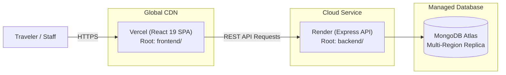

# WanderLuxe — Deployment & Production Operations Guide

This guide details the deployment architecture, platform configuration, and environment setup for running WanderLuxe in staging and production environments.

---

## Table of Contents

1. [Production Architecture](#production-architecture)
2. [Frontend Deployment (Vercel)](#frontend-deployment-vercel)
3. [Backend Deployment (Render)](#backend-deployment-render)
4. [Database (MongoDB Atlas)](#database-mongodb-atlas)
5. [Production CORS Configuration](#production-cors-configuration)
6. [Razorpay Live Webhook Configuration](#razorpay-live-webhook-configuration)
7. [Environment Update & Redeployment Rules](#environment-update--redeployment-rules)

---

## Production Architecture



---

## Frontend Deployment (Vercel)

The WanderLuxe frontend is deployed to [Vercel](https://vercel.com/) as a static Single Page Application (SPA).

### Vercel Project Settings

| Setting | Value | Notes |
| :--- | :--- | :--- |
| **Framework Preset** | Vite | Automatically configures build defaults |
| **Root Directory** | `frontend` | Critical: do not set to repository root |
| **Build Command** | `npm run build` | Compiles React bundle into `dist/` |
| **Output Directory** | `dist` | Generated static bundle |
| **Install Command** | `npm ci` | Clean install from `frontend/package-lock.json` |
| **Node.js Version** | `20.x` or `22.x` | Set in Vercel General Settings |

### Client-Side SPA Routing (`vercel.json`)

The file `frontend/vercel.json` provides rewrite rules ensuring client-side routes (e.g. `/staff/sales`, `/quotation/:id`, `/trips/:slug`) resolve to `index.html`:

```json
{
  "rewrites": [
    {
      "source": "/(.*)",
      "destination": "/index.html"
    }
  ]
}
```

### Vercel Environment Variables

Configure these in **Vercel Project Settings -> Environment Variables**:

| Variable Name | Required? | Example Value | Description |
| :--- | :---: | :--- | :--- |
| `VITE_API_URL` | **Yes** | `https://api.wanderluxe.com` | Production Render backend URL |
| `VITE_RAZORPAY_KEY_ID` | **Yes** | `rzp_live_xxxxxxxxxxxxxxxx` | Live Razorpay public Key ID |
| `VITE_SITE_URL` | **Yes** | `https://wanderluxe.vercel.app` | Canonical public domain |

---

## Backend Deployment (Render)

The WanderLuxe API is deployed as a long-running Node Web Service on [Render](https://render.com/).

### Render Web Service Settings

| Setting | Value | Notes |
| :--- | :--- | :--- |
| **Runtime** | Node | Standard Node.js environment |
| **Root Directory** | `backend` | Critical: do not set to repository root |
| **Build Command** | `npm ci` | Deterministic dependency install |
| **Start Command** | `npm start` | Executes `node server.js` |
| **Health Check Path** | `/health` | Render automatically monitors this endpoint |
| **Auto-Deploy** | `Yes` (on `main` branch push) | Continuous deployment |

### Render Environment Variables

Configure these in **Render Dashboard -> Environment**:

| Variable Name | Required? | Example Value / Notes |
| :--- | :---: | :--- |
| `NODE_ENV` | **Yes** | `production` |
| `PORT` | **Yes** | Injected automatically by Render (defaults to 10000) |
| `MONGODB_URI` | **Yes** | Production MongoDB Atlas SRV URI |
| `JWT_SECRET` | **Yes** | Minimum 32-character secret (rejected at startup if weak) |
| `FRONTEND_URL` | **Yes** | `https://wanderluxe.vercel.app` |
| `ALLOWED_ORIGINS` | **Yes** | `https://wanderluxe.vercel.app,https://www.wanderluxe.com` |
| `ALLOW_VERCEL_PREVIEWS` | Optional | `true` (enables CORS for Vercel preview deploys) |
| `RAZORPAY_KEY_ID` | **Yes** | Live Key ID (`rzp_live_...`) |
| `RAZORPAY_KEY_SECRET` | **Yes** | Live Key Secret |
| `RAZORPAY_WEBHOOK_SECRET` | **Yes** | Live Webhook signing secret |
| `GEMINI_API_KEY` | Optional | Google Gemini API key for AI Planner 2.0 |
| `CLOUDINARY_CLOUD_NAME` | **Yes** | Production Cloudinary cloud name |
| `CLOUDINARY_API_KEY` | **Yes** | Cloudinary API Key |
| `CLOUDINARY_API_SECRET` | **Yes** | Cloudinary API Secret |
| `BREVO_API_KEY` | Optional | Brevo API key for quotation OTP verification emails |
| `BREVO_SENDER_EMAIL` | Optional | Verified sender email address |
| `BREVO_SENDER_NAME` | Optional | `WanderLuxe` |
| `TWILIO_ACCOUNT_SID` | Optional | Twilio account SID for WhatsApp e-tickets |
| `TWILIO_AUTH_TOKEN` | Optional | Twilio auth token |
| `TWILIO_WHATSAPP_NUMBER` | Optional | Twilio WhatsApp sender number |

---

## Database (MongoDB Atlas)

1. **Network Access**: Add Render's outbound IP addresses or allow `0.0.0.0/0` (with strong database credentials and role-scoped users).
2. **Database User**: Create a dedicated application user with `readWrite` permissions on the production database.
3. **Connection Pooling**: Mongoose defaults manage connection pooling automatically. The server includes timeout configurations (`serverSelectionTimeoutMS: 15000`) in `backend/config/db.js`.

---

## Production CORS Configuration

WanderLuxe implements strict origin verification in `backend/server.js`:

- Requests without an `Origin` header (such as server-to-server health probes or curl) are permitted.
- Browser requests must match one of:
  - An exact domain listed in `ALLOWED_ORIGINS` or `FRONTEND_URL`.
  - A `*.vercel.app` preview URL **if and only if** `ALLOW_VERCEL_PREVIEWS=true`.
- Any unauthorized origin receives a `403 Forbidden` error with `{ success: false, message: "Origin is not allowed by CORS policy." }`.

> [!CAUTION]
> Never set `Access-Control-Allow-Origin: *` in production. Wildcard CORS allows malicious third-party websites to make credentialed requests against the API on behalf of logged-in staff members.

---

## Razorpay Live Webhook Configuration

To ensure payments are verified even if a traveler closes their browser during payment redirect:

1. Log in to the [Razorpay Dashboard](https://dashboard.razorpay.com/).
2. Navigate to **Settings -> Webhooks -> Add New Webhook**.
3. Set the **Webhook URL**:
   ```text
   https://<your-render-backend-url>/api/payments/razorpay/webhook
   ```
4. Enter a strong, randomly generated **Secret** and save it.
5. Set `RAZORPAY_WEBHOOK_SECRET` in your Render environment variables to this exact value.
6. Select the following **Active Events**:
   - `order.paid`
   - `payment.captured`
   - `payment.failed`
7. Save the webhook.

The backend endpoint uses `express.raw({ type: 'application/json' })` to compute an authentic HMAC-SHA256 signature against the raw request buffer before parsing.

---

## Environment Update & Redeployment Rules

Understanding how environment changes propagate is essential to avoiding stale deployments:

### Frontend (Vercel)
- Because `VITE_` variables are statically baked into the JavaScript bundle at build time, **updating an environment variable in Vercel requires a new build / redeploy** to take effect.
- Trigger a redeployment via Vercel Dashboard -> Deployments -> Redeploy.

### Backend (Render)
- Backend environment variables are read dynamically from `process.env` at server startup.
- Updating an environment variable in Render automatically triggers a rolling service restart without downtime.
