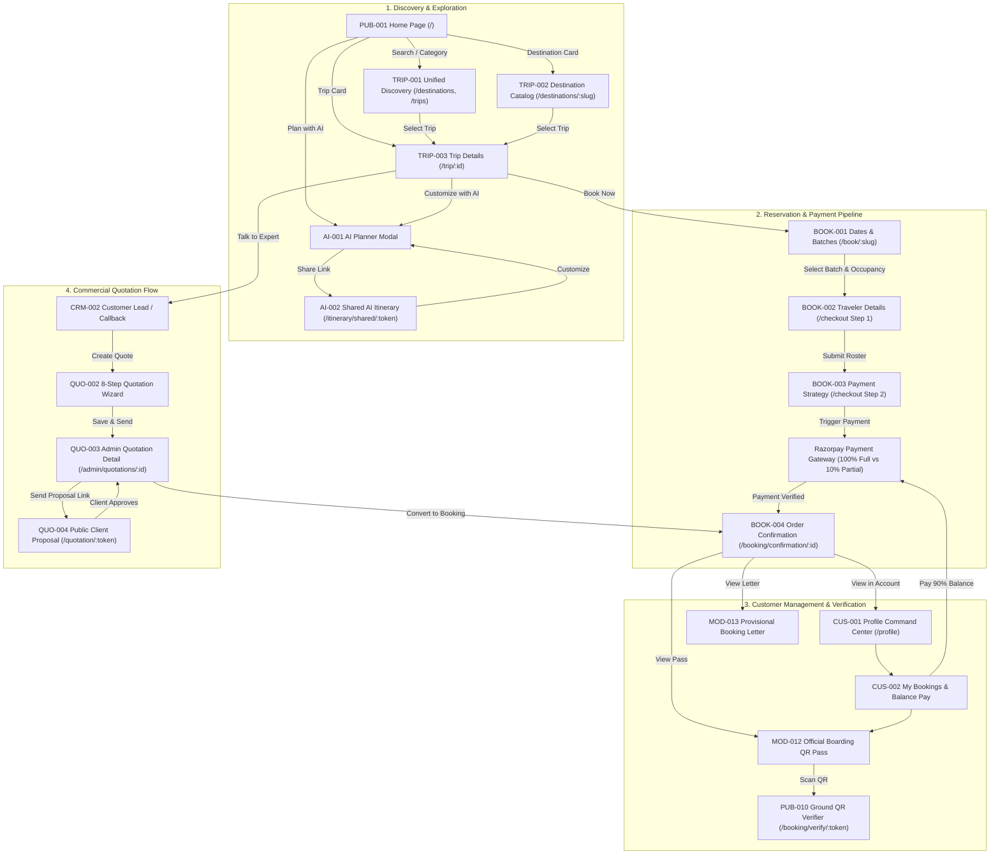

# WanderLuxe — Complete Screen Inventory

**Generated from:** Current repository implementation  
**Purpose:** Canonical inventory of all application screens, routes, major sub-screens and access rules.  
**Important:** This document describes the actual implemented application, not proposed future screens.

---

## Inventory Summary

| Category | Screens |
|---|---:|
| Public Website & Legal Policies | 10 |
| Authentication | 5 |
| Trip Discovery & Catalog | 3 |
| Booking & Checkout Flow | 4 |
| Customer Profile & Trips | 6 |
| AI Itinerary Planner & Shared Plans | 2 |
| Quotations (Admin & Public Proposal) | 4 |
| CRM & Lead Management | 2 |
| Admin Control Center & Content CMS | 4 |
| Canonical Location Media Library | 5 |
| Real-Time Platform Analytics | 2 |
| Creator & Influencer Partner Portal | 7 |
| System, Fallback & Error Screens | 5 |
| **Total Authority Screens** | **59** |

---

## Master Screen Inventory Table

| ID | Screen Name | Route / View Key | Audience | Primary Component | Status |
|---|---|---|---|---|---|
| **PUB-001** | Home Storefront | `/` | Public | `frontend/src/pages/Home.jsx` | ACTIVE |
| **PUB-002** | Dynamic Content & Landing Page | `/page/:slug`, `/pages/:slug` | Public | `frontend/src/pages/DynamicPage.jsx` | ACTIVE |
| **PUB-003** | About Us & Brand Heritage | `/about` | Public | `frontend/src/pages/About.jsx` | ACTIVE |
| **PUB-004** | Travel Blog & Packing Stories | `/blog` | Public | `frontend/src/pages/Blog.jsx` | ACTIVE |
| **PUB-005** | Contact & Custom Trip Inquiry | `/contact`, `/custom-trip` | Public | `frontend/src/pages/Contact.jsx` | ACTIVE |
| **PUB-006** | Privacy Policy | `/privacy` | Public | `frontend/src/pages/PlaceholderPage.jsx` | ACTIVE |
| **PUB-007** | Terms of Service | `/terms` | Public | `frontend/src/pages/PlaceholderPage.jsx` | ACTIVE |
| **PUB-008** | Cancellation & Refund Policy | `/cancellation` | Public | `frontend/src/pages/PlaceholderPage.jsx` | ACTIVE |
| **PUB-009** | Frequently Asked Questions | `/faq` | Public | `frontend/src/pages/PlaceholderPage.jsx` | ACTIVE |
| **PUB-010** | Boarding Pass QR Authenticity Verifier | `/booking/verify/:token` | Public / Captains | `frontend/src/pages/BookingVerify.jsx` | ACTIVE |
| **AUTH-001** | Customer Login | `/login` | Public Guest | `frontend/src/pages/Login.jsx` | ACTIVE |
| **AUTH-002** | Customer Registration | `/signup` | Public Guest | `frontend/src/pages/Signup.jsx` | ACTIVE |
| **AUTH-003** | Master Admin Portal Login | `/admin/login` | Administrators | `frontend/src/pages/AdminLogin.jsx` | ACTIVE |
| **AUTH-004** | Creator / Influencer Portal Login | `/influencer/login` | Creators | `frontend/src/pages/InfluencerLogin.jsx` | ACTIVE |
| **AUTH-005** | Creator Application & Onboarding | `/influencer/signup`, `/influencer/apply` | Authenticated Users | `frontend/src/pages/InfluencerSignup.jsx` | ACTIVE |
| **TRIP-001** | Unified Trip Discovery & Catalog | `/destinations`, `/packages`, `/trips`, `/domestic`, `/international`, `/community-trips`, `/weekend-trips`, `/backpacking-trips`, `/adventure-treks`, `/romantic-escapes`, `/culture-heritage`, `/fixed-departures` | Public | `frontend/src/pages/Destinations.jsx` | ACTIVE |
| **TRIP-002** | Regional Destination Curated Catalog | `/destinations/:destinationSlug`, `/trips/:destinationSlug` | Public | `frontend/src/pages/Destinations.jsx` | ACTIVE |
| **TRIP-003** | Trip Details & Expedition Dossier | `/trip/:id` (Alias: `/trip/:slug`) | Public | `frontend/src/pages/TripDetails.jsx` | ACTIVE |
| **BOOK-001** | Batch Date & Occupancy Selector | `/book/:tripSlug`, `/book/:tripSlug/dates` | Public / Customer | `frontend/src/pages/BookingDates.jsx` | ACTIVE |
| **BOOK-002** | Traveler Roster & Contact Entry | `/book/:tripSlug/travelers`, `/checkout` (Step 1) | Authenticated / Guest | `frontend/src/pages/Checkout.jsx` | ACTIVE |
| **BOOK-003** | Booking Review & Payment Gateway | `/checkout` (Step 2) | Authenticated / Guest | `frontend/src/pages/Checkout.jsx` | ACTIVE |
| **BOOK-004** | Booking Order Confirmation & Receipt | `/booking/confirmation/:bookingId`, `/bookings/:bookingId` | Customer | `frontend/src/pages/BookingConfirmation.jsx` | ACTIVE |
| **CUS-001** | Traveler Profile & Pre-Trip Command | `/profile` | Authenticated Customer | `frontend/src/pages/Profile.jsx` | ACTIVE |
| **CUS-002** | My Bookings & Balance Payment View | `/profile` (`tab=bookings`) | Authenticated Customer | `frontend/src/pages/Profile.jsx` | ACTIVE |
| **CUS-003** | Traveler Preferences & Dietary Needs | `/profile` (`tab=preferences`) | Authenticated Customer | `frontend/src/pages/Profile.jsx` | ACTIVE |
| **CUS-004** | Saved AI Itineraries Library | `/profile` (`tab=ai-plans`) | Authenticated Customer | `frontend/src/pages/Profile.jsx` | ACTIVE |
| **CUS-005** | Curated Wishlist Trips | `/profile` (`tab=wishlist`) | Authenticated Customer | `frontend/src/pages/Profile.jsx` | ACTIVE |
| **CUS-006** | Recently Viewed Expeditions Log | `/profile` (`tab=history`) | Authenticated Customer | `frontend/src/pages/Profile.jsx` | ACTIVE |
| **AI-001** | AI Travel Planner Engine | Modal Workflow (`AIPlannerModal`) | Public / Customer | `frontend/src/components/AIPlannerModal.jsx` | ACTIVE |
| **AI-002** | Public Shared AI Itinerary | `/itinerary/shared/:shareToken` | Public | `frontend/src/pages/SharedItinerary.jsx` | ACTIVE |
| **QUO-001** | Quotation Commercial Pipeline | `/admin/quotations`, `/admin?tab=quotations` | Admin / Sales | `frontend/src/pages/AdminDashboard.jsx` | ACTIVE |
| **QUO-002** | Multi-Tier Quotation Builder Wizard | Modal Workflow (`QuotationBuilderWizard`) | Admin / Sales | `frontend/src/components/QuotationBuilderWizard.jsx` | ACTIVE |
| **QUO-003** | Admin Quotation Commercial Dossier | `/admin/quotations/:id` | Admin / Sales | `frontend/src/pages/QuotationDetail.jsx` | ACTIVE |
| **QUO-004** | Public Client Quotation Proposal | `/quotation/:token`, `/quotations/:token` | Client (Public Token) | `frontend/src/pages/PublicQuotationView.jsx` | ACTIVE |
| **CRM-001** | Master Bookings Ledger | `/admin` (`tab=bookings_crm`, Top Section) | Admin / Operations | `frontend/src/pages/AdminDashboard.jsx` | ACTIVE |
| **CRM-002** | Customer Inquiries & Scheduled Callbacks | `/admin` (`tab=bookings_crm`, CRM Leads Section) | Admin / Sales | `frontend/src/pages/AdminDashboard.jsx` | ACTIVE |
| **ADM-001** | Master Admin Control Center | `/admin` | Admin / Super Admin | `frontend/src/pages/AdminDashboard.jsx` | ACTIVE |
| **ADM-002** | Discount Engine & Promo Coupons | `/admin` (`tab=coupons`) | Admin / Super Admin | `frontend/src/pages/AdminDashboard.jsx` | ACTIVE |
| **ADM-003** | User Account & Role Authority Manager | `/admin` (`tab=users`) | Super Admin / Admin | `frontend/src/pages/AdminDashboard.jsx` | ACTIVE |
| **CMS-001** | Trip CMS Catalog Management | `/admin` (`tab=trips`) | Admin / Operations | `frontend/src/pages/AdminDashboard.jsx` | ACTIVE |
| **CMS-002** | Trip Package Structured Wizard | Modal Workflow (`showTripModal`) | Admin / Operations | `frontend/src/pages/AdminDashboard.jsx` | ACTIVE |
| **CMS-003** | Dynamic Public Pages CMS | `/admin` (`tab=pages`) | Admin / Marketing | `frontend/src/pages/AdminDashboard.jsx` | ACTIVE |
| **CMS-004** | Dynamic Page Editor Modal | Modal Workflow (`showPageModal`) | Admin / Marketing | `frontend/src/pages/AdminDashboard.jsx` | ACTIVE |
| **MED-001** | Canonical Location Photography Repository | `/admin` (`tab=media_library`) | Admin / Operations | `frontend/src/pages/AdminDashboard.jsx` | ACTIVE |
| **MED-002** | Geographic Coverage & Missing Queue | `/admin` (`tab=media_library`, Coverage Widget) | Admin / Operations | `frontend/src/pages/AdminDashboard.jsx` | ACTIVE |
| **MED-003** | Location Media Library Picker | Modal Workflow (`MediaLibraryModal`) | Admin / Sales | `frontend/src/components/MediaLibraryModal.jsx` | ACTIVE |
| **MED-004** | Index & Upload Location Image | Modal Workflow (`UploadLocationImageModal`) | Admin / Operations | `frontend/src/components/UploadLocationImageModal.jsx` | ACTIVE |
| **MED-005** | Media Asset Full Inspector Lightbox | Modal Workflow (`adminMediaPreview`) | Admin / Operations | `frontend/src/pages/AdminDashboard.jsx` | ACTIVE |
| **ANL-001** | Real-Time Platform Analytics Engine | `/admin` (`tab=analytics`) | Admin / Leadership | `frontend/src/pages/AdminDashboard.jsx` | ACTIVE |
| **ANL-002** | Quotation Funnel & Conversion Pipeline | `/admin` (`tab=analytics`, Pipeline Grid) | Admin / Sales | `frontend/src/pages/AdminDashboard.jsx` | ACTIVE |
| **INF-001** | Creator Program Overview & Benefits | `/influencer/program` | Public / Creators | `frontend/src/pages/InfluencerLanding.jsx` | ACTIVE |
| **INF-002** | Creator Application & Verification Status | `/influencer/signup` (`InfluencerPending`) | Authenticated Creator | `frontend/src/pages/InfluencerSignup.jsx` | ACTIVE |
| **INF-003** | Creator Partner Control Panel | `/influencer` | Approved Influencers | `frontend/src/pages/InfluencerDashboard.jsx` | ACTIVE |
| **INF-004** | Creator Public Storefront | `/creator/:username`, `/creators/:username` | Public | `frontend/src/pages/CreatorStorefront.jsx` | ACTIVE |
| **INF-005** | Creator Co-Branded Trip Landing | `/creators/:username/:tripSlug` | Public | `frontend/src/pages/CreatorTrip.jsx` | ACTIVE |
| **INF-006** | Creator Verification & Approval Engine | `/admin` (`tab=influencer_verification`) | Admin / Super Admin | `frontend/src/pages/AdminDashboard.jsx` | ACTIVE |
| **INF-007** | Creator Payouts & Commission Engine | `/admin` (`tab=payouts`) | Admin / Super Admin | `frontend/src/pages/AdminDashboard.jsx` | ACTIVE |
| **SYS-001** | 404 Route Off The Map | `*` (Catch-all) | Public | `frontend/src/pages/NotFound.jsx` | ACTIVE |
| **SYS-002** | Global Error Boundary Fallback | System Boundary Catch | All Audiences | `frontend/src/components/ErrorBoundary.jsx` | ACTIVE |
| **SYS-003** | Route Access Denied / Auth Gate | `/admin/*`, `/influencer` | Unauthenticated | `frontend/src/components/AdminRoute.jsx` | ACTIVE |
| **SYS-004** | Invalid / Expired QR Pass Screen | `/booking/verify/:token` (Error State) | Public / Captains | `frontend/src/pages/BookingVerify.jsx` | ACTIVE |
| **SYS-005** | Expired / Revoked Quotation Share Link | `/quotation/:token` (Error State) | Public Client | `frontend/src/pages/PublicQuotationView.jsx` | ACTIVE |

---

# Detailed Screen Specifications

## PUB-001 — Home Storefront

**Category:** Public Website  
**Route:** `/`  
**Audience:** Public  
**Primary Component:** `frontend/src/pages/Home.jsx`  
**Layout:** MainLayout (`frontend/src/layouts/MainLayout.jsx`)  
**Route Parameters:** None  

**Purpose:**  
The flagship landing page for WanderLuxe. Features dynamic time-of-day greetings, seasonal banners, fast search with trending chips, upcoming departures categorized by month, curated Indian and international trip collections, photo moments gallery, traveler testimonials, and direct callback inquiry capture.

**Entry Points:**  
- Direct root URL visit (`/`)  
- Navbar logo click from any page  
- 404 "Return to Homepage" button  
- Footer brand logo  

**Primary Data:**  
- `UPCOMING_TRIPS` catalog & static destinations  
- Real MongoDB live trips via backend `/api/trips`  
- Travel context engine (`useTravelContext`) for time and season personalization  
- Curated gallery photo assets  

**Primary Actions:**  
- Search trips by destination, duration, or budget  
- Filter upcoming community departures by month tabs  
- Click trip cards to navigate to `TRIP-003 Trip Details`  
- Click destination cards to navigate to `TRIP-001 / TRIP-002 Discovery`  
- Launch AI Travel Planner modal via hero CTA  
- Submit callback request via `CallbackForm`  

**Major States:**  
- Default loaded state with live trips  
- Filtered state by selected departure month  
- No matching month results (smooth fallback to top trips)  
- Callback form submission success  

**Responsive Behavior:**  
- Desktop: Multi-column hero search bar, multi-grid trip layouts  
- Mobile: Compact sticky search trigger, horizontal scrolling month pills, single-column trip cards  

**Related Screens:**  
- `TRIP-003 Trip Details`  
- `TRIP-001 Unified Discovery`  
- `AI-001 AI Planner Modal`  
- `CRM-002 Customer Inquiries`  

**Notes / Issues:** None.

---

## PUB-002 — Dynamic Content & Landing Page

**Category:** Public Website  
**Route:** `/page/:slug` (Route Alias: `/pages/:slug`)  
**Audience:** Public  
**Primary Component:** `frontend/src/pages/DynamicPage.jsx`  
**Layout:** MainLayout (`frontend/src/layouts/MainLayout.jsx`)  
**Route Parameters:**  
- `slug` — Dynamic unique page identifier (e.g., `meghalaya-guide`, `ladakh-monsoon-tips`)  

**Purpose:**  
Renders rich marketing landing pages, SEO destination dossiers, and promotional travel guides published dynamically by administrators from the Pages CMS without code deployments.

**Entry Points:**  
- Footer custom links  
- Blog article contextual mentions  
- Marketing campaign emails and social media ads  
- Admin Pages CMS "View Live" action  

**Primary Data:**  
- Dynamic page document fetched via `getPageBySlugApi(slug)`  
- SEO meta tags, title, OpenGraph images, and structured JSON-LD  

**Primary Actions:**  
- Read rich structured page sections  
- Click call-to-action buttons redirecting to relevant trip details or booking  
- Share page via native Web Share API or social links  

**Major States:**  
- Loading spinner (`Loader2`)  
- Published page loaded with full hero and sections  
- Page Not Found (404-style error card if slug does not exist in MongoDB)  

**Responsive Behavior:**  
- Full fluid typography scaling from mobile viewport to desktop container  

**Related Screens:**  
- `CMS-003 Dynamic Public Pages CMS`  
- `CMS-004 Dynamic Page Editor Modal`  

**Notes / Issues:** None. Both `/page/:slug` and `/pages/:slug` routes resolve to this canonical component.

---

## PUB-003 — About Us & Brand Heritage

**Category:** Public Website  
**Route:** `/about`  
**Audience:** Public  
**Primary Component:** `frontend/src/pages/About.jsx`  
**Layout:** MainLayout (`frontend/src/layouts/MainLayout.jsx`)  
**Route Parameters:** None  

**Purpose:**  
Showcases WanderLuxe’s core brand ethos, safety standards, captain certifications, community numbers (50,000+ travelers, 200+ departures), leadership team dossiers, and organizational schema.

**Entry Points:**  
- Navbar "About Us" link  
- Footer "About WanderLuxe" link  

**Primary Data:**  
- Core brand statistics and company milestones  
- Team member profiles from `TEAM_MEMBERS`  
- Organization JSON-LD schema (`getOrganizationSchema`)  

**Primary Actions:**  
- Read company mission and safety protocols  
- Explore founding team profiles  
- Navigate to trip discovery via "Explore Our Journeys" CTA  

**Major States:** Static render with client-side animation.  
**Responsive Behavior:** Grid switches from 1 column on mobile to 4 columns on desktop.  
**Related Screens:** `PUB-001 Home`, `PUB-005 Contact`.  
**Notes / Issues:** None.

---

## PUB-004 — Travel Blog & Packing Stories

**Category:** Public Website  
**Route:** `/blog`  
**Audience:** Public  
**Primary Component:** `frontend/src/pages/Blog.jsx`  
**Layout:** MainLayout (`frontend/src/layouts/MainLayout.jsx`)  
**Route Parameters:** None  

**Purpose:**  
Comprehensive content hub containing travel stories, high-altitude packing advice, cultural immersion guides, and newsletter subscription capture.

**Entry Points:**  
- Navbar "Blog" link  
- Footer "Travel Stories & Guides" link  

**Primary Data:**  
- `BLOG_POSTS` collection  
- Article JSON-LD schema (`getArticleSchema`)  

**Primary Actions:**  
- Keyword search across post titles and excerpts  
- Category filtering (`Backpacking Tips`, `Himalayan Expeditions`, `Cultural Experiences`, `Packing Guides`)  
- Click post card to open full-screen reading modal with complete story  
- Newsletter email subscription form  

**Major States:**  
- All posts displayed with featured hero article  
- Filtered posts by category or keyword search  
- Empty search state  
- Full article reading modal active  
- Newsletter subscription success state  

**Responsive Behavior:** Filter category pill bar is horizontally scrollable on mobile devices.  
**Related Screens:** `PUB-002 Dynamic Content Page`, `TRIP-001 Discovery`.  
**Notes / Issues:** None.

---

## PUB-005 — Contact & Custom Trip Inquiry

**Category:** Public Website  
**Route:** `/contact` (Route Alias: `/custom-trip`)  
**Audience:** Public  
**Primary Component:** `frontend/src/pages/Contact.jsx`  
**Layout:** MainLayout (`frontend/src/layouts/MainLayout.jsx`)  
**Route Parameters:** None  

**Purpose:**  
Provides travelers with direct communication channels (phone, email, physical office address, business hours) and a multi-field inquiry submission form for bespoke private group itineraries.

**Entry Points:**  
- Navbar "Contact" and "Custom Trip" links  
- Footer contact links  
- Trip Details "Need a Customized Itinerary?" CTA  

**Primary Data:**  
- WanderLuxe concierge telephone and email addresses  
- FAQ accordion questions and schema (`getFAQSchema`)  
- MongoDB CRM Lead creation API (`createLeadApi`)  

**Primary Actions:**  
- Submit custom travel inquiry (Name, Email, Phone, Destination, Special Notes)  
- Expand/collapse FAQ questions  
- Click telephone or WhatsApp links to initiate instant agent consultation  

**Major States:**  
- Default form view  
- Submitting state (`isSubmitting`) with button loader  
- Submission success banner thanking the traveler and promising 2-hour contact  

**Responsive Behavior:** 2-column contact cards on desktop stack into a single vertical column on mobile.  
**Related Screens:** `CRM-002 Customer Inquiries & Scheduled Callbacks`.  
**Notes / Issues:** Both `/contact` and `/custom-trip` load this screen.

---

## PUB-006 through PUB-009 — Legal Policies & Compliance Screens

**Category:** Public Website  
**Route:** `/privacy`, `/terms`, `/cancellation`, `/faq`  
**Audience:** Public  
**Primary Component:** `frontend/src/pages/PlaceholderPage.jsx`  
**Layout:** MainLayout (`frontend/src/layouts/MainLayout.jsx`)  
**Route Parameters:** Derived from current `location.pathname`  

**Purpose:**  
Authoritative legal compliance documents for consumer protection, payment gateway approval (Razorpay compliance), booking cancellation rules, and frequently asked traveler questions.

### Internal Views:
1. **PUB-006: Privacy Policy (`/privacy`)** — Data collection, PCI-DSS payment encryption standards, sharing only with captains and permit departments.
2. **PUB-007: Terms of Service (`/terms`)** — Group tour conduct codes, unpredictable mountain weather re-routing authority, medical fitness declarations.
3. **PUB-008: Cancellation & Refund Policy (`/cancellation`)** — 15+ days prior 100% credit or free rollover, 7-14 days 50% refund, <7 days non-refundable policy.
4. **PUB-009: FAQ (`/faq`)** — Solo traveler matching, booking confirmation advances, equipment checklist.

**Entry Points:**  
- Website footer links  
- Checkout page payment terms links  
- Booking confirmation fine-print  

**Primary Actions:** Read legal clauses, copy policy sections, navigate back to home.  
**Major States:** Dynamic clause rendering based on URL path.  
**Related Screens:** `BOOK-003 Checkout Review`, `BOOK-004 Confirmation`.  
**Notes / Issues:** None.

---

## PUB-010 — Boarding Pass QR Authenticity Verifier

**Category:** Public Website / Verification  
**Route:** `/booking/verify/:token`  
**Audience:** Public / Certified Trip Captains / Forest Checkposts  
**Primary Component:** `frontend/src/pages/BookingVerify.jsx`  
**Layout:** MainLayout (`frontend/src/layouts/MainLayout.jsx`)  
**Route Parameters:**  
- `token` — Cryptographic booking verification token embedded in traveler QR codes  

**Purpose:**  
Publicly accessible verification screen used by WanderLuxe Trip Captains and ground operators at departure boarding points (e.g., Delhi Majnu Ka Tila, Guwahati Airport) to scan traveler boarding passes and instantly verify authentic booking records.

**Entry Points:**  
- Scanning the dynamic QR code on a customer’s Boarding Pass Modal or PDF ticket  

**Primary Data:**  
- Backend verification endpoint `verifyBookingTokenApi(token)`  
- Verified booking record (Lead traveler name, pax count, trip title, departure batch, pickup point, emergency contact)  

**Primary Actions:**  
- View real-time green shield authentication badge  
- Inspect passenger manifesto details  
- Return to homepage if invalid  

**Major States:**  
- Verifying token spinner (`Verifying Boarding Pass Authenticity...`)  
- **Authentic Verified Pass:** Displays official green header, booking ID, pickup point, traveler roster  
- **Invalid / Expired Pass:** Red warning dialog stating token is unauthorized or expired  

**Responsive Behavior:** Centered mobile card optimized for smartphone camera scanner browsers.  
**Related Screens:** `BOOK-004 Confirmation`, `CUS-002 My Bookings`.  
**Notes / Issues:** None.

---

## AUTH-001 — Customer Login

**Category:** Authentication  
**Route:** `/login`  
**Audience:** Public Guest  
**Primary Component:** `frontend/src/pages/Login.jsx`  
**Layout:** MainLayout (`frontend/src/layouts/MainLayout.jsx`)  
**Route Parameters:** None  

**Purpose:**  
Customer authentication portal enabling travelers to sign in with email and password to access their profile, view booking vouchers, settle pending balances, and retrieve saved AI plans.

**Entry Points:**  
- Navbar "Login" button  
- Automatic redirect from `/profile` when unauthenticated  
- Automatic redirect from `/checkout` if login is requested  
- Footer account links  

**Primary Data:**  
- `AuthContext` login function connected to backend `/api/auth/login`  

**Primary Actions:**  
- Input email and password with show/hide password toggle  
- Submit credentials  
- Navigate to customer signup (`/signup`)  
- Navigate to creator login or admin portal  

**Major States:**  
- Blank form  
- Submitting state with loading indicator  
- Validation or credential error alert  
- Auto-redirect to intended previous page (`from` route) upon success  

**Responsive Behavior:** 2-column split card on desktop (branding left, form right), collapses to single column on mobile.  
**Related Screens:** `AUTH-002 Signup`, `CUS-001 Profile`.  
**Notes / Issues:** If already logged in, automatically redirects to `/profile`.

---

## AUTH-002 — Customer Registration

**Category:** Authentication  
**Route:** `/signup`  
**Audience:** Public Guest  
**Primary Component:** `frontend/src/pages/Signup.jsx`  
**Layout:** MainLayout (`frontend/src/layouts/MainLayout.jsx`)  
**Route Parameters:** None  

**Purpose:**  
New traveler account creation capturing Full Name, Email, Phone Number, and Password.

**Entry Points:**  
- Navbar "Sign Up" button  
- Login screen "Create an Account" link  
- Checkout page guest-to-account conversion  

**Primary Data:**  
- Backend registration API `/api/auth/register`  

**Primary Actions:**  
- Enter full name, phone number, email address, password, and confirm password  
- Submit account creation  
- Switch to login screen  

**Major States:**  
- Clean form  
- Client-side validation (password length, phone digits, matching password)  
- Server error notification (e.g., email already registered)  
- Success transition into authenticated session  

**Related Screens:** `AUTH-001 Login`, `CUS-001 Profile`.  
**Notes / Issues:** None.

---

## AUTH-003 — Master Admin Portal Login

**Category:** Authentication  
**Route:** `/admin/login`  
**Audience:** Administrators / Operations / Super Admin  
**Primary Component:** `frontend/src/pages/AdminLogin.jsx`  
**Layout:** MainLayout (`frontend/src/layouts/MainLayout.jsx`)  
**Route Parameters:** None  

**Purpose:**  
Dedicated security portal for WanderLuxe executives, operations managers, and sales concierges to authenticate into the master administration backend.

**Entry Points:**  
- Direct URL entry (`/admin/login`)  
- Automatic redirect from `AdminRoute` when attempting to access `/admin` without admin privileges  

**Primary Data:**  
- Backend `/api/auth/login` with strict role verification (`admin`, `super_admin`)  

**Primary Actions:**  
- Enter administrative credentials  
- Submit authentication request  
- Auto-redirect to `/admin` dashboard upon success  

**Major States:**  
- Dark executive login theme with glowing background orbs  
- Authentication error state for non-admin accounts  
- Success redirect  

**Related Screens:** `ADM-001 Master Admin Control Center`.  
**Notes / Issues:** If user is already authenticated with an admin role, navigating to `/admin/login` immediately forwards to `/admin`.

---

## AUTH-004 — Creator / Influencer Portal Login

**Category:** Authentication  
**Route:** `/influencer/login`  
**Audience:** Approved Creator Partners  
**Primary Component:** `frontend/src/pages/InfluencerLogin.jsx`  
**Layout:** MainLayout (`frontend/src/layouts/MainLayout.jsx`)  
**Route Parameters:** None  

**Purpose:**  
Secure login portal tailored specifically for creator and influencer partners to access their affiliate promo codes, wallet balance, and payout ledger.

**Entry Points:**  
- Direct URL entry (`/influencer/login`)  
- Creator Program landing page (`/influencer/program`) "Login as Creator" button  
- Redirect from `InfluencerRoute` when visiting `/influencer` unauthenticated  

**Primary Data:**  
- Backend influencer authentication and status check (`user.role === 'influencer'`)  

**Primary Actions:**  
- Enter creator email and password  
- Sign in to Creator Dashboard  
- Link to Creator Signup (`/influencer/signup`) for new applicants  

**Major States:**  
- Form display with creator branding  
- Credential error display  
- Auto-forwarding to `/influencer` upon verified creator session  

**Related Screens:** `INF-001 Creator Program`, `INF-003 Creator Control Panel`.  
**Notes / Issues:** None.

---

## AUTH-005 — Creator Application & Onboarding

**Category:** Authentication / Creator Onboarding  
**Route:** `/influencer/signup` (Route Alias: `/influencer/apply`)  
**Audience:** Authenticated Travelers wishing to become verified Creators  
**Primary Component:** `frontend/src/pages/InfluencerSignup.jsx`  
**Layout:** MainLayout (`frontend/src/layouts/MainLayout.jsx`)  
**Route Parameters:** None  

**Purpose:**  
Allows prospective travel influencers to submit their social profile, follower metrics, primary platform, travel niche, and sample travel portfolio for administrative verification.

**Entry Points:**  
- Creator Program landing page (`/influencer/program`) "Apply Now" button  
- Creator Login page "Apply as New Creator" link  

**Primary Data:**  
- User profile data from `AuthContext`  
- Influencer application API `applyInfluencer(payload)`  

**Primary Actions:**  
- Enter full name, phone number, primary platform (Instagram, YouTube, TikTok, Blog)  
- Enter social handle, follower count, travel niche, and past content links  
- Submit application for review  

**Major States:**  
- **Unauthenticated State:** Prompts user to log in or register before applying  
- **Application Form:** Interactive submission form prepopulated with user name and email  
- **Under Review State (`InfluencerPending`):** Displays pending verification clock notice if application is currently awaiting admin decision  
- **Approved State:** Redirects directly to `/influencer` dashboard  

**Related Screens:** `INF-006 Admin Creator Approvals`, `INF-003 Creator Dashboard`.  
**Notes / Issues:** Both `/influencer/signup` and `/influencer/apply` render this screen.

---

## TRIP-001 — Unified Trip Discovery & Catalog

**Category:** Trip Discovery  
**Route:**  
- Canonical: `/destinations`  
- Unified Engine Aliases:  
  `/packages`, `/trips`, `/trips/india`, `/trips/international`, `/domestic`, `/international`, `/community-trips`, `/group-trips`, `/weekend-trips`, `/backpacking-trips`, `/adventure-treks`, `/romantic-escapes`, `/culture-heritage`, `/fixed-departures`, `/destinationspage`, `/destination`  
**Audience:** Public  
**Primary Component:** `frontend/src/pages/Destinations.jsx`  
**Layout:** MainLayout (`frontend/src/layouts/MainLayout.jsx`)  
**Route Parameters:** None (Filtered dynamically via route taxonomy and URL search parameters `?dest=`, `?month=`, `?dur=`, `?budget=`, `?type=`, `?mood=`, `?city=`, `?sort=`, `?q=`)  

**Purpose:**  
The central catalog search engine of WanderLuxe. Handles all trip discovery taxonomy rules via `discoveryTaxonomy.js`. Renders interactive breadcrumbs, live keyword search, multi-facet filtering, sorting dropdowns, and responsive grid layouts for group departures.

**Entry Points:**  
- Navbar dropdown categories (India Trips, International, Weekend Getaways)  
- Home page hero search submit  
- Footer destination tags  
- Search input chips  

**Primary Data:**  
- Full catalog from `UPCOMING_TRIPS` and MongoDB `/api/trips`  
- Travel context recommendations and seasonal weather badges  
- Taxonomy presets from `getPresetByPath(location.pathname)`  

**Primary Actions:**  
- Type search query with live filtering  
- Toggle facet filters (Month, Duration, Budget, Trip Category, Climate Mood, Starting City)  
- Change sorting order (Context Recommendation, Nearest Batch Date, Price Ascending/Descending, Duration, Trending)  
- Open and close mobile filter drawer  
- Reset all active filters  
- Click trip card to navigate to `TRIP-003 Trip Details`  

**Major States:**  
- Default catalog view matching route taxonomy  
- Filtered results list with active filter badges  
- Zero results state with "Reset Filters" action button  

**Responsive Behavior:**  
- Desktop: Left sticky filter sidebar (`FilterSidebar.jsx`) and right 3-column cards grid  
- Mobile: Sticky bottom/top filter button opening a slide-over mobile drawer (`mobileFilterOpen`)  

**Related Screens:** `TRIP-003 Trip Details`, `PUB-001 Home`.  
**Notes / Issues:** 18 different public routes are unified into this single engine.

---

## TRIP-002 — Regional Destination Curated Catalog

**Category:** Trip Discovery  
**Route:** `/destinations/:destinationSlug` (Route Alias: `/trips/:destinationSlug`)  
**Audience:** Public  
**Primary Component:** `frontend/src/pages/Destinations.jsx`  
**Layout:** MainLayout (`frontend/src/layouts/MainLayout.jsx`)  
**Route Parameters:**  
- `destinationSlug` — Regional identifier (e.g., `spiti-valley`, `meghalaya`, `bali`, `kashmir`, `ladakh`)  

**Purpose:**  
A pre-filtered variation of the unified discovery engine focusing exclusively on all expeditions, treks, and weekend circuits operating within a specific geographic territory.

**Entry Points:**  
- Home page "Trending Destinations" cards  
- Footer regional destination links  
- Dynamic page contextual links  

**Primary Data:**  
- Destination details and weather forecasts  
- Filtered trips matching `destinationSlug`  

**Primary Actions:**  
- Filter trips within the selected destination  
- Inspect seasonal travel advice  
- Select a specific trip to view full itinerary  

**Major States:** Same as `TRIP-001`, scoped to target region.  
**Related Screens:** `TRIP-003 Trip Details`, `TRIP-001 Unified Discovery`.  
**Notes / Issues:** None.

---

## TRIP-003 — Trip Details & Expedition Dossier

**Category:** Trip Discovery  
**Route:** `/trip/:id` (Route Alias: `/trip/:slug`)  
**Audience:** Public  
**Primary Component:** `frontend/src/pages/TripDetails.jsx`  
**Layout:** MainLayout (`frontend/src/layouts/MainLayout.jsx`)  
**Route Parameters:**  
- `id` — Unique trip identifier (MongoDB Object ID, URL slug, or static ID)  

**Purpose:**  
The primary conversion screen on WanderLuxe. Displays the complete trip dossier: high-resolution photo gallery, live seasonal weather badge, departure batch selector, sharing occupancy options, day-by-day expandable itinerary with canonical location photos, stay accommodation details, meal inclusions/exclusions, interactive gear packing checklist, verified traveler reviews, and persistent booking triggers.

**Entry Points:**  
- Clicking any trip card on Home, Discovery, Blog, or Creator Storefronts  
- Shared trip URLs on WhatsApp and social media  
- Search engine organic results  

**Primary Data:**  
- Backend trip document from `/api/trips/:id` or static knowledge catalog  
- Live destination weather from `getDestinationWeather`  
- Available departure batches and remaining seat counts  
- Canonical itinerary media assets resolved by geographic tagging  

**Primary Actions:**  
- Browse photo gallery and open full-screen lightbox  
- Select upcoming departure batch dates  
- Select occupancy sharing tier (Double Sharing, Triple Sharing, Quad Sharing)  
- Expand and collapse itinerary days  
- Check off items in interactive packing checklist  
- Toggle trip wishlist heart  
- Click "Book Now" (navigates to `BOOK-001`)  
- Click "Talk to Travel Expert" (opens `RequestCallbackModal`)  
- Click "Customize with AI" (opens `AIPlannerModal`)  

**Major States:**  
- Loading skeleton  
- Available for booking with multiple active batches  
- Low availability warning ("Only 3 seats left!")  
- Fullscreen photo gallery lightbox view  

**Responsive Behavior:**  
- Desktop: Right sticky booking card with batch picker, price calculation, and CTA  
- Mobile: Sticky bottom booking bar showing starting price and "Select Dates & Book" button  

**Related Screens:**  
- `BOOK-001 Batch Date Selector`  
- `AI-001 AI Planner Modal`  
- `CRM-002 Callback Lead capture`  

**Notes / Issues:** Both `/trip/:id` and `/trip/:slug` are supported.

---

## BOOK-001 — Batch Date & Occupancy Selector

**Category:** Booking Flow  
**Route:** `/book/:tripSlug` (Route Alias: `/book/:tripSlug/dates`)  
**Audience:** Public / Traveler  
**Primary Component:** `frontend/src/pages/BookingDates.jsx`  
**Layout:** MainLayout (`frontend/src/layouts/MainLayout.jsx`)  
**Route Parameters:**  
- `tripSlug` — Unique trip slug or ID  

**Purpose:**  
The first dedicated step in the customer reservation pipeline. Travelers choose their exact departure batch (grouped by month pills), select their preferred room sharing occupancy (Double, Triple, Quad), and adjust traveler headcount. Computes dynamic live pricing totals.

**Entry Points:**  
- Clicking "Book Now" or "Select Dates" on `TRIP-003 Trip Details`  
- Re-selecting dates from checkout review  

**Primary Data:**  
- Trip batch schedule and seat quotas  
- Pricing calculation endpoint `calculateBookingPricingApi`  

**Primary Actions:**  
- Switch between departure month tabs  
- Select an active batch card  
- Select room occupancy option  
- Increase / decrease traveler count  
- Click "Proceed to Traveler Details" (navigates to `BOOK-002`)  
- Request callback if dates are unavailable  

**Major States:**  
- Batch selected with highlighted green border and updated pricing summary  
- Sold out / full batch state (disabled selection)  
- Pricing loading state while calculating discounts  

**Responsive Behavior:** Month tabs scroll horizontally on mobile; bottom floating bar confirms selected date and total price.  
**Related Screens:** `TRIP-003 Trip Details`, `BOOK-002 Traveler Details`.  
**Notes / Issues:** Both `/book/:tripSlug` and `/book/:tripSlug/dates` resolve here.

---

## BOOK-002 — Traveler Roster & Contact Entry

**Category:** Booking Flow  
**Route:** `/book/:tripSlug/travelers` (Also accessible via `/checkout` Step 1)  
**Audience:** Authenticated Customer or Guest Traveler  
**Primary Component:** `frontend/src/pages/Checkout.jsx` (`activeStep === 'traveler_details'`)  
**Layout:** MainLayout (`frontend/src/layouts/MainLayout.jsx`)  
**Route Parameters:**  
- `tripSlug` — Unique trip slug (optional when reached via `/checkout`)  

**Purpose:**  
Captures lead traveler contact details (Name, Email, Phone, City, Emergency Contact) and roster details for every individual traveler in the group (Full Name, Age, Gender) needed for forest trekking permits and hotel room allocations.

**Entry Points:**  
- Proceeding from `BOOK-001 Batch Date Selector`  
- Direct checkout entry with saved booking draft in session storage  

**Primary Data:**  
- Authenticated user profile (auto-populates lead traveler name, email, phone)  
- Active booking draft (selected batch, occupancy, count)  

**Primary Actions:**  
- Fill in lead traveler contact info  
- Fill in individual traveler cards  
- Apply discount coupon code (`applyCouponApi`) or creator referral code  
- Click "Review Booking & Pay" to advance to `BOOK-003`  

**Major States:**  
- Clean form  
- Form validation error (missing phone number or traveler names)  
- Coupon code applied with green success badge and recalculation  

**Responsive Behavior:** Stacked traveler cards on mobile; sticky summary sidebar on desktop.  
**Related Screens:** `BOOK-001 Dates Selector`, `BOOK-003 Payment Selection`.  
**Notes / Issues:** None.

---

## BOOK-003 — Booking Review & Payment Gateway

**Category:** Booking Flow / Payment  
**Route:** `/checkout` (`activeStep === 'review_booking'`)  
**Audience:** Authenticated Customer or Guest Traveler  
**Primary Component:** `frontend/src/pages/Checkout.jsx`  
**Layout:** MainLayout (`frontend/src/layouts/MainLayout.jsx`)  
**Route Parameters:** None  

**Purpose:**  
The decisive financial settlement screen. Travelers review the complete trip breakdown, traveler roster, batch dates, and choose their payment strategy:
1. **100% Full Payment:** Immediate settlement and instant confirmed booking voucher with Boarding Pass.
2. **10% Partial Token Deposit:** Pay 10% now to lock in seats, with remaining 90% balance due within 6 days or before departure.

**Entry Points:**  
- Completing traveler details on `BOOK-002`  

**Primary Data:**  
- Pricing breakdown (Base price, occupancy adjustment, GST 5%, coupon discount, final amount, partial deposit amount)  
- Razorpay order creation endpoint `createBookingOrderApi`  
- Razorpay cryptographic signature verification endpoint `verifyBookingPaymentApi`  

**Primary Actions:**  
- Toggle between "Pay Full Amount (100%)" and "Pay 10% Token Advance"  
- Inspect balance due date and partial payment eligibility rules  
- Click "Confirm & Pay via Razorpay"  
- Complete UPI / NetBanking / Card transaction in the Razorpay popup modal  

**Major States:**  
- Payment selection review  
- Razorpay SDK modal active on screen  
- Payment processing and verification spinner  
- Payment failure alert with retry action  
- Successful payment redirection to `BOOK-004 Confirmation`  

**Responsive Behavior:** Clean card layout with prominent payment toggle buttons.  
**Related Screens:** `BOOK-002 Traveler Details`, `BOOK-004 Booking Confirmation`.  
**Notes / Issues:** None.

---

## BOOK-004 — Booking Order Confirmation & Receipt

**Category:** Booking Flow  
**Route:** `/booking/confirmation/:bookingId` (Route Alias: `/bookings/:bookingId`)  
**Audience:** Authenticated Customer  
**Primary Component:** `frontend/src/pages/BookingConfirmation.jsx`  
**Layout:** MainLayout (`frontend/src/layouts/MainLayout.jsx`)  
**Route Parameters:**  
- `bookingId` — MongoDB booking identifier (e.g., `WL-849201`)  

**Purpose:**  
Displays the official booking receipt, payment summary, itinerary recap, and boarding instructions after successful checkout. Provides triggers to download the official boarding pass or provisional booking letter and pay any remaining balance.

**Entry Points:**  
- Successful transaction completion from `BOOK-003 Checkout`  
- Customer clicking a booking record in `CUS-002 My Bookings`  

**Primary Data:**  
- Booking document loaded via `getBookingByIdApi(bookingId)`  
- Payment status (`PAID` vs `PARTIALLY_PAID`) and booking status (`CONFIRMED` vs `PROVISIONALLY_CONFIRMED`)  

**Primary Actions:**  
- Copy booking ID to clipboard  
- Print booking receipt / invoice  
- Open **Official Boarding Pass Modal** with verified QR code  
- Open **Provisional Booking Letter Modal** (if 10% deposit was paid)  
- Settle remaining 90% balance via inline Razorpay button  
- Navigate to `CUS-001 Profile`  

**Major States:**  
- **Fully Confirmed Booking:** Green celebration banner, Confirmed E-Ticket badge, Boarding QR Pass trigger  
- **Provisionally Confirmed Booking:** Amber badge, 10% paid indicator, balance payment countdown, Provisional Booking Letter trigger  
- Balance payment processing state  

**Responsive Behavior:** Optimized for mobile display and print styles.  
**Related Screens:** `CUS-002 My Bookings`, `PUB-010 QR Verifier`.  
**Notes / Issues:** Both `/booking/confirmation/:bookingId` and `/bookings/:bookingId` resolve to this screen.

---

## CUS-001 — Traveler Profile & Pre-Trip Command Center

**Category:** Customer Profile  
**Route:** `/profile`  
**Audience:** Authenticated Customer  
**Primary Component:** `frontend/src/pages/Profile.jsx`  
**Layout:** MainLayout (`frontend/src/layouts/MainLayout.jsx`)  
**Route Parameters:** None  

**Purpose:**  
The central customer travel hub. When a traveler has an active confirmed booking, it renders the **Pre-Trip Command Center** banner featuring departure countdown, captain contact details, pickup location, and instant Boarding QR Pass trigger. Also provides user profile info, session logout, and a tabbed navigation bar for all customer sub-views.

**Entry Points:**  
- Navbar "Profile" button  
- Successful login / signup redirect  
- Booking confirmation "View in Profile" link  

**Primary Data:**  
- Authenticated user session (`AuthContext`)  
- Active bookings from MongoDB `/api/bookings/my-bookings`  

**Primary Actions:**  
- Open Boarding QR Pass modal  
- Edit profile details (Name, Phone, Address)  
- Log out of session  
- Switch between profile tabs  

**Major States:**  
- Active upcoming trip state (Pre-Trip Command Center visible)  
- No active bookings state (standard profile overview)  
- Unauthenticated guest state (shows prompt with "Login with Email" CTA)  

**Responsive Behavior:** Countdown banner stacks vertically on mobile devices.  
**Related Screens:** `CUS-002` through `CUS-006`.  
**Notes / Issues:** None.

---

## CUS-002 — My Bookings & Balance Payment View

**Category:** Customer Profile  
**Route:** `/profile` (`activeTab === 'bookings'`)  
**Audience:** Authenticated Customer  
**Primary Component:** `frontend/src/pages/Profile.jsx`  
**Layout:** MainLayout (`frontend/src/layouts/MainLayout.jsx`)  
**Route Parameters:** None  

**Purpose:**  
Lists all current and past trip bookings with payment status (`PAID` vs `PARTIALLY_PAID`). Enables customers who paid a 10% token deposit to settle their remaining 90% balance directly via Razorpay before the due date.

**Entry Points:**  
- Profile screen default tab  

**Primary Data:**  
- Live bookings fetched via `getMyBookingsApi()`  
- Balance payment API `payRemainingBalanceApi` and verification `verifyRemainingBalanceApi`  

**Primary Actions:**  
- View booking code, trip title, departure dates, and traveler count  
- Click "Pay Balance" to launch Razorpay checkout for remaining 90%  
- Open Boarding Pass modal or Provisional Booking Letter modal  
- Cancel booking (subject to cancellation policies)  

**Major States:**  
- Bookings loaded list  
- Balance payment processing state with button spinner  
- Zero bookings state with "Discover Trips" CTA  

**Related Screens:** `BOOK-004 Confirmation`, `PUB-008 Cancellation Policy`.  
**Notes / Issues:** None.

---

## CUS-003 — Traveler Preferences & Dietary Needs

**Category:** Customer Profile  
**Route:** `/profile` (`activeTab === 'preferences'`)  
**Audience:** Authenticated Customer  
**Primary Component:** `frontend/src/pages/Profile.jsx`  
**Layout:** MainLayout (`frontend/src/layouts/MainLayout.jsx`)  
**Route Parameters:** None  

**Purpose:**  
Captures user travel styles (Backpacking, Luxury, Treks, Cultural), preferred departure hub city (Delhi, Mumbai, Bangalore, Kolkata), budget tier, emergency contact person, and dietary restrictions (Vegetarian, Vegan, Jain, Non-Veg) to auto-tune AI recommendations and hotel meal allocations.

**Entry Points:**  
- Profile tab "Travel Preferences"  

**Primary Data:**  
- LocalStorage and user account preferences state  

**Primary Actions:**  
- Select travel style tags  
- Update departure city and dietary restrictions  
- Save preferences  

**Major States:** Interactive form with instant save notification.  
**Related Screens:** `AI-001 AI Planner Modal`.  
**Notes / Issues:** None.

---

## CUS-004 — Saved AI Itineraries Library

**Category:** Customer Profile  
**Route:** `/profile` (`activeTab === 'ai-plans'`)  
**Audience:** Authenticated Customer  
**Primary Component:** `frontend/src/pages/Profile.jsx`  
**Layout:** MainLayout (`frontend/src/layouts/MainLayout.jsx`)  
**Route Parameters:** None  

**Purpose:**  
Displays all AI-generated travel itineraries saved by the customer to their account or MongoDB database.

**Entry Points:**  
- Profile tab "Saved AI Plans"  
- Saving a plan inside `AIPlannerModal`  

**Primary Data:**  
- Server saved plans via `getMySavedItinerariesApi()`  
- LocalStorage fallback via `getSavedAIItineraries()`  

**Primary Actions:**  
- View saved itinerary details  
- Click "Edit in AI Planner" to reopen plan in `AIPlannerModal`  
- Click "Share" to open `ShareItineraryModal` and generate public share link  
- Click "Download PDF" to export clean printable document via `AIItineraryDocument`  
- Delete saved plan  

**Major States:**  
- Saved plans grid  
- Zero saved plans state with "Plan a Trip with AI" button  

**Related Screens:** `AI-001 AI Planner Modal`, `AI-002 Shared AI Itinerary`.  
**Notes / Issues:** None.

---

## CUS-005 — Curated Wishlist Trips

**Category:** Customer Profile  
**Route:** `/profile` (`activeTab === 'wishlist'`)  
**Audience:** Authenticated Customer  
**Primary Component:** `frontend/src/pages/Profile.jsx`  
**Layout:** MainLayout (`frontend/src/layouts/MainLayout.jsx`)  
**Route Parameters:** None  

**Purpose:**  
Shows all expeditions that the user favorited by clicking heart icons across the website.

**Entry Points:**  
- Profile tab "My Wishlist"  
- Heart icon clicks on trip cards  

**Primary Data:**  
- Wishlist IDs from `userHistory.js` matched against catalog  

**Primary Actions:**  
- Click trip card to view details  
- Click "Book Now"  
- Remove trip from wishlist  

**Major States:**  
- Wishlist grid  
- Empty wishlist state with "Explore Departures" CTA  

**Related Screens:** `TRIP-001 Discovery`, `TRIP-003 Trip Details`.  
**Notes / Issues:** None.

---

## CUS-006 — Recently Viewed Expeditions Log

**Category:** Customer Profile  
**Route:** `/profile` (`activeTab === 'history'`)  
**Audience:** Authenticated Customer  
**Primary Component:** `frontend/src/pages/Profile.jsx`  
**Layout:** MainLayout (`frontend/src/layouts/MainLayout.jsx`)  
**Route Parameters:** None  

**Purpose:**  
Displays a chronological trail of expeditions recently inspected by the traveler, allowing effortless return to previously considered departures.

**Entry Points:**  
- Profile tab "Recently Viewed"  

**Primary Data:**  
- History array from `userHistory.js`  

**Primary Actions:**  
- Click trip card to resume viewing  
- Clear viewing history  

**Related Screens:** `TRIP-003 Trip Details`.  
**Notes / Issues:** None.

---

## AI-001 — AI Travel Planner Engine

**Category:** AI / Itinerary Generation  
**Route:** Modal Workflow (`AIPlannerModal`)  
**Audience:** Public / Authenticated Customer  
**Primary Component:** `frontend/src/components/AIPlannerModal.jsx`  
**Layout:** Standalone full-screen modal with backdrop blur  
**Route Parameters:** None (accepts props: `initialDestination`, `initialDays`, `initialMood`, `initialPlan`)  

**Purpose:**  
WanderLuxe's proprietary AI Itinerary Generator. In Step 1, travelers specify destination, duration, headcount, mood/travel style, pace, budget, and custom preferences. In Step 2, the engine renders an interactive day-by-day plan with morning/afternoon/evening activities, location media photos, single-day regeneration, live editing, user account saving, and multi-template PDF export.

**Entry Points:**  
- Home hero "Plan with AI" button  
- Navbar "AI Planner" button  
- Trip Details "Customize this Trip with AI" button  
- Profile "Saved AI Plans" create/edit button  
- Shared Itinerary "Customize This Plan" button  

**Sub-Screens / Steps:**  
1. **Trip Requirements & Prompt:** Destination picker, day counter slider, traveler count, travel style chips (Adventure, Romantic, Cultural, Relaxed), pace toggle (Relaxed, Balanced, Packed), budget tier (Budget, Moderate, Luxury), special instructions input.  
2. **Interactive Plan & Refinement:** Day accordions, activity cards, time-of-day badges (Sunrise, Morning, Afternoon, Evening, Night), "Regenerate Day" button (`regenerateDayApi`), inline title/description editing, Save to Profile button (`saveAIItineraryApi`), Share modal trigger, PDF export trigger.  

**Primary Data:**  
- AI generation endpoint `generateAIItineraryApi` or client fallback `generateAIItinerary`  
- Single day regeneration endpoint `regenerateDayApi`  
- Canonical location media assets resolved deterministically by smart image resolver  

**Primary Actions:**  
- Generate itinerary  
- Regenerate individual days  
- Save itinerary to profile  
- Share itinerary link  
- Export PDF in Classic, Modern, or Minimal layout  

**Major States:**  
- Config step  
- Multi-stage generation loader ("Analyzing regional geography...", "Optimizing routes...")  
- Interactive result step  
- Single-day regenerating state  
- PDF downloading state  

**Responsive Behavior:** Fully responsive modal scaling to mobile viewports with sticky bottom actions.  
**Related Screens:** `AI-002 Shared AI Itinerary`, `CUS-004 Saved Plans`.  
**Notes / Issues:** None.

---

## AI-002 — Public Shared AI Itinerary

**Category:** AI / Public Itinerary  
**Route:** `/itinerary/shared/:shareToken`  
**Audience:** Public (Anyone with share link)  
**Primary Component:** `frontend/src/pages/SharedItinerary.jsx`  
**Layout:** MainLayout (`frontend/src/layouts/MainLayout.jsx`)  
**Route Parameters:**  
- `shareToken` — Cryptographic unique share token generated on itinerary save  

**Purpose:**  
Clean, public, mobile-responsive view of a custom travel itinerary designed by a user or travel concierge. Allows friends, family, or travel companions to inspect the route, download high-res PDF plans, or fork the itinerary into their own AI planner.

**Entry Points:**  
- Clicking shared link copied from `ShareItineraryModal` (WhatsApp, SMS, Email, Social)  

**Primary Data:**  
- Public shared itinerary fetched via `getPublicSharedItineraryApi(shareToken)`  
- Fallback mock itinerary if token lookup encounters network interruption  

**Primary Actions:**  
- Expand and collapse day details  
- Switch PDF styling template (Classic, Modern, Minimal)  
- Download PDF document via `exportElementToPdf`  
- Print itinerary directly  
- Click "Customize This Plan" to open `AIPlannerModal` prepopulated with this plan  

**Major States:**  
- Loading plan spinner  
- Rendered itinerary with hero banner, route stats, and day breakdown  
- PDF generating spinner  

**Responsive Behavior:** Optimized for mobile browser viewing.  
**Related Screens:** `AI-001 AI Planner`, `CUS-004 Saved Plans`.  
**Notes / Issues:** None.

---

## QUO-001 — Quotations Pipeline Dashboard

**Category:** Quotations / Commercial  
**Route:** `/admin/quotations` (Also accessible via `/admin?tab=quotations`)  
**Audience:** Administrators / Sales Concierges / Operations  
**Primary Component:** `frontend/src/pages/AdminDashboard.jsx` (`activeTab === 'quotations'`)  
**Layout:** Enterprise Admin Control Center Layout  
**Route Parameters:** None  

**Purpose:**  
The central commercial proposals desk. Displays the live quotation conversion pipeline, comprehensive search, multi-status filters, destination filters, sort orders, and interactive proposal table. Enables agents to preview proposals, copy public client tokens, launch the 8-step builder wizard, and manage proposal lifecycles.

**Entry Points:**  
- Admin sidebar tab "Quotations"  
- Direct route `/admin/quotations`  
- Admin analytics quotation conversion widget  

**Primary Data:**  
- Quotations list loaded from MongoDB `/api/quotations` via `getQuotationsApi()`  
- Pipeline counts and conversion KPIs  

**Primary Actions:**  
- Search by quotation number, client name, or destination  
- Filter by status (`DRAFT`, `SENT`, `VIEWED`, `APPROVED`, `REJECTED`, `EXPIRED`, `CONVERTED`)  
- Filter by destination  
- Sort by Updated, Newest, or Value  
- Click "Create New Quotation" to launch `QUO-002 QuotationBuilderWizard`  
- Click quotation number to open `QUO-003 QuotationDetail`  
- Preview proposal via `QuotationPreviewModal`  
- Share proposal via `ShareQuotationModal`  
- Delete draft quotation  

**Major States:**  
- Quotation table loaded  
- Filtered table with no matching quotes  
- Loading spinner on refresh  

**Related Screens:** `QUO-002 Builder Wizard`, `QUO-003 Detail`, `QUO-004 Public View`.  
**Notes / Issues:** None.

---

## QUO-002 — Multi-Tier Quotation Builder Wizard

**Category:** Quotations / Builder  
**Route:** Modal Workflow (`QuotationBuilderWizard`)  
**Audience:** Administrators / Sales Concierges  
**Primary Component:** `frontend/src/components/QuotationBuilderWizard.jsx`  
**Layout:** Full-screen modal overlay with 8-step wizard navigation  
**Route Parameters:** None (accepts props: `quotationId`, `initialLead`, `onClose`, `onQuotationSaved`)  

**Purpose:**  
WanderLuxe's enterprise multi-tier commercial proposal generator. Sales concierges configure custom itineraries, multiple hotel tiers, fleet options, add-ons, profit margins, and payment policies to generate binding commercial proposals.

**Sub-Screens / Steps:**  
1. **1. Customer & Scope (`customer`):** Full name, email, phone, city, notes, trip title, destination, departure date, return date, duration calculator, adults, children, assigned sales agent.  
2. **2. Itinerary Builder (`itinerary`):** Day-by-day title, detailed narrative, meals included, smart image resolver button, manual media library picker modal trigger (`MediaLibraryModal`), upload location photo modal trigger (`UploadLocationImageModal`).  
3. **3. Stay Segments & Hotels (`hotels`):** Multi-city stay segments, hotel options (Boutique, Luxury, Heritage, Villa), star rating, room category, meal plan (EP, CP, MAP, AP), cost per night, alternative tiers.  
4. **4. Transport & Fleet (`transport`):** Vehicle type (Innova Crysta, Tempo Traveler, Sedan, SUV), fleet provider, seating capacity, AC/Non-AC, driver allowances, toll/parking, transfers included.  
5. **5. Experiences & Add-ons (`activities`):** Optional activities, adventure sports, guided walking tours, pricing type (Per Person vs Fixed Group), cost price, client price.  
6. **6. Pricing & Margins (`pricing`):** Direct net costs, agency markup percentage, subtotal, GST (5%), discount value, final client price, price per person breakdown.  
7. **7. Payment & Policies (`terms`):** Advance deposit percentage (e.g. 20%), balance due date, cancellation schedule, inclusions and exclusions list.  
8. **8. Review & Proposal (`preview`):** Complete proposal summary, client proposal preview, public token generation, copy link, export PDF, print.  

**Primary Actions:**  
- Save Draft (`createQuotationApi` / `updateQuotationApi`)  
- Create Revision with change log notes (`createQuotationRevisionApi`)  
- Convert approved quotation to trip draft package (`convertQuotationToTripApi`)  
- Convert approved quotation to confirmed booking order (`createBookingFromQuotationApi`)  
- Copy public proposal link  

**Major States:**  
- New quotation creation  
- Prepopulated from CRM lead (`initialLead`)  
- Editing existing quotation (`quotationId`)  
- Saving indicator  

**Related Screens:** `QUO-001 Pipeline`, `QUO-003 Detail`, `QUO-004 Public View`.  
**Notes / Issues:** None.

---

## QUO-003 — Admin Quotation Commercial Dossier

**Category:** Quotations / Detail  
**Route:** `/admin/quotations/:id`  
**Audience:** Administrators / Sales Concierges / Operations  
**Primary Component:** `frontend/src/pages/QuotationDetail.jsx`  
**Layout:** Header control bar + Tabbed detail container  
**Route Parameters:**  
- `id` — Unique MongoDB quotation ID  

**Purpose:**  
Comprehensive inspection and lifecycle management screen for an individual quotation. Features version history, customer decision timestamps, commercial margin audits, approval snapshots, and conversion triggers.

### Internal Views / Tabs:
1. **Overview (`overview`):** Commercial summary KPIs (Cost, Markup %, Gross Value, Per Person), client snapshot, conversion banner.  
2. **Customer & Lead (`customer`):** Contact info, city, special requirements, lead source, assigned concierge.  
3. **Itinerary (`itinerary`):** Day-by-day plan with location tags, morning/afternoon/evening items, and photos.  
4. **Stays & Fleet (`accommodations`):** Stay segments, selected hotels, alternative options, vehicle fleet details.  
5. **Commercials (`pricing`):** Financial margin audit, line-item costs, taxes, client discount.  
6. **Audit & Revisions (`audit`):** Complete revision history list (v1, v2, v3), change reasons, client acceptance audit stamp.  

**Primary Actions:**  
- Send quotation to client via email (`sendQuotationApi`)  
- Manually approve quotation (`approveQuotationApi`)  
- Convert to live booking order Path B (`createBookingFromQuotationApi`)  
- Convert to trip catalog draft Path A (`convertQuotationToTripApi`)  
- Create new revision (`createQuotationRevisionApi`)  
- Preview PDF proposal (`QuotationPreviewModal`)  
- Open public client view in new tab  
- Delete or archive quotation  

**Major States:**  
- Loading dossier spinner  
- Active proposal states: `DRAFT`, `SENT`, `VIEWED`, `APPROVED`, `CONVERTED`, `REJECTED`, `EXPIRED`  
- Converted celebration banner linking to live booking order  

**Related Screens:** `QUO-001 Pipeline`, `QUO-004 Public View`, `CRM-001 Bookings`.  
**Notes / Issues:** None.

---

## QUO-004 — Public Client Quotation Proposal

**Category:** Quotations / Public Client Proposal  
**Route:** `/quotation/:token` (Route Alias: `/quotations/:token`)  
**Audience:** Client (Secured via unguessable token)  
**Primary Component:** `frontend/src/pages/PublicQuotationView.jsx`  
**Layout:** MainLayout (`frontend/src/layouts/MainLayout.jsx`)  
**Route Parameters:**  
- `token` — Cryptographic public share token  

**Purpose:**  
The client-facing interactive proposal presentation. Customers can explore their tailored itinerary, compare alternative hotel options (e.g., upgrading from 4-star boutique to 5-star heritage with live price recalculation), inspect inclusions, review flight/train connections, and formally accept or request adjustments.

**Entry Points:**  
- Quotation share links sent via email, WhatsApp, or SMS  

**Primary Data:**  
- Quotation proposal document via `getPublicQuotationByTokenApi(token)`  
- Dynamic option selection update API `updatePublicSelectedOptionsApi`  
- Client decision API `customerQuotationDecisionApi`  

**Primary Actions:**  
- Switch between alternative hotel options in stay segments  
- Switch between vehicle options  
- Click "Accept & Approve Proposal" (opens approval confirmation modal)  
- Click "Request Changes" (opens feedback modal with notes input)  
- Download PDF proposal via `exportElementToPdf`  
- Print proposal document  
- Share proposal with co-travelers via `ShareQuotationModal`  

**Major States:**  
- Loading proposal  
- Interactive proposal view  
- **Approved State:** Green accepted banner, locked against further changes  
- **Rejected State:** Amber adjustment requested banner  
- **Expired State:** Red notice indicating proposal validity has lapsed  
- **Converted State:** Confirmation that booking order has been created  

**Responsive Behavior:** Optimized for mobile phones and executive tablets.  
**Related Screens:** `QUO-003 Admin Detail`, `BOOK-003 Checkout`.  
**Notes / Issues:** Both `/quotation/:token` and `/quotations/:token` resolve here.

---

## CRM-001 — Master Bookings Ledger

**Category:** CRM / Operations  
**Route:** `/admin` (`activeTab === 'bookings_crm'`, Master Bookings Section)  
**Audience:** Administrators / Operations / Sales Concierges  
**Primary Component:** `frontend/src/pages/AdminDashboard.jsx`  
**Layout:** Enterprise Admin Control Center  
**Route Parameters:** None  

**Purpose:**  
Authoritative live ledger of all bookings created on WanderLuxe (both direct catalog checkouts and converted commercial quotations). Displays customer identity, trip package, paid amount, payment status (`PAID` vs `PARTIALLY_PAID`), and booking status (`CONFIRMED` vs `PROVISIONALLY_CONFIRMED`).

**Entry Points:**  
- Admin sidebar tab "Bookings & CRM"  

**Primary Data:**  
- Real MongoDB bookings collection fetched via `getAllBookingsApi()`  

**Primary Actions:**  
- Inspect booking order details via `BookingDetailsModal`  
- View customer email and telephone  
- Filter bookings by payment or confirmation status  

**Major States:**  
- Bookings table loaded with real paid orders  
- Empty state if no bookings exist  

**Related Screens:** `BOOK-004 Confirmation`, `QUO-003 Quotation Detail`.  
**Notes / Issues:** None.

---

## CRM-002 — Customer Inquiries & Scheduled Callbacks

**Category:** CRM / Lead Management  
**Route:** `/admin` (`activeTab === 'bookings_crm'`, CRM Customer Inquiries Section)  
**Audience:** Administrators / Sales Concierges  
**Primary Component:** `frontend/src/pages/AdminDashboard.jsx`  
**Layout:** Enterprise Admin Control Center  
**Route Parameters:** None  

**Purpose:**  
Real-time customer lead intake management. Captures callback requests from trip pages, general website contact forms, and custom expedition inquiries. Enables sales concierges to track callback windows, call travelers with one click, start WhatsApp conversations, assign leads, and convert leads into quotations with one click.

**Entry Points:**  
- Admin sidebar tab "Bookings & CRM" (bottom section)  

**Primary Data:**  
- Real MongoDB leads collection fetched via `getLeadsApi()`  
- Status update API `updateLeadStatusApi`  
- Sales assignee API `assignLeadApi`  

**Primary Actions:**  
- Search inquiries by traveler name, phone, or trip title  
- Filter by lead type (`callback_request`, `trip_enquiry`, `general`)  
- Filter by lead status (`NEW`, `CONTACTED`, `IN_PROGRESS`, `QUALIFIED`, `CONVERTED`, `LOST`)  
- Click phone number to trigger `tel:` dialer  
- Click WhatsApp button to launch pre-filled chat with lead  
- Assign lead to specific sales concierge agent  
- Click "Create Quote" to automatically launch `QuotationBuilderWizard` prepopulated with customer name, phone, email, and destination  

**Major States:**  
- Filtered table of leads  
- Status change dropdowns  
- Zero matching inquiries alert  

**Related Screens:** `QUO-002 Quotation Builder Wizard`, `PUB-005 Contact`.  
**Notes / Issues:** None.

---

## ADM-001 — Master Admin Control Center

**Category:** Admin  
**Route:** `/admin`  
**Audience:** Administrators / Super Admin  
**Primary Component:** `frontend/src/pages/AdminDashboard.jsx`  
**Layout:** Enterprise Admin Control Center  
**Route Parameters:** None  

**Purpose:**  
The master root screen of the administration portal. Features an executive banner displaying admin email, quick-action "Add New Trip" button, logout trigger, and role-adaptive master tab navigation switching between all 10 admin subsystems.

**Entry Points:**  
- Navigating to `/admin` after admin authentication  
- Successful login from `/admin/login`  

**Primary Data:**  
- Master statistics aggregated from MongoDB bookings, payments, leads, and trips  
- Current administrator role from `AuthContext`  

**Primary Actions:**  
- Switch active admin tab  
- Launch Add Trip wizard modal  
- Log out of admin session  

**Related Screens:** `ADM-002`, `ADM-003`, `CMS-001`, `CMS-003`, `ANL-001`, `MED-001`.  
**Notes / Issues:** Role gates ensure restricted tabs (such as Users & Roles or Creator Approvals) are visible only to permitted administrator tiers.

---

## ADM-002 — Discount Engine & Promo Coupons

**Category:** Admin / Commerce  
**Route:** `/admin` (`activeTab === 'coupons'`)  
**Audience:** Administrators / Super Admin  
**Primary Component:** `frontend/src/pages/AdminDashboard.jsx`  
**Layout:** Enterprise Admin Control Center  
**Route Parameters:** None  

**Purpose:**  
Administration control over promotional discount coupons. Allows managers to create percentage-based or flat cash discount codes, toggle codes active or inactive, set usage limits, and delete obsolete discounts.

**Entry Points:**  
- Admin tab "Discounts"  

**Primary Data:**  
- Coupons collection from backend `/api/coupons`  

**Primary Actions:**  
- View coupon cards with redemption count and expiry  
- Toggle coupon active/inactive status  
- Click "Create Coupon" to open `showCouponModal` (Code, Type, Value)  
- Delete coupon  

**Major States:**  
- Coupon cards grid  
- Create coupon modal active  

**Related Screens:** `BOOK-002 Checkout`, `INF-003 Creator Dashboard`.  
**Notes / Issues:** None.

---

## ADM-003 — User Account & Role Authority Manager

**Category:** Admin / Security  
**Route:** `/admin` (`activeTab === 'users'`)  
**Audience:** Super Admin / Master Admin  
**Primary Component:** `frontend/src/pages/AdminDashboard.jsx`  
**Layout:** Enterprise Admin Control Center  
**Route Parameters:** None  

**Purpose:**  
Master security screen for inspecting all registered user accounts, phone numbers, registration timestamps, and current permission roles. Allows super administrators to promote users to `admin` or demote administrators back to `user`.

**Entry Points:**  
- Admin tab "Users & Roles"  

**Primary Data:**  
- Users list fetched via `getUsersListApi()`  
- Role update API `updateUserRoleApi(userId, newRole)`  

**Primary Actions:**  
- View user names, emails, roles, and join dates  
- Toggle user role between `USER` and `ADMIN` with confirmation dialog  

**Major States:** User table with role badges (`admin`, `influencer`, `user`).  
**Related Screens:** `AUTH-001 Login`, `AUTH-003 Admin Login`.  
**Notes / Issues:** Strictly guarded to super admin roles.

---

## CMS-001 — Trip CMS Catalog Management

**Category:** CMS / Trips  
**Route:** `/admin` (`activeTab === 'trips'`)  
**Audience:** Administrators / Operations / Marketing  
**Primary Component:** `frontend/src/pages/AdminDashboard.jsx`  
**Layout:** Enterprise Admin Control Center  
**Route Parameters:** None  

**Purpose:**  
Complete catalog management interface for travel packages and departures. Administrators can search trips, filter by status (`published`, `draft`, `inactive`), inspect live public storefront pages, open the 6-step structured trip editor, or delete departures.

**Entry Points:**  
- Admin tab "Trip CMS"  

**Primary Data:**  
- Trips list loaded from MongoDB `/api/trips`  

**Primary Actions:**  
- Search trips by title, location, or destination  
- Filter by publishing status  
- Click "View Live" to inspect public page in new tab (`/trip/:id`)  
- Click "Edit" to launch `CMS-002 Trip Package Structured Wizard`  
- Click "Create Trip Package" to create a new departure  
- Delete trip with confirmation dialog  

**Major States:**  
- Grid of trip cards with hero images, pricing, duration, and status tags  
- Zero trips found matching search filter  

**Related Screens:** `CMS-002 Trip Package Wizard`, `TRIP-003 Public Trip Details`.  
**Notes / Issues:** None.

---

## CMS-002 — Trip Package Structured Wizard

**Category:** CMS / Trip Creator  
**Route:** Modal Workflow (`showTripModal` inside `AdminDashboard.jsx`)  
**Audience:** Administrators / Operations  
**Primary Component:** `frontend/src/pages/AdminDashboard.jsx` (`showTripModal === true`)  
**Layout:** Full-screen modal overlay with 6 structured sub-tabs  
**Route Parameters:** None (operates on `editingTripId` or clean state)  

**Purpose:**  
The authoritative creation and editing wizard for public travel packages. Features a 6-step structured configuration flow covering every commercial and operational attribute of an expedition.

**Sub-Screens / Steps:**  
1. **1. Basic Info (`basic`):** Trip Title, URL Slug, Region/Destination, Starting Location, Duration (e.g. 5D/4N), Pick-up & Drop-off Points, Trip Style/Category.  
2. **2. Media & Images (`media`):** Hero Cover Image URL, Online Gallery URLs (comma separated), thumbnail previews.  
3. **3. Pricing & Batches (`pricing`):** Base Price, Discounted Price, Departure Batches table (Dates, Available Seats, Status, Month Label).  
4. **4. Itinerary Builder (`itinerary`):** Day-by-day title, detailed itinerary description, day photo URL, "Select from Media Library" button (`MediaLibraryModal`), "Upload New Photo" button (`UploadLocationImageModal`).  
5. **5. Inclusions & FAQs (`details`):** Inclusions list (comma separated), Exclusions list (comma separated), package highlights.  
6. **6. SEO & Publishing (`seo`):** SEO Title Tag, Meta Description, Search Indexing Directives (`index, follow` vs `noindex, nofollow`), Publishing Status (`published`, `draft`, `inactive`).  

**Primary Actions:**  
- Switch between wizard tabs  
- Add/remove departure batches  
- Add/remove itinerary days  
- Save trip changes (`updateTripApi`) or publish new trip (`createTripApi`)  

**Major States:** New trip creation vs editing existing trip.  
**Related Screens:** `CMS-001 Trip CMS Catalog`, `MED-003 Media Library Modal`.  
**Notes / Issues:** None.

---

## CMS-003 — Dynamic Public Pages CMS

**Category:** CMS / Pages  
**Route:** `/admin` (`activeTab === 'pages'`)  
**Audience:** Administrators / Marketing  
**Primary Component:** `frontend/src/pages/AdminDashboard.jsx`  
**Layout:** Enterprise Admin Control Center  
**Route Parameters:** None  

**Purpose:**  
Management interface for dynamic custom landing pages, regional guides, and promotional pages rendered on `/page/:slug`.

**Entry Points:**  
- Admin tab "Pages CMS"  

**Primary Data:**  
- Dynamic pages collection loaded from MongoDB `/api/pages`  

**Primary Actions:**  
- View pages table with URL slug, category, section count, SEO health score, and publishing status  
- Click "View" to open public landing page in new tab (`/page/:slug`)  
- Click "Edit" to launch `CMS-004 Dynamic Page Editor Modal`  
- Click "Create Content Page"  
- Delete page  

**Major States:** Table of published and draft content pages.  
**Related Screens:** `CMS-004 Page Editor Modal`, `PUB-002 Public Dynamic Page`.  
**Notes / Issues:** None.

---

## CMS-004 — Dynamic Page Content Editor Modal

**Category:** CMS / Page Editor  
**Route:** Modal Workflow (`showPageModal` inside `AdminDashboard.jsx`)  
**Audience:** Administrators / Marketing  
**Primary Component:** `frontend/src/pages/AdminDashboard.jsx` (`showPageModal === true`)  
**Layout:** Modal dialog with form controls  
**Route Parameters:** None  

**Purpose:**  
Modal editor for creating or updating a dynamic public landing page without requiring code deployments.

**Form Fields:**  
- Page Title (auto-generates URL slug)  
- URL Slug (`/page/:slug`)  
- Category (e.g., Travel Guide, Expedition, Stories)  
- Hero Subtitle  
- Main Content Body (multi-paragraph text)  
- Author Name  
- Publishing Status (`published` vs `draft`)  

**Primary Actions:**  
- Save / Publish page to database (`createPageApi` / `updatePageApi`)  
- Cancel editing  

**Related Screens:** `CMS-003 Pages CMS`, `PUB-002 Public Dynamic Page`.  
**Notes / Issues:** None.

---

## MED-001 — Canonical Location Photography Repository

**Category:** Media Library  
**Route:** `/admin` (`activeTab === 'media_library'`)  
**Audience:** Administrators / Operations / Marketing  
**Primary Component:** `frontend/src/pages/AdminDashboard.jsx` (`activeTab === 'media_library'`)  
**Layout:** Enterprise Admin Control Center  
**Route Parameters:** None  

**Purpose:**  
The authoritative photographic repository of WanderLuxe. Manages indexed photographic assets mapped to exact destinations, localities, and POIs (points of interest). Feeds the Smart Image Resolver used across Quotations, Trip CMS, AI Itineraries, and PDF exports.

**Entry Points:**  
- Admin sidebar tab "Media Library"  

**Primary Data:**  
- Indexed `MediaAsset` collection fetched from `/api/media` via `getMediaAssetsListApi()`  
- Asset metadata: Title, Destination, Locality, POI, Dimensions, Usage Count, Aspect Ratio, Tags  

**Primary Actions:**  
- Browse photography cards grid  
- Filter assets by destination  
- Click "Index New Photo" to launch `UploadLocationImageModal`  
- Click eye icon on image card to open `MED-005 Media Asset Inspector Lightbox`  
- Delete media asset  
- Refresh media assets and coverage intelligence report  

**Major States:**  
- Asset grid loaded with destination badges and dimensions  
- Empty repository state with upload CTA  

**Related Screens:** `MED-002 Coverage Intelligence`, `MED-003 Media Picker`, `MED-004 Upload Modal`.  
**Notes / Issues:** Fully database-driven.

---

## MED-002 — Geographic Coverage & Missing Queue

**Category:** Media Library / Intelligence  
**Route:** `/admin` (`activeTab === 'media_library'`, Coverage Intelligence Widget)  
**Audience:** Administrators / Operations  
**Primary Component:** `frontend/src/pages/AdminDashboard.jsx`  
**Layout:** Header widget within Media Library tab  
**Route Parameters:** None  

**Purpose:**  
Analyzes photographic completeness across all catalog destinations. Highlights destinations with 100% verified photo coverage versus territories in the "Missing Media Queue" that require photo uploads to eliminate generic fallbacks.

**Entry Points:**  
- Top section of Media Library admin tab  

**Primary Data:**  
- Coverage report endpoint `getMediaCoverageReportApi()`  

**Primary Actions:**  
- Inspect coverage percentage per destination  
- Click "Upload Photo" directly from the missing queue to launch `UploadLocationImageModal` prefilled with target destination and locality  

**Major States:**  
- Coverage metrics bar (Total Assets, Fully Covered Destinations, Needs Attention Count)  
- Missing queue list with direct upload actions  

**Related Screens:** `MED-001 Media Repository`, `MED-004 Upload Modal`.  
**Notes / Issues:** None.

---

## MED-003 — Location Media Library Picker Modal

**Category:** Media Library / Selector  
**Route:** Modal Workflow (`MediaLibraryModal`)  
**Audience:** Administrators / Sales Concierges  
**Primary Component:** `frontend/src/components/MediaLibraryModal.jsx`  
**Layout:** Full modal dialog with search and destination filtering  
**Route Parameters:** None (accepts props: `isOpen`, `onClose`, `destinationFilter`, `onSelectAsset`)  

**Purpose:**  
Reusable modal tool allowing administrators and concierges to pick a verified location photograph for a specific itinerary day inside `QuotationBuilderWizard` or `AdminDashboard Trip CMS`.

**Entry Points:**  
- Quotation Builder Wizard: Itinerary day "Pick from Library" button  
- Trip CMS Package Wizard: Itinerary day "Select from Media Library" button  

**Primary Data:**  
- Filtered media assets matching destination filter  

**Primary Actions:**  
- Search photos by POI, monument, or locality name  
- Filter by destination dropdown  
- Click any photo to select it and bind its URL and metadata to the target itinerary day  

**Major States:**  
- Photos grid  
- Zero photos match filter (provides shortcut button to upload new image)  

**Related Screens:** `QUO-002 Quotation Wizard`, `CMS-002 Trip Wizard`, `MED-004 Upload Modal`.  
**Notes / Issues:** Reusable across both Quotation and Trip CMS workflows.

---

## MED-004 — Index & Upload Location Image Modal

**Category:** Media Library / Upload  
**Route:** Modal Workflow (`UploadLocationImageModal`)  
**Audience:** Administrators / Operations  
**Primary Component:** `frontend/src/components/UploadLocationImageModal.jsx`  
**Layout:** Modal dialog with file dropzone and geographic tagging inputs  
**Route Parameters:** None (accepts props: `isOpen`, `onClose`, `initialDestination`, `initialLocation`, `onAssetUploaded`)  

**Purpose:**  
Enables administrators to index a new location photograph into the database with strict canonical geographic tagging (Destination, Locality, POI, Orientation, Tags) to expand Smart Resolver coverage.

**Entry Points:**  
- Media Library "Index New Photo" button  
- Coverage Intelligence "Upload Photo" action  
- Quotation Builder Itinerary "Upload New Image" button  
- Trip CMS Itinerary "Upload Image" button  

**Form Fields:**  
- Image File (file dropzone with image preview) or Image URL  
- Photo Title  
- Destination * (dropdown of canonical destinations)  
- Locality / City  
- POI / Attraction Name  
- Photo Caption  
- Alt Text  
- Tags (comma separated)  
- Featured toggle  

**Primary Actions:**  
- Upload and index asset into MongoDB database (`uploadMediaAssetApi`)  
- Callback triggers asset refresh in parent component  

**Related Screens:** `MED-001 Media Repository`, `MED-003 Media Picker`.  
**Notes / Issues:** Automatically reads image pixel dimensions.

---

## MED-005 — Media Asset Full Inspector Lightbox

**Category:** Media Library / Inspection  
**Route:** Modal Workflow (`adminMediaPreview` inside `AdminDashboard.jsx`)  
**Audience:** Administrators / Operations  
**Primary Component:** `frontend/src/pages/AdminDashboard.jsx` (`adminMediaPreview !== null`)  
**Layout:** Centered modal lightbox with dark backdrop  
**Route Parameters:** None  

**Purpose:**  
High-resolution inspection dialog for an individual media asset. Displays full uncropped photography, resolution dimensions, aspect ratio, destination, locality, usage count across itineraries, and semantic tags.

**Entry Points:**  
- Clicking the preview eye button on any card in `MED-001 Media Library`  

**Primary Actions:**  
- Inspect high-resolution asset  
- Review usage statistics  
- Close preview  

**Related Screens:** `MED-001 Media Repository`.  
**Notes / Issues:** None.

---

## ANL-001 — Real-Time Platform Analytics Engine

**Category:** Analytics  
**Route:** `/admin` (`activeTab === 'analytics'`)  
**Audience:** Administrators / Executive Leadership  
**Primary Component:** `frontend/src/pages/AdminDashboard.jsx` (`activeTab === 'analytics'`)  
**Layout:** Enterprise Admin Control Center  
**Route Parameters:** None  

**Purpose:**  
Authoritative executive dashboard aggregating real data from verified MongoDB bookings, payments, inquiries, and users. Contains range selectors (7 Days, 30 Days, 90 Days, This Year, All Time), 4 core KPI cards, monthly revenue trends, and destination booking breakdowns.

**Entry Points:**  
- Admin sidebar tab "Analytics"  

**Primary Data:**  
- Real-time aggregated statistics from `/api/admin/stats`  

**Key Metrics Displayed:**  
- Verified Revenue (INR) from real paid bookings  
- Total Bookings (Confirmed vs Pending)  
- Active Departures live in public catalog  
- CRM Inquiries & Conversion Rate  
- Monthly Revenue & Trend Chart  
- Top Booked Destinations breakdown with percentage progress bars  

**Primary Actions:**  
- Change aggregation period (7d, 30d, 90d, year, all)  
- Inspect monthly booking volumes  

**Major States:**  
- Populated analytics metrics  
- Empty state with guidance when no transactions have occurred in range  

**Related Screens:** `ANL-002 Quotation Pipeline Analytics`, `CRM-001 Bookings`.  
**Notes / Issues:** Zero mock/random numbers; strictly aggregated from verified records.

---

## ANL-002 — Quotation Funnel & Conversion Pipeline

**Category:** Analytics / Sales  
**Route:** `/admin` (`activeTab === 'analytics'`, Quotation Pipeline Widget)  
**Audience:** Administrators / Sales Concierges  
**Primary Component:** `frontend/src/pages/AdminDashboard.jsx`  
**Layout:** Pipeline conversion grid within Analytics tab  
**Route Parameters:** None  

**Purpose:**  
Monitors the end-to-end commercial proposal funnel from creation to payment:
1. Quotes Drafted (Commercial proposals drafted)  
2. Quotes Sent / Viewed (Delivered to clients)  
3. Quotes Approved (Client verified & accepted)  
4. Quote ➔ Booking Conversion Rate (% of proposals successfully converted into confirmed booking orders)  

**Entry Points:**  
- Prominent widget on Analytics admin tab  

**Primary Actions:**  
- Monitor proposal conversion health  
- Navigate to `QUO-001 Quotations Pipeline` to review individual quotes  

**Related Screens:** `QUO-001 Quotations Pipeline`, `ANL-001 Analytics Engine`.  
**Notes / Issues:** None.

---

## INF-001 — Creator Program Overview & Benefits

**Category:** Influencer  
**Route:** `/influencer/program`  
**Audience:** Public / Creators  
**Primary Component:** `frontend/src/pages/InfluencerLanding.jsx`  
**Layout:** MainLayout (`frontend/src/layouts/MainLayout.jsx`)  
**Route Parameters:** None  

**Purpose:**  
Public creator partner acquisition landing page. Explains the 4-step partnership flow (Submit Application, Admin Verification, Generate Promo Codes, Earn & Withdraw Commission), program commission rates (up to 10%), exclusive follower discounts (10-15%), low payout threshold (₹1,000), and dedicated creator storefront URLs.

**Entry Points:**  
- Navbar "Creator Program" link  
- Footer "Become a Creator Partner" link  

**Primary Actions:**  
- Click "Apply as Creator" (navigates to `AUTH-005 / INF-002`)  
- Click "Creator Login" (navigates to `AUTH-004`)  
- Read program FAQs and commission breakdown  

**Major States:** High-impact dark theme with emerald gradients.  
**Related Screens:** `AUTH-004 Creator Login`, `AUTH-005 Creator Application`.  
**Notes / Issues:** None.

---

## INF-002 — Creator Application & Verification Status

**Category:** Influencer  
**Route:** `/influencer/signup` (Route Alias: `/influencer/apply`)  
**Audience:** Authenticated Creator Applicant  
**Primary Component:** `frontend/src/pages/InfluencerSignup.jsx` (with `InfluencerPending.jsx`)  
**Layout:** MainLayout (`frontend/src/layouts/MainLayout.jsx`)  
**Route Parameters:** None  

**Purpose:**  
Displays the real-time review status of a submitted creator application. When status is `pending`, renders `InfluencerPending.jsx` with an animated verification clock, submitted social handle, application date, and explanation of verification criteria.

**Entry Points:**  
- Following submission on `AUTH-005`  
- Visiting `/influencer/signup` when an application is already under review  

**Primary Data:**  
- User profile influencer application record (`user.influencerApplication`)  

**Primary Actions:**  
- Check review status  
- Return to homepage or profile  

**Major States:**  
- Application Under Review card  
- Approved redirect  

**Related Screens:** `INF-006 Admin Creator Approvals`, `INF-003 Creator Dashboard`.  
**Notes / Issues:** None.

---

## INF-003 — Creator Partner Control Panel

**Category:** Influencer  
**Route:** `/influencer`  
**Audience:** Verified & Approved Creators (`user.role === 'influencer'`)  
**Primary Component:** `frontend/src/pages/InfluencerDashboard.jsx`  
**Layout:** Dark Creator Studio Layout  
**Route Parameters:** None  

**Purpose:**  
The central control panel for approved creators. Features 6 internal sections, financial balances, promo code generation, immutable ledger log, and instant payout withdrawal requests.

### Internal Views / Sections:
1. **Dashboard Home (`home`):** 8 KPI Cards (Total Bookings, Attributed Revenue, Active Coupons, Customer Savings, Pending Commission, Available Wallet, Total Withdrawn, Conversion Rate).  
2. **Discover Eligible Plans (`discover`):** Browse WanderLuxe departures eligible for affiliate promotion and click "Generate Code" to create custom promo codes.  
3. **My Coupons (`coupons`):** Active coupon cards, discount value, redemptions count, gross revenue generated, copy coupon code button, copy referral link button.  
4. **Wallet & Ledger (`wallet`):** Financial overview (Pending Balance, Cleared Balance, Total Withdrawn) and immutable transaction history table (`ledgerTransactions`).  
5. **Payout System (`payouts`):** Payout history table, withdrawal request modal (`showPayoutModal`), UPI / Bank transfer details, minimum threshold validation (₹1,000).  
6. **Performance Analytics (`analytics`):** Charts and breakdowns of bookings, monthly commission trends, and top destinations.  

**Primary Actions:**  
- Generate unique promo code for eligible travel plans (`generatePlanCoupon`)  
- Copy referral link to clipboard (`?ref=...`)  
- Request commission withdrawal to UPI (`requestPayoutWithdrawal`)  
- Click "My Creator Storefront" to view public creator page in new tab  
- Log out of creator session  

**Major States:**  
- Populated dashboard  
- Payout request modal active  
- Payout submission success banner  

**Related Screens:** `INF-004 Creator Storefront`, `INF-007 Admin Payouts`.  
**Notes / Issues:** Guarded by `InfluencerRoute`.

---

## INF-004 — Creator Public Storefront

**Category:** Influencer / Creator Storefront  
**Route:** `/creator/:username` (Route Alias: `/creators/:username`)  
**Audience:** Public  
**Primary Component:** `frontend/src/pages/CreatorStorefront.jsx`  
**Layout:** MainLayout (`frontend/src/layouts/MainLayout.jsx`)  
**Route Parameters:**  
- `username` — Creator username handle (e.g., `gaurav`, `rohit_travels`)  

**Purpose:**  
A dedicated public storefront for an individual creator. Displays creator profile, bio, follower count, verified badge, active discount coupon cards with copy triggers, and curated list of group departures led or recommended by the creator.

**Entry Points:**  
- Creator link-in-bio (Instagram, YouTube, TikTok)  
- Creator Dashboard "My Creator Storefront" button  

**Primary Data:**  
- Creator profile, bio, and stats  
- Active coupons and curated trips  

**Primary Actions:**  
- Copy exclusive promo code to clipboard  
- Click trip card to view expedition details with creator discount pre-applied  
- Book trip directly from creator storefront  

**Major States:** Creator hero card with avatar, stats, coupons, and trip cards grid.  
**Related Screens:** `INF-005 Creator Co-Branded Trip`, `BOOK-002 Checkout`.  
**Notes / Issues:** Both `/creator/:username` and `/creators/:username` resolve here.

---

## INF-005 — Creator Co-Branded Trip Landing

**Category:** Influencer / Co-Branded Expedition  
**Route:** `/creators/:username/:tripSlug`  
**Audience:** Public  
**Primary Component:** `frontend/src/pages/CreatorTrip.jsx`  
**Layout:** MainLayout (`frontend/src/layouts/MainLayout.jsx`)  
**Route Parameters:**  
- `username` — Creator username  
- `tripSlug` — Unique trip slug  

**Purpose:**  
A co-branded expedition landing page designed for trips co-led by a creator. Highlights creator notes, exclusive discounts, itinerary highlights, budget transparency, and customized booking links.

**Entry Points:**  
- Direct links shared by creators for specific group departures  
- Creator storefront trip card clicks  

**Primary Data:**  
- Creator metadata and custom trip dossier  
- Structured Schema.org JSON-LD trip data  

**Primary Actions:**  
- Copy creator promo code  
- Review day-by-day itinerary  
- Book now with pre-applied creator discount  

**Related Screens:** `INF-004 Creator Storefront`, `TRIP-003 Trip Details`.  
**Notes / Issues:** None.

---

## INF-006 — Creator Verification & Approval Engine

**Category:** Influencer / Admin  
**Route:** `/admin` (`activeTab === 'influencer_verification'`)  
**Audience:** Administrators / Super Admin  
**Primary Component:** `frontend/src/pages/AdminDashboard.jsx`  
**Layout:** Enterprise Admin Control Center  
**Route Parameters:** None  

**Purpose:**  
Administrative review engine for creator partner applications. Displays applicant details, social handles, audience follower count, travel niche, and application dates. Administrators can verify credentials and either approve and activate the creator account or reject the application.

**Entry Points:**  
- Admin sidebar tab "Creator Approvals"  

**Primary Data:**  
- Influencer applications collection from `/api/admin/influencers`  

**Primary Actions:**  
- Review applicant profile and social handle link  
- Click "Approve & Activate" (`approveInfluencerApplication`)  
- Click "Reject" (`rejectInfluencerApplication`) with rejection reason  

**Major States:**  
- Pending applications table  
- Decided/Finalized status badges  

**Related Screens:** `AUTH-005 Creator Application`, `INF-003 Creator Dashboard`.  
**Notes / Issues:** None.

---

## INF-007 — Creator Payouts & Commission Engine

**Category:** Influencer / Admin  
**Route:** `/admin` (`activeTab === 'payouts'`)  
**Audience:** Administrators / Super Admin  
**Primary Component:** `frontend/src/pages/AdminDashboard.jsx`  
**Layout:** Enterprise Admin Control Center  
**Route Parameters:** None  

**Purpose:**  
Administrative financial review screen for creator withdrawal requests. Displays creator name, requested amount, destination UPI/Bank account details, and request status. Administrators can review and approve transfers once paid.

**Entry Points:**  
- Admin sidebar tab "Payouts"  

**Primary Data:**  
- Payout requests collection from `/api/admin/payouts`  

**Primary Actions:**  
- Inspect withdrawal destination details  
- Click "Approve" to mark payout settled (`adminApprovePayout`)  

**Major States:** Table of pending and approved payouts.  
**Related Screens:** `INF-003 Creator Dashboard Wallet`, `ANL-001 Analytics`.  
**Notes / Issues:** None.

---

## SYS-001 — 404 Route Off The Map

**Category:** System / Error  
**Route:** `*` (Catch-all for unmatched routes)  
**Audience:** Public  
**Primary Component:** `frontend/src/pages/NotFound.jsx`  
**Layout:** MainLayout (`frontend/src/layouts/MainLayout.jsx`)  
**Route Parameters:** None  

**Purpose:**  
Branded error screen shown when a user navigates to an invalid URL or deleted departure. Features an animated compass icon, search input to find active destinations, trending trip cards, and return buttons.

**Entry Points:**  
- Any invalid route URL  

**Primary Actions:**  
- Search for a destination  
- Click "Return to Homepage"  
- Click trending trip cards  

**Related Screens:** `PUB-001 Home`, `TRIP-001 Discovery`.  
**Notes / Issues:** None.

---

## SYS-002 — Global Error Boundary Fallback

**Category:** System / Error  
**Route:** System Exception Catcher (Wraps root components)  
**Audience:** All Audiences  
**Primary Component:** `frontend/src/components/ErrorBoundary.jsx`  
**Layout:** Standalone dark theme screen  
**Route Parameters:** None  

**Purpose:**  
Enterprise React class error boundary preventing white screens of death. Catches unexpected runtime render exceptions, logs the component stack, and displays a user-friendly recovery card with "Reload Page" and "Go to Homepage" recovery actions.

**Entry Points:**  
- Uncaught React component rendering errors  

**Primary Actions:**  
- Reload page (`window.location.reload()`)  
- Return to homepage (`/`)  
- Inspect error stack in development  

**Related Screens:** `SYS-001 404`.  
**Notes / Issues:** Prevents fatal crashes.

---

## SYS-003 — Route Access Denied / Auth Gate

**Category:** System / Security Gate  
**Route:** Guard component protecting `/admin/*` and `/influencer`  
**Audience:** Unauthenticated or Unauthorized Users  
**Primary Component:** `frontend/src/components/AdminRoute.jsx` & `frontend/src/components/InfluencerRoute.jsx`  
**Layout:** Automatic redirection or denied alert  
**Route Parameters:** None  

**Purpose:**  
Route guard wrappers enforcing role-based access control. If an unauthenticated user attempts to visit `/admin`, they are redirected to `/admin/login`. If a non-creator visits `/influencer`, they are redirected to `/influencer/login`.

**Related Screens:** `AUTH-003 Admin Login`, `AUTH-004 Influencer Login`.  
**Notes / Issues:** None.

---

## SYS-004 — Invalid / Expired QR Pass Screen

**Category:** System / Verification Error  
**Route:** `/booking/verify/:token` (when token is invalid or expired)  
**Audience:** Public / Trip Captains  
**Primary Component:** `frontend/src/pages/BookingVerify.jsx` (Error state)  
**Layout:** MainLayout  
**Route Parameters:** `token`  

**Purpose:**  
Dedicated security screen displayed when a scanned QR code does not correspond to an active or confirmed booking in the database.

**Primary Actions:**  
- Read invalid notice  
- Return to homepage  

**Related Screens:** `PUB-010 QR Verifier`.  
**Notes / Issues:** None.

---

## SYS-005 — Expired / Revoked Quotation Share Link

**Category:** System / Quotation Error  
**Route:** `/quotation/:token` (when token is expired or revoked)  
**Audience:** Client  
**Primary Component:** `frontend/src/pages/PublicQuotationView.jsx` (Expired / Not Found state)  
**Layout:** MainLayout  
**Route Parameters:** `token`  

**Purpose:**  
Informs the customer that their custom travel proposal has expired or been revoked by the sales concierge, providing contact buttons to request an updated quotation.

**Related Screens:** `QUO-004 Public Quotation`, `PUB-005 Contact`.  
**Notes / Issues:** None.

---

# Major Modal / Drawer Screens

The following components represent full standalone workflows that behave as product screens within their parent contexts:

| ID | Modal / Drawer Name | Parent Screen | Primary Component | Trigger / Purpose |
|---|---|---|---|---|
| **MOD-001** | AI Travel Planner Modal | Home, Trip Details, Profile, Shared Itinerary | `frontend/src/components/AIPlannerModal.jsx` | Full 2-step AI travel generation, day regeneration, and custom editing engine. |
| **MOD-002** | Multi-Tier Quotation Builder Wizard | Admin Quotations (`QUO-001`, `QUO-003`) | `frontend/src/components/QuotationBuilderWizard.jsx` | Full 8-step enterprise proposal builder with stay segments, fleet, and commercials. |
| **MOD-003** | Quotation Proposal Preview Modal | Admin Quotations (`QUO-001`, `QUO-003`) | `frontend/src/components/QuotationPreviewModal.jsx` | Full-screen proposal inspection, client delivery, and print trigger. |
| **MOD-004** | Multi-Channel Quotation Share Modal | Quotations (`QUO-001`, `QUO-003`, `QUO-004`) | `frontend/src/components/ShareQuotationModal.jsx` | Copy public token URL, share via WhatsApp, email dispatch, or export PDF. |
| **MOD-005** | Location Media Library Picker | Quotation Wizard (`QUO-002`), Trip CMS (`CMS-002`) | `frontend/src/components/MediaLibraryModal.jsx` | Search and select verified location photos for itinerary days. |
| **MOD-006** | Index & Upload Location Photo Modal | Media Library (`MED-001`), Quotation Wizard, Trip CMS | `frontend/src/components/UploadLocationImageModal.jsx` | Upload new photo with canonical destination, locality, and POI tagging. |
| **MOD-007** | Media Asset Full Inspector Lightbox | Media Library (`MED-001`) | `frontend/src/pages/AdminDashboard.jsx` (`adminMediaPreview`) | High-resolution image inspection with dimensions, tags, and usage counts. |
| **MOD-008** | Trip Package Structured Editor Modal | Admin Trip CMS (`CMS-001`) | `frontend/src/pages/AdminDashboard.jsx` (`showTripModal`) | Full 6-section wizard for configuring public trip packages, batches, and SEO. |
| **MOD-009** | Dynamic Page Editor Modal | Admin Pages CMS (`CMS-003`) | `frontend/src/pages/AdminDashboard.jsx` (`showPageModal`) | Content creation dialog for publishing landing pages on `/page/:slug`. |
| **MOD-010** | Create Discount Coupon Modal | Admin Discounts (`ADM-002`) | `frontend/src/pages/AdminDashboard.jsx` (`showCouponModal`) | Create promo discount codes (percentage vs flat cash) with expiry rules. |
| **MOD-011** | Master Booking Details Modal | Admin Bookings (`CRM-001`), Quotation Detail (`QUO-003`) | `frontend/src/components/BookingDetailsModal.jsx` | Full order inspector showing traveler manifest, payment refs, and pricing breakdown. |
| **MOD-012** | Official Boarding Pass & QR Modal | Booking Confirmation (`BOOK-004`), Profile (`CUS-001`) | `frontend/src/components/BoardingPassModal.jsx` | Generates verified traveler travel pass with scannable cryptographic QR code. |
| **MOD-013** | Provisional Booking Letter Modal | Booking Confirmation (`BOOK-004`), Profile (`CUS-002`) | `frontend/src/components/ProvisionalBookingModal.jsx` | Issues official provisional confirmation letter for 10% token deposit payments. |
| **MOD-014** | Request Callback / Talk to Expert Modal | Trip Details (`TRIP-003`), Dates Selector (`BOOK-001`) | `frontend/src/components/RequestCallbackModal.jsx` | Customer consultation modal capturing phone and preferred call time window. |
| **MOD-015** | Share AI Itinerary Modal | Profile (`CUS-004`), AI Planner (`AI-001`) | `frontend/src/components/ShareItineraryModal.jsx` | Generates public share token for AI itinerary plans with WhatsApp/Email share links. |
| **MOD-016** | Creator Payout Request Modal | Creator Dashboard (`INF-003`) | `frontend/src/pages/InfluencerDashboard.jsx` (`showPayoutModal`) | Withdrawal dialog validating minimum balance (₹1,000) and UPI destination. |
| **MOD-017** | Trip Details Photo Gallery Lightbox | Trip Details (`TRIP-003`) | `frontend/src/pages/TripDetails.jsx` (`lightboxIndex`) | Fullscreen high-resolution slideshow of all destination photo assets. |
| **MOD-018** | Mobile Discovery Filter Drawer | Discovery Catalog (`TRIP-001`) | `frontend/src/components/FilterSidebar.jsx` | Slide-over mobile drawer for multi-facet catalog filtering on smartphones. |
| **MOD-019** | Document Preview Lightbox | Public Quotation (`QUO-004`), Detail (`QUO-003`) | `frontend/src/components/DocumentPreviewModal.jsx` | Fullscreen inspection modal for supporting itinerary documents and photos. |

---

# Document & Print Views

WanderLuxe implements dedicated, high-fidelity renderable document views designed for client presentation and print/PDF generation:

| Document View | Implementation Type | Primary Component | Output Format | Description |
|---|---|---|---|---|
| **Commercial Quotation Proposal Document** | Embedded Renderable View & Modal Document | `frontend/src/components/QuotationDocument.jsx` | High-Resolution Portrait PDF / Direct Print | Multi-page luxury proposal document containing client summary, itinerary day narratives with location photos, stay segments, hotel star ratings, transport fleet specs, cost breakdown, and terms. |
| **Official Boarding Pass Document** | Renderable Document & Modal View | `frontend/src/components/BoardingPassDocument.jsx` (inside `BoardingPassModal.jsx`) | Printable E-Ticket / Digital Boarding Pass | Airline-style travel boarding pass with departure batch, pickup point, captain name, passenger roster, and scannable verification QR code. |
| **Provisional Booking Letter** | Modal Document View | `frontend/src/components/ProvisionalBookingModal.jsx` | Printable Official Letter / PDF | Official WanderLuxe letterhead document acknowledging 10% seat reservation deposit, detailing remaining 90% balance due date, and reservation terms. |
| **AI Travel Itinerary Document** | Renderable Document Engine | `frontend/src/components/AIItineraryDocument.jsx` | 3-Template PDF (Classic, Modern, Minimal) / Direct Print | Comprehensive travel guide document featuring route overview, weather advice, packing checklist, and day-by-day activity timelines with location media. |

---

# Primary Customer Navigation Flow

---

# Architectural Analysis & Audit Findings

### 1. Dead or Unreachable Screens
**None.** Every single one of the 27 page files in `frontend/src/pages/` is actively imported, registered, and mapped to a real route in `frontend/src/App.jsx`. All modals and document views have live triggers in their parent components.

### 2. Routes with Missing Screen Components
**None.** All 27 route declarations in `App.jsx` point to verified existing components. There are no broken component imports or placeholder stubs.

### 3. Navigation & Route Aliases
The application implements deliberate, user-friendly route aliases for SEO and backward compatibility:
- **Discovery Taxonomy Aliases:** 18 paths (`/destinations`, `/destinationspage`, `/destination`, `/packages`, `/trips`, `/trips/india`, `/trips/international`, `/domestic`, `/international`, `/community-trips`, `/group-trips`, `/weekend-trips`, `/backpacking-trips`, `/adventure-treks`, `/romantic-escapes`, `/culture-heritage`, `/fixed-departures`) are cleanly handled by the unified listing engine `Destinations.jsx`.
- **Trip Details:** Both `/trip/:id` and `/trip/:slug` resolve to `TripDetails.jsx`.
- **Booking Steps:** `/book/:tripSlug` and `/book/:tripSlug/dates` resolve to `BookingDates.jsx`. `/book/:tripSlug/travelers` and `/checkout` resolve to `Checkout.jsx`.
- **Booking Confirmations:** Both `/booking/confirmation/:bookingId` and `/bookings/:bookingId` resolve to `BookingConfirmation.jsx`.
- **Quotations:** Both `/quotation/:token` and `/quotations/:token` resolve to `PublicQuotationView.jsx`.
- **Dynamic Content Pages:** Both `/page/:slug` and `/pages/:slug` resolve to `DynamicPage.jsx`.
- **Creator Storefronts:** Both `/creator/:username` and `/creators/:username` resolve to `CreatorStorefront.jsx`.
- **Creator Onboarding:** Both `/influencer/signup` and `/influencer/apply` resolve to `InfluencerSignup.jsx`.

### 4. Admin Routing Architecture
The Administration platform uses a hybrid routing approach:
- Top-level paths `/admin`, `/admin/quotations`, `/admin/quotations/:id`, `/admin/quotations/:quoteId/edit`, and `/admin/bookings/:id` are managed by React Router.
- The 10 internal administration sections (`analytics`, `quotations`, `trips`, `media_library`, `pages`, `bookings_crm`, `influencer_verification`, `payouts`, `coupons`, `users`) are controlled seamlessly through `AdminDashboard.jsx`'s role-adaptive `activeTab` state and URL search parameters (`?tab=...`).
